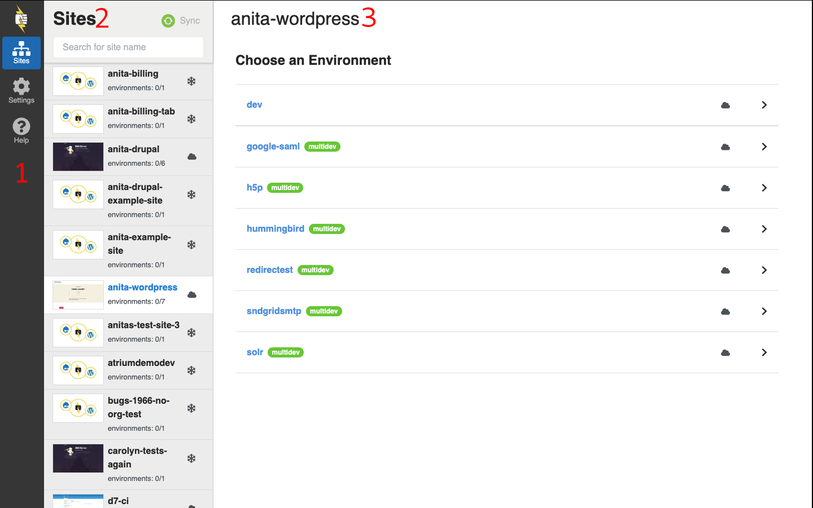
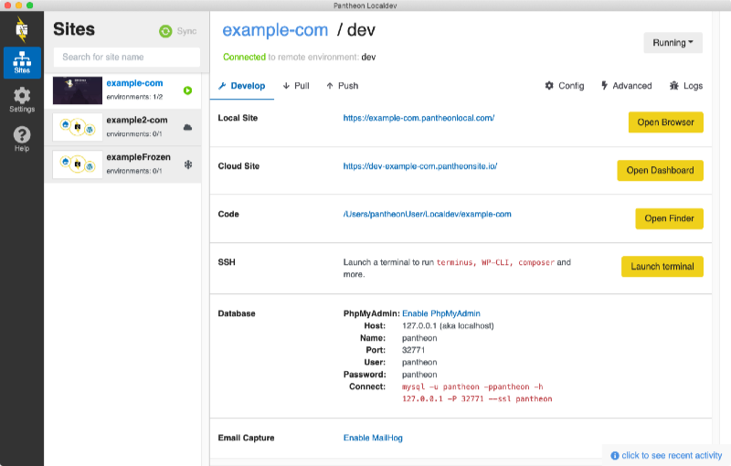
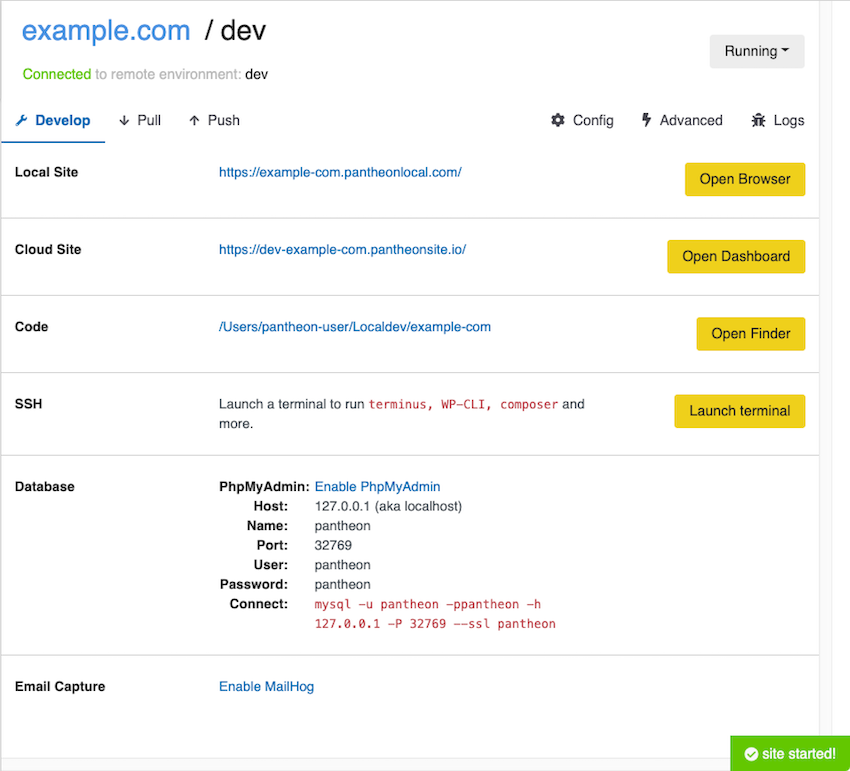

The Localdev Main user interface display is divided into three areas.

1. Switch between [Sites](#connect-and-clone-your-site-locally), [Settings](#settings), and [Help](#help) in the **Global Navigation** menu.

1. Use **Sync** to refresh the lists in the **Sites** panel when sites have been added or removed (you can only see sites for which you have permissions). 

1. Select a site to access site-specific actions and environments in the Main interface panel.

## Connect and Clone your Site Locally

1. Select a site from the **Sites** list > **Choose an Environment** if the site has any Multidev environments. 

1. Click **Pull for local development** to clone the site locally and boot the local environment. This process will take several minutes the first time you clone the entire site code.

Each site is cloned to its own directory within `~/Localdev/` by default. If your site specifies a nested docroot with `web_docroot: true` in its [pantheon.yml](/pantheon-yml/#site-local-configurations-pantheonyml) or [pantheon.upstream.yml](/pantheon-yml/#custom-upstream-configurations-pantheonupstreamyml) file, the site's web root will be located in the `web` subdirectory.

Unless you [reset Localdev to its defaults](#log-out-and-reset-to-defaults), you will only need to do this once for each site.

Localdev will revert all changes and return you to the **Clone the Dev Environment** screen if there are any errors. Try the process again, then consult the [Troubleshooting section](/guides/localdev/troubleshoot-support#faq) below for details, or [contact Support](/guides/localdev/troubleshoot-support#contact-support) if the issues persists.

The Main interface will display the Site Screen if the clone is successful.

### Start and Stop the Container

Localdev automatically starts a set of containers that closely resembles [Pantheon's Platform architecture](https://pantheon.io/features/elastic-hosting?docs) when you first pull a Site for local development. This allows you to develop your site locally, without risking compatibility issues once synced.

To start a stopped site container:

1. Click the gray **Stopped** button in the upper right-hand corner. 

1. Click **Start** to start the local server.

  

1. Preview the site from the <i className="fa fa-wrench"></i> **Develop** tab on the **Local Site** row by clicking the **Open Browser** button after the container has been started. 

1. Sync changes using the <i className="fa fa-arrow-down"></i> **Pull** and <i className="fa fa-arrow-up"></i> **Push** tabs.

### Develop

You can use the **<i className="fa fa-wrench"></i> Develop** tab for the following actions:

- View the local site from **Open Browser**.

- View the [Site Dashboard](/guides/account-mgmt/workspace-sites-teams/sites) on Pantheon from **Open Dashboard**.

- View your local site files from **Open Finder**.

- SSH into the local site container to run [Composer](/guides/composer) [Drush](/guides/drush), [WP-CLI](/guides/wp-cli), or [Terminus](/terminus) commands from **Launch Terminal**. Note that this will connect into the container shell, not the terminal environment for your local computer.

- View the database container information and access [phpMyAdmin](https://www.phpmyadmin.net/) if enabled from the [Config](#Config) tab.

- Access email capture through [MailHog](https://github.com/mailhog/MailHog), if enabled from [Config](#config).

### Push and Pull Code

If you have a Git client that you're already comfortable with, you can use it to track, commit, push, and pull code as you normally would. Navigate or point your Git client to track your local code directory, for example: `/Users/yourUser/Localdev/examplesite`.

You can also use the **<i className="fa fa-arrow-down"></i> Pull** and **<i className="fa fa-arrow-up"></i> Push** tabs to have Localdev handle Git for you.

1. Select the **Pull** tab.

1. Select the **Pull code** option to copy the site's code from the Pantheon **Dev** environment to your local environment. 
  
    - The *Last Pull* line below each option's area shows the last time the code was synced.

After you make changes to your site:

1. Navigate to the **<i className="fa fa-arrow-up"></i> Push** tab.

1. Select the information you want pushed to the Pantheon **Dev** environment.

1. Enter a **Git commit message** that describes the changes made in this particular push.

1. Click **Push**.

## Push and Pull Content

The **<i className="fa fa-arrow-down"></i> Pull** and **<i className="fa fa-arrow-up"></i> Push** tabs also let you sync content (files and/or databases) from the Pantheon platform to your Localdev environment.

<Alert title="Warning" type="danger">

Pantheon does not recommend pushing your database or files from your local environment to the platform, as this can result in the *permanent* loss of data. There are exceptions to this rule, but in general it is best to only pull content down from the platform, and push code up.

Pulling content will *overwrite* your local working data. If you need to keep a copy, export the database using phpMyAdmin and make a copy of your files.

</Alert>

### Config

Follow the steps below to initialize tools:

1. Navigate to the site **<i className="fa fa-cog"></i> Config** tab.

1. Review the available tools and enable those you want to use. For example:

    - [phpMyAdmin](https://www.phpmyadmin.net/)
    - [MailHog](https://github.com/mailhog/MailHog)
    - [CDN](/guides/global-cdn) for emulation to test cookies
    - [Solr](/solr) or [Redis](/guides/object-cache) for the local site

### Advanced

1. Navigate to the **<i className="fa fa-bolt"></i> Advanced** tab.

1. Click the **<i className="fa fa-bug"></i> Logs** tab to:

    - Change log verbosity
    - Initiate a forced rebuild (see [troubleshooting](/guides/localdev/troubleshoot-support) for more information)
    - Force-remove the entire application (this will also destroy all local site databases)

### Logs

The **<i className="fa fa-bug"></i> Logs** tab provides three views:

- The **activity** view shows what actions have been taken from the app.

- The **console** view shows updates to the binary log file for the tools used by Localdev under the hood. Note that it will only display log updates created while the console view is open.

- The **logs (beta)** view shows the application logs for Lando and any underlying tools like Localdev or Docker.

  - When viewing logs, use the links at the bottom to switch between the various containers enabled for your site's environment, including the appserver, redis / solr, cache, database, nginx, mailhog, and phpmyadmin (if enabled).

## Use a Local IDE to Develop your Pantheon Site

There are a number of Integrated Development Environments (IDEs) that have built-in Git tools or plugins available for working with Git from within the IDE:

- [Atom](https://atom.io/)
- [Sublime Text](https://www.sublimetext.com/)
- [TextMate](https://macromates.com/)
- [Visual Studio Code](https://code.visualstudio.com)
- [PhpStorm](https://www.jetbrains.com/phpstorm)

See your editor's documentation for specific steps on how to commit and push changes from inside the editor.
