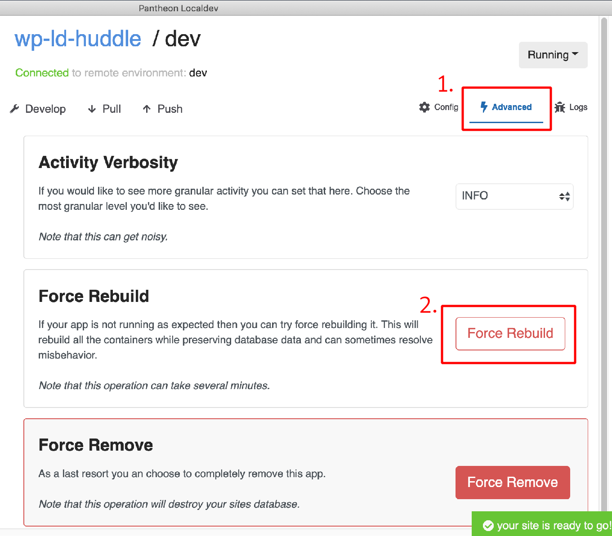
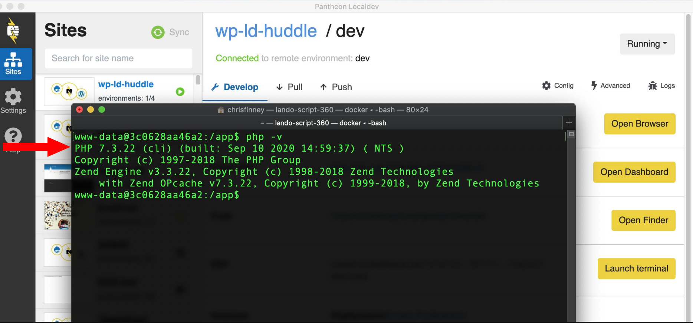

## Contact Support

Before contacting Support, review the [support request best practices](/support#best-practices) to help our team help you resolve the issue, or to report any potential issues in Localdev itself.

1. Navigate to the **Settings** menu and confirm that *Usage and Crash Data* is set to **Allow reports**. This allows the application to automatically submit crash data to Pantheon Support.

   - Application reports are collected and stored locally in `~/.pantheonlocaldev`.

1. Reproduce the error and note the steps taken.

   - If the error is inconsistent, make note of this as well. Multiple reports of an inconsistent error help our team troubleshoot.

1. Report the error:

   - [Contact Support via your Dashboard](https://dashboard.pantheon.io/#support/support/all) or [via Chat](/support/#real-time-chat-support) and include the steps you took to reproduce the error.

## Provide Feedback or Feature Requests

Please provide feedback by submitting an issue to the [GitHub repository](https://github.com/pantheon-systems/localdev-issues/issues) or by joining the [Pantheon community](https://pantheon.io/docs/pantheon-community#joining-the-community).

## Troubleshooting

### Clone Failed Due To Modified .gitignore

Older WordPress sites on Pantheon that have removed the `wp-content/uploads` folder from their site's `.gitignore` file will fail when pulling locally. The logs may show something similar to:

```bash
{"level":"error","message":"pulling files from dev errored with:
mkdir: cannot create directory '/app/./wp-content/uploads':
File exists\n","label":"myawesomesite","timestamp":"2020-11-25T16:40:12.057Z"}
```

The contents of `wp-contents/uploads` should be symlinked to files, in keeping with the [code moves up, content moves down](/pantheon-workflow#code-moves-up-content-moves-down) best practice of the Pantheon WebOps workflow.

You can [contact support](#contact-support) for help moving your files out of the codebase.

### Clone of a New Site Failed

If you attempt to initialize a site within Localdev before you've completed the CMS install on Pantheon, it will fail when attempting to pull the (non-existent) database from the platform. The logs under **show detail (beta)** will show:

```docker
Pulling your database... This miiiiight take a minute
 [notice] Command: anita-wordpress.dev -- wp db export [Exit: 0]
Checking db pull for expected tables...
Database pull failed...
```

See step 9 of [Create a Site](/create-sites#create-a-site).

### Log out and Reset to Defaults

The steps in this section should only be used as a last resort. This resets Localdev and will remove the machine token and all local copies of your connected sites.

1. Click **Settings**

1. **Reset to defaults**

1. **Proceed with reset**

## FAQ

### What does Localdev do about existing Lando config files?

While Localdev uses parts of Lando under the hood, they should be considered separate tools. Localdev will not respect existing Lando configuration files, and we recommend keeping the two tools separate. That is, if you are going to use both tools, they should point to separate project directories.

### Can WordPress Site Networks be developed through Localdev?

At this time, WordPress Site Network (also known as WordPress Multisite) is supported only for networks using subdirectories, not subdomains. See the [Choose Between Subdirectories and Subdomains](/guides/multisite/considerations/#choose-between-subdirectories-and-subdomains) section of our [WordPress Site Networks](/guides/multisite) guide for more information.

### How do you configure PHP versions for sites in the Localdev environment?

Localdev will [respect the changes made to your local `pantheon.yml`](/php-versions#configure-php-version) file.

A forced rebuild is required for changes in `pantheon.yml` to take effect:



You can verify which version of PHP your site is using by clicking **Launch Terminal**, then running `php -v`:



### Can I create Multidev environments from Localdev?

No, new Multidev environments must still be created from the Site Dashboard or [Terminus](/terminus/commands/multidev-create).
