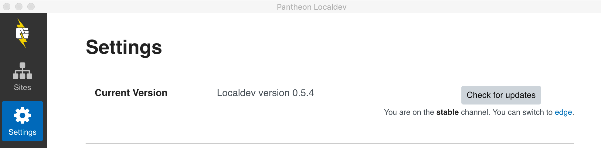

## Changelog

You can view the most recent Localdev release and changelogs in [Pantheon's Localdev repository](https://github.com/pantheon-systems/localdev/releases).

## Download and Test Beta Versions

Download Edge versions to get the latest features, bug fixes, instructions, and help test Localdev.

Note that some versions of Localdev are not compatible with some versions of Docker. See GitHub for more information, or (we don't recommend this) to continue with an untested version of Docker, you can turn off the compatibility check in Localdev's settings.

1. Select Settings in the left menu within your Localdev installation.

1. Click on `switch to edge` in the Current Version section.

  

<Alert type="info" title="Note">

Help improve Localdev by sharing bug reports and feedback in the [GitHub issue queue](https://github.com/pantheon-systems/localdev-issues), or join the [Pantheon Community](/pantheon-community) to post in the [Localdev Slack channel](https://pantheon-community.slack.com/messages/CB2H8065D). Get your [Slack invite here](https://slackin.pantheon.io/).

</Alert>
