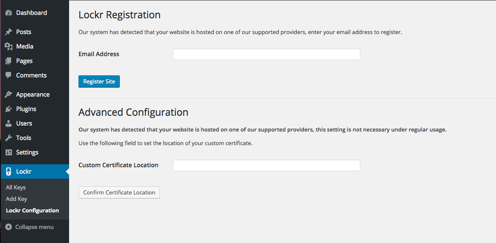
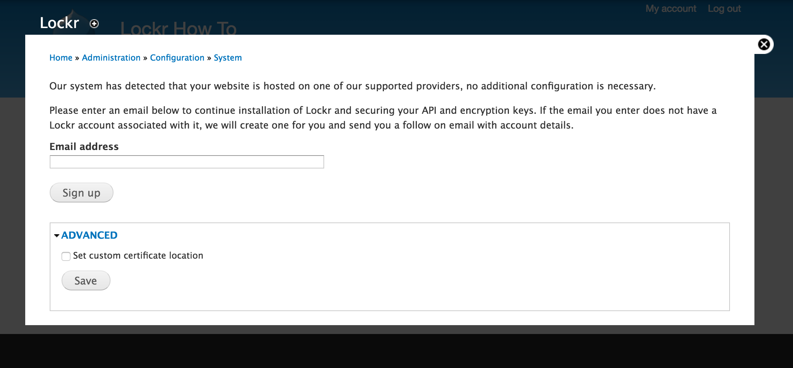

[Lockr](https://lockr.io) is an easy-to-use plugin for WordPress or Drupal to manage your site’s API and encryption keys in a secure offsite hosted environment. Lockr removes the key from your site code and database and stores it in a secure and certified key manager. When your site needs the key for an encryption/decryption or API request, Lockr uses the Pantheon server’s certificate to authenticate on your behalf and release the key.

Site administrators have the ability to control how and where their sensitive keys are stored, thus improving the overall security of the site and allowing it to meet specific regulatory and compliance requirements for key management. Lockr also separately stores development and production specific keys to create an additional layer of security between environments.

## Benefits of Lockr

By combining a simple-to-use developer interface with a managed scalable cloud key management system, Lockr allows applications of all sizes to meet industry standards for key management. Unlike other key managers, Lockr offers additional layers of security and system monitoring, no ongoing maintenance, and continuous development for integration with your favorite modules and plugins. Offsite API and encryption key management delivers best-practice security to help sites comply with HIPAA, FERPA, and FISMA. Development use of Lockr in the Dev, Test, and Multidev environments is always free.

## Install Lockr via the Lockr Terminus Plugin

[The Lockr Terminus plugin](https://github.com/lockr/lockr-terminus) allows you to install all necessary components, register the site with Lockr, and patch all relevant plugins/modules running on your site with a single [Terminus](/terminus) command. To enable the Terminus plugin, complete these steps in your local environment:

1. Clone [the Lockr Terminus plugin](https://github.com/lockr/lockr-terminus) into the `~/terminus/plugins` directory on your local environment.

1. Log in with Terminus.

   ```bash{promptUser: user}
   terminus auth:login --email=<email> --machine-token=<machine_token>
   ```

1. Run the following command:

   ```bash{promptUser: user}
   terminus lockdown [<Lockr account email>] --password=[<Lockr account password>]
   ```

1. Select the site for the install. It will now detect the CMS, download and install all necessary components, register the site, and patch all relevant plugins in your site.

It's that simple! One command and your site is set up. After successfully installing and registering Lockr, you will see a confirmation on the Configuration page that the site is registered. You are now able to set keys through the Admin interface for site's that have been registered. Alternatively, you can follow the steps below for the CMS your site uses to install and configure Lockr.

## WordPress Installation

Lockr is automatically configured to secure API keys for numerous third-party plugins for seamless integration and securing of your keys.
Visit the [GitHub page](https://github.com/lockr/lockr-patches/tree/wp) for a list of plugins that can be automatically patched.

1. [Set the connection mode to SFTP](/sftp) for the Dev or Multidev environment via the Pantheon Dashboard or with [Terminus](/terminus):

 ```bash{promptUser: user}
 terminus connection:set <site>.<env> sftp
 ```

1. Install and activate the [Lockr](https://wordpress.org/plugins/lockr) plugin from within the Dev or Multidev environment's WordPress Dashboard (`/wp-admin/plugin-install.php?tab=search&s=lockr`) or with [Terminus](/terminus):

 ```bash{promptUser: user}
 terminus wp <site>.<env> -- plugin install lockr --activate
 ```

1. Click **Lockr** from within the WordPress Dashboard to visit the Lockr Configuration page  (`/wp-admin/admin.php?page=lockr-site-config`):

   ​

1. Enter your email address, and click **Register Site**.

1. Create keys within **Lockr** > **Add Keys** and manage existing keys within **Lockr** > **All Keys**.

1. Visit the [Lockr patch library](https://github.com/lockr/lockr-patches/tree/wp) for the latest patches to your favorite plugins or apply patches with [Terminus](/terminus):

 ```bash{promptUser: user}
 terminus wp <site>.<env> -- lockr lockdown
 ```

### WP-CLI Commands

The Lockr plugin contains a number of WP-CLI commands to quickly register a site and get a key through the command line.

#### Register the site with Lockr

This command will register the site with Lockr to the email address provided. The password is only necessary for existing Lockr accounts. This is useful for automated deployment from a Custom Upstream using [Quicksilver](/quicksilver).

```bash{promptUser: user}
terminus wp <site>.<env> -- lockr register-site --email=[<Lockr email address>] --password=[<Lockr account password>]
```

#### Use Lockr to patch existing plugins

Run this command and Lockr will go to the [patch library](https://github.com/lockr/lockr-patches/tree/wp) and automatically patch your existing plugins that do not currently integrate natively with Lockr.

```bash{promptUser: user}
terminus wp <site>.<env> -- lockr lockdown
```

#### Get and decrypt a key from Lockr

Run this command to get and decrypt a key from Lockr. This is a useful command to program in automated functionality in Quicksilver.

```bash{promptUser: user}
terminus wp <site>.<env> -- lockr get-key [key name]
```

#### Encrypt a key and sends it to Lockr

This command encrypts a key and sends it to Lockr. This is useful during site migrations or automated deployments of new sites through Quicksilver.

```bash{promptUser: user}
terminus wp <site>.<env> -- lockr set-key --name=[key name] --label=[key label] --value=[key value]
```

## Drupal Installation

Pairing together the [Lockr](https://www.drupal.org/project/lockr), [Encrypt](https://www.drupal.org/project/encrypt), and [Key](https://www.drupal.org/project/key) modules allow Drupal to take advantage of best security practices of separating the keys away from the data they protect.

Lockr is currently available for Drupal 7 and Drupal 8 (development release). See the project's [GitHub page](https://github.com/lockr/lockr-patches/tree/drupal7) for a list of modules that can be automatically patched.

1. [Set the connection mode to SFTP](/sftp) for the Dev or Multidev environment via the Pantheon Dashboard or with [Terminus](/terminus):

 ```bash{promptUser: user}
 terminus connection:set <site>.<env> sftp
 ```

1. Install the [Lockr](https://www.drupal.org/project/lockr) module and the required [Key](https://www.drupal.org/project/key) module by uploading files to the modules directory (Drupal 7: `/sites/all/modules/contrib` Drupal 8: `/modules/contrib`) or using the [Drupal interface](https://www.drupal.org/docs/7/extending-drupal/installing-modules).

1. Go to the modules page (`/admin/modules`) and enable both modules.

1. Navigate to the Lockr configuration page (`/admin/config/system/lockr`):

  ​

1. Enter your email address and click **Sign Up**.  

### Drush Commands

Use Drush to download and install Lockr in a few simple commands.

```bash{promptUser: user}
terminus drush <site>.<env> -- dl lockr
terminus drush <site>.<env> -- en lockr
terminus drush <site>.<env> -- lockr-register --email=[<Lockr account email >] --password=[<Lockr account password>]
```

This command registers the site with Lockr to the email address provided. The password is only necessary for email addresses already with a Lockr account. This is useful for automated deployment from a Custom Upstream using Quicksilver.

```bash{promptUser: user}
terminus drush <site>.<env> -- lockr-lockdown
```

Run this command and Lockr will go to a [patch library](https://github.com/lockr/lockr-patches/tree/drupal7) and automatically patch your existing plugins that do not currently integrate natively with Lockr.

## Frequently Asked Questions (FAQs)

#### Can Lockr be used by non-CMS applications?

Non-CMS applications can easily integrate with Lockr after their credentials are set up through [Lockr Support](https://lockr.io).

#### What types of keys does Lockr manage?

- API keys for connecting to external services such as: Payment gateways and web commerce solutions like PayPal, Stripe, WooCommerce, Authorize.net, etc.
- Email services providers: MailChimp, SendGrid, SMTP mail servers, etc.
- Various external services like Amazon Web Services
- A key used for encrypting data on your website
- LDAP and SSO authentication credentials

#### How is Lockr different from other key management systems?

Lockr encrypts the keys prior to leaving the site or application with a process called key wrapping. This prevents keys stored in Lockr from being viewed or compromised by adding another layer of security to the process. Backed by Townsend Security’s FIPS 140-2 compliant key manager, keys are secured to the highest of industry standards.

#### Is Lockr Safe?

Yes! Lockr can be used to secure any API key, application secret, and other types of credentials. Once enabled in the CMS, keys entered are sent over an encrypted connection to the Lockr system. The credentials used to access Lockr are provided by the site host or application platform to prevent hijacking and tampering. This credentialed methodology enables the separation of development and production environments. Using key wrapping, keys are rendered useless from being used outside the website or application environment. Lockr is unable to see the values of your key.

Lockr manages keys on a “per environment" basis, which helps eliminate the potential of keys being shared from production to development environments. No longer will you have to worry about sending a test notification from development to production users, or having production data decrypted in development environments. Leveraging proven enterprise-grade key management technology from Townsend Security, Lockr’s offsite key management delivers best-practice security to protect against critical vulnerabilities within your CMS solution.

#### Will developers be able to access my keys?

If you're encrypting sensitive information in your production environment, that data should not be decrypted anywhere but in production. With Lockr, data is encrypted in production with a production key that is not retrievable outside that environment. When a database is cloned to development, the keys that Drupal has access to cannot decrypt the data.

#### Who do I contact for Lockr support?

You can email the Lockr Support Team at support@lockr.io or get real-time support on Lockr's [Slack channel](http://slack.lockr.io).
