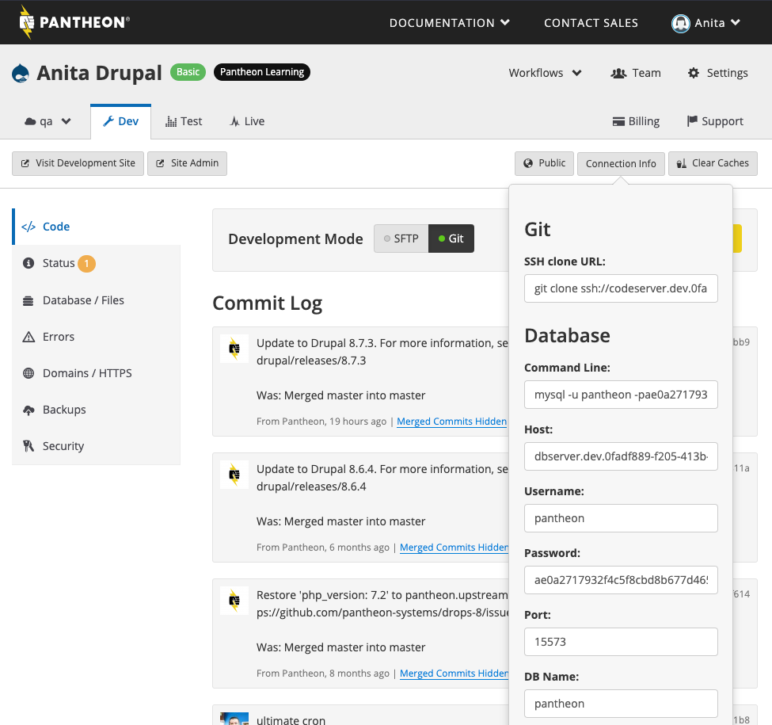

This section provides information on how to access your MariaDB or MySQL database through Pantheon.

<Alert title="Note" type="info">

Due to the nature of our platform, the connection information will change from time to time due to server upgrades, endpoint migrations, etc. You will need to check the Dashboard periodically or when you can’t connect.

</Alert>

## Database Connection Information

<Partial file="platform-considerations-connections.md" />

### Access Your Database Directly

You cannot access the database directly if you have purchased [Secure Runtime Access](/guides/secure-development/secure-runtime-access).

The database credentials for each site environment are located in your Site Dashboard.

Navigate to the environment you want to connect with, and select **Connection Info** to view your Database credentials.



The following required fields are provided:

- **Server**: The hostname of the server.
- **Port**: The TCP/IP port number to use for the connection. The platform randomly selects the port number. Port numbers will differ in every environment for each site, and might not match what PHP reports.
- **Username**: The user name to use when connecting to server.
- **Password**: The password to use when connecting to the server.
- **Database**: The database name to use. This value will always be `pantheon` and cannot be altered.

Each database server is in the cloud, which allows credentials to occasionally be updated, without any notice. Normally, this is transparent to a site, as the credentials are automatically included by the server. However, if you've saved the credentials in a local client and a month later you can't connect, check your Dashboard for the current credentials.

There's a wide array of MySQL clients that you can use, including:
- [MySQL Workbench](https://dev.mysql.com/downloads/workbench/)
- [Sequel Ace (formerly Sequel Pro)](https://sequel-ace.com/)
- [Navicat](https://www.navicat.com/download)
- [PHPMyAdmin](https://www.phpmyadmin.net/)

Refer to the documentation or issue queue of your software to learn more about how to configure a connection.

#### Open Sequel Ace Database Connection

Drupal users can create [`spf-template.spf`](https://gist.github.com/aaronbauman/f50cc691eb3ed60a358c#file-spf-template-spf) and use the following script to establish a database connection in Sequel Ace via [Terminus](/terminus) and [Drush](/guides/drush):

```bash:title=establish-db-connection.sh
#!/bin/bash

# exit on any errors:
set -e

if [ $# -lt 1 ]
then
  echo "Usage: $0 @pantheon-alias"
  exit 1
fi

# Path to drush goes here:
DRUSH='/usr/local/bin/drush'

# Authenticate with Terminus
terminus auth:login --email <email>


# see the following file:
TEMPLATE='spf-template.spf'

# may need to change this:
TMP_SPF='/tmp/tmp.spf'

# Update aliases
terminus aliases

echo "fetching connection string"
CONNECTION_STRING=`$DRUSH $1 sql-connect`
echo $CONNECTION_STRING
DATABASE=`echo $CONNECTION_STRING | sed -e 's/.*--database=\([^\\ ]*\).*/\1/g'`
HOST=`echo $CONNECTION_STRING | sed -e 's/.*--host=\([^\\ ]*\).*/\1/g'`
PORT=`echo $CONNECTION_STRING | sed -e 's/.*--port=\([^\\ ]*\).*/\1/g'`
PASSWORD=`echo $CONNECTION_STRING | sed -e 's/.*--password=\([^\\ ]*\).*/\1/g'`
USER=`echo $CONNECTION_STRING | sed -e 's/.*--user=\([^\\ ]*\).*/\1/g'`

# This is for Sequel Ace:
eval "echo \"$(< $TEMPLATE)\""
# For some reason, Sequel Ace or Open do not behave the same way given the -f
# flag compared to opening a file from file system. So, we write to a tmp file.
eval "echo \"$(< $TEMPLATE)\"" > $TMP_SPF

# Swap this out to fit your system:
open $TMP_SPF
```

Props to Aaron Bauman for writing [this script](https://gist.github.com/aaronbauman/f50cc691eb3ed60a358c)!

### Accessing the Database via Your Application with PHP

You can connect to the application with Pantheon's internal network. Use the following variables in your application to access the database:

- **DB_HOST**: Name of the server.
- **DB_PORT**: Database port used.
- **DB_USER**: User name to use when connecting to server.
- **DB_PASSWORD**: The password to use when connecting to the server.
- **DB_NAME**: The database name to use. This value will always be `pantheon` and cannot be altered.
- **REPLICA_DB_HOST**: Database IP address. This will be changing to have the same value as DB_HOST, and route to a proxy server. We will no longer support connections via IP Address.
- **REPLICA_DB_PORT**: Replica database port.
- **REPLICA_DB_USER**: MySQL replica user name to use when connecting to server.
- **REPLICA_DB_PASSWORD**: The password to use when connecting to the server.
- **REPLICA_DB_NAME**: The replica database name to use. This value will always be `pantheon` and cannot be altered.


For example:
```sql
DB_HOST=dbhost
DB_PORT=6033
DB_USER=21b24cbb5bb44b9988a6112f46558b06
DB_PASSWORD=e064b4a6223149c3812810e232b88eb5
DB_NAME=pantheon
REPLICA_DB_HOST=10.73.1.226
REPLICA_DB_PORT=14097
REPLICA_DB_USER=59e14dd2cedd4188848b6b4aed6fb5f5
REPLICA_DB_PASSWORD=e35eff3a5a9f4c29b9044df35ad004e7
REPLICA_DB_NAME=pantheon
```

## SSH Tunneling

MySQL connections made to Pantheon are encrypted by default:

```sql
mysql> SHOW STATUS LIKE "Ssl_cipher";
+---------------+---------------------------+
| Variable_name | Value                     |
+---------------+---------------------------+
| Ssl_cipher    | DHE-RSA-AES128-GCM-SHA256 |
+---------------+---------------------------+
```

Developers can use SSH tunnels to add additional layers of encryption to remote MySQL connections, or tunnel the connection across non-standard ports. For more information on how to set up tunnels for databases, refer to [Secure Connections to Pantheon Services via TLS or SSH Tunnels](/guides/secure-development/ssh-tunnels).

## Troubleshooting MySQL Connections

### Lost Connection to MySQL Server

```sql
ERROR 2013 (HY000): Lost connection to MySQL server at 'reading initial communication packet', system error: 0
```

Or

```sql
ERROR 2003 (HY000): Can't connect to MySQL server on 'dbserver.$ENV.$SITE.drush.in' (111)
```

This error occurs when a request is sent to a database server that is in sleep mode. Pantheon containers spin down after about one hour of idle time. Live environments on a paid plan spin down after 12 hours of idle time. Environments usually spin up within 30 seconds of receiving a request. To resolve this error, wake environments by loading the home page or with the following Terminus command:

```bash{promptUser: user}
terminus env:wake <site>.<env>
```

### Can't Connect to Local MySQL Server Through Socket

Refer to [Database Connection Errors](/guides/mariadb-mysql/database-connection-errors) to troubleshoot connection errors such as the following:

```bash
Can’t connect to local MySQL server through socket '/var/lib/mysql/mysql.sock'...).
```

## More Resources

- [MariaDB and MySQL FAQ](/guides/mariadb-mysql/mariadb-mysql-faq)

- [MySQL Slow Log](/guides/mariadb-mysql/mysql-slow-log)

- [Secure Connections to Pantheon Services via TLS or SSH Tunnels](/guides/secure-development/ssh-tunnels)
