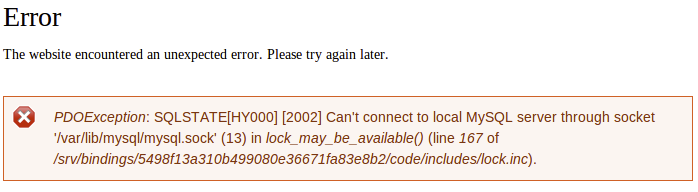

This section provides information on database connection errors.

There is an issue connecting to the Pantheon database if your site suddenly reverts to `install.php`, or you get database connection errors like the one below:



```sql
Can’t connect to local MySQL server through socket '/var/lib/mysql/mysql.sock'...).
```

There are two common causes for this issue: 

- Overwriting core
- Using non-standard bootstraps

## Overwriting Core

### Drupal Pressflow Core

Pantheon provides Pressflow core as the underlying basis for all Drupal sites. This is important for performance reasons, but also to load configuration out of the server environment. You can run Drupal on Pantheon with no `settings.php` file, though there are still plenty of great uses for this file.

You can overwrite the Pressflow core by unpacking a tarball from drupal.org "over" your Git checkout and then pushing the change, or by updating core via Drush. However, your site will be unable to read the environmental configuration.

 Examine your `includes/bootstrap.inc` file to determine whether this is the case. Verify that you there is code in the `drupal_settings_initialize()` function which loads data from `$_SERVER['PRESSFLOW_SETTINGS']`.

If no code is present in the function, go to your recent changes and revert or remove whatever overwrote your core.

### WordPress Core

Apply one-click updates within the Site Dashboard on Pantheon or via [Terminus](/terminus). Do not update core using the WordPress Dashboard or WP-CLI; you will overwrite your core. Refer to [Scope of Support](/guides/support) and [WordPress and Drupal Core Updates](/core-updates) for more information.

## Drupal Non-Standard Bootstraps

Some modules, like the **domain.module**, change Drupal's standard bootstrap process. These modules typically require you to add an include file to the end of your `settings.php`, which causes an escalated bootstrap earlier than normal. This allows the module to perform some higher level functions like checking whether a user has access.

However, because the Pantheon environment data is not loaded at this time, any bootstrap to the database level will fail since there is no valid connection information. In this case, include a snippet in your `settings.php` before the module's include call.

### Drupal 7 Style

```php
# Include any other settings.php magic here.
  extract(json_decode($_SERVER['PRESSFLOW_SETTINGS'], TRUE));
  include './sites/all/modules/domain/settings.inc';
```

<Alert title="Warning" type="danger">

If you use any other advanced `settings.php` tricks (e.g. enabling Object Cache), you will need to do this *before* the snippet in D7 to ensure you have a consistent `$conf` array.

</Alert>

## Base Table or View Not Found

This error may occur during a database clone, restore, or import. A standard MySQL import happens sequentially and in alphabetical order from A to Z. If you access the site before the operation is complete, Drupal will try to bootstrap, and the MySQL import may only be at the table letter G. The result is the "semaphore does not exist" error.

Drupal will be able to bootstrap correctly when the process is complete. Wait for the process to complete and the error will disappear. If the site is locked down from web visitors, there may still be a backend process such as our healthcheck process pinging the database trying to obtain a lock via the semaphore table.

This error shouldn’t cause any issues for your site:


```sql
Uncaught exception 'PDOException' with message 'SQLSTATE[42S02]: Base table or view not found: 1146 Table 'pantheon.semaphore' doesn't exist' in /srv/bindings/xxxxxxxx-xxxx-xxxx-xxxx-xxxxxxxxxxxx/code/includes/database/database.inc:2171 Stack trace: #0 /srv/bindings/7xxxxxxxx-xxxx-xxxx-xxxx-xxxxxxxxxxxx/code/includes/database/database.inc(2171): PDOStatement->execute(Array) #1 /srv/bindings/xxxxxxxx-xxxx-xxxx-xxxx-xxxxxxxxxxxx/code/includes/database/database.inc(683): DatabaseStatementBase->execute(Array, Array) #2 /srv/bindings/xxxxxxxx-xxxx-xxxx-xxxx-xxxxxxxxxxxx/code/includes/database/database.inc(2350): DatabaseConnection->query('SELECT expire, ...', Array, Array) #3 /srv/bindings/xxxxxxxx-xxxx-xxxx-xxxx-xxxxxxxxxxxx/code/includes/lock.inc(167): db_query('SELECT expire, ...', Array) #4 /srv/bindings/xxxxxxxx-xxxx-xxxx-xxxx-xxxxxxxxxxxx/code/includes/lock.inc(146): lock_may_be_available('schema:runtime:...') #5 /srv/bindings/xxxxxxxx-xxxx-xxxx-xxxx-xxxxxxxxxxxx/code/includes/bootstrap.inc(433): ...
```

## More Resources

- [Troubleshooting MySQL Connections](/guides/mariadb-mysql/mysql-access/#troubleshooting-mysql-connections)