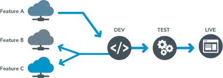

Multidevs are development environments for teams. A Multidev environment allows a developer to fork the entire stack (code and content), work independently, and then merge the code changes back into the main `master` site. Each forked branch has its own separate development environment, including database and files. Each branch environment can be independently set to use either SFTP or Git mode for code changes.

Each site has a limit of 10 Multidev environments. Elite sites can request additional Multidev environments [from support](/guides/support/contact-support/) as needed.

Multidev is available for the following accounts:

- Gold

- Platinum

- Diamond

- Agency partners

<Alert title="Note"  type="info" >

Site admins of an organization with Multidev can invite independent contractors or set an agency as a supporting organization. The Pantheon system will automatically choose the highest account tier among the group. This logic makes Multidev features, including the ability to create Multidev environments, available to the supporting organization or the site team members on the associated sites.   

</Alert>

<Enablement title="Get WebOps Training" link="https://pantheon.io/learn-pantheon?docs">

Optimize your dev team and streamline internal workflows. Pantheon delivers on-demand training to help development teams make the most of our platform and improve their internal WebOps.

</Enablement>

## Benefits of Multidev

**Easy workflow:** Developers on your team can use a standardized best-practice development workflow in the cloud through their Dashboard.

**No more surprises:** Multidev makes it easy to keep in sync with code from every team member and content updates from any environment. As a result, deployments become surprisingly predictable.

**A fork for every developer on your team:** Multidev gets new developers started quickly; you can’t have too many cooks in a Multidev kitchen.

​

## Branching and Multidev Terminology

Branching is a standard mechanism for duplicating source code under revision control for parallel development. Multidev is Pantheon’s support of a branching workflow using the Pantheon platform and Dashboard.

There are a number of terms used throughout the Multidev workflow that will be useful for you and your team to know:

- **Commit:** Record snapshot to history.

- **Push:** Send changes to a remote repository.

- **Branch:** Movable pointer to a set of commits, allowing independent development and history.

- **Environment:** Independent infrastructure for a site, including code, database, and files.

- **Fork:** To divide in branches, copying source code to start independent development. At Pantheon, we are also copying content (files and database) when forking.

- **Merge:** Combine contents of a&nbsp;branch into another, like a bug fix branch into master.

- **Master:** Name of default branch; deployed to Pantheon Dev, Test, and Live environments.

## More Resources

- [Pantheon Site Dashboard](/sites)

- [Use the Pantheon WebOps Workflow](/pantheon-workflow)