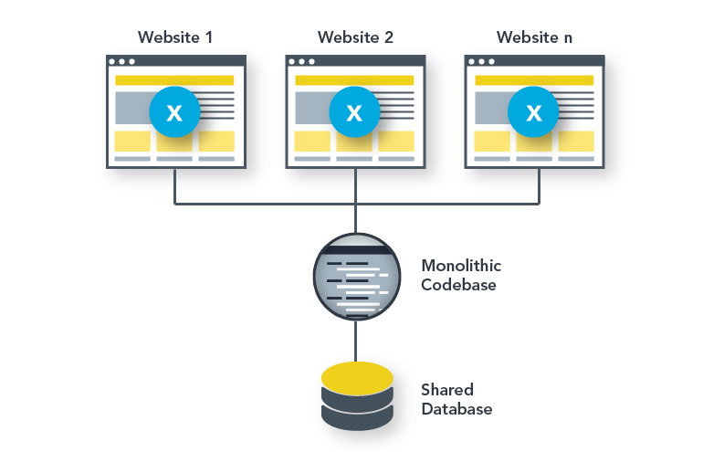

This guide covers the process of requesting, configuring, and maintaining a new WordPress Site Network on Pantheon. We'll also explore supported use cases, considerations and some common troubleshooting tips.

## About WordPress Site Networks
Pantheon supports [WordPress Site Networks](https://codex.wordpress.org/Glossary#Network) (also known as WordPress Multisite) which lets you create a network of sites using a single copy of the WordPress codebase and a common database. For those responsible for maintaining several or dozens of similar sites, WordPress Site Networks can make it much easier to fix bugs and deploy new features across all of those sites.

## Supported Use Cases
Pantheon supports the most common use case for site networks: a common codebase which powers a set of related sites. This includes, but is not limited to, networks of:

- Blogs for faculty at a university
- Franchise sites under a parent organization site
- Sections within a media publication
- [Bedrock based](https://carlalexander.ca/using-bedrock-with-pantheon/) or Composer based WP Multi-site is a possibility and can be discussed during onboarding

## Unsupported Use Cases
We do not support uses of WordPress Site Networks that run functionally-different or uniquely-owned sites on the same WordPress installation. This includes, but is not limited to:

- Software as a service (SAAS) products
- Agencies using one WordPress installation to support several customers
- [WordPress Multi-Network](https://wordpress.org/plugins/wp-multi-network/) installations where multiple domains can be added aside from subdomains and subdirectories.

## Request a WordPress Site Network
Running a WordPress Site Network requires a special configuration that is only available to contract customers with Performance or Elite sites. Only Pantheon employees have the ability to create the sites and add you to the team. Existing WordPress sites cannot be converted to a network, however they can be [migrated](/migrate-wordpress-site-networks).

Reach out to your account manager to request that a new WordPress Site Network be created for you. Once an employee of Pantheon has created the network, you will receive an email informing you that you've been added to the site. If you don't have an account manager, you can [contact sales](https://pantheon.io/contact-us).

 
