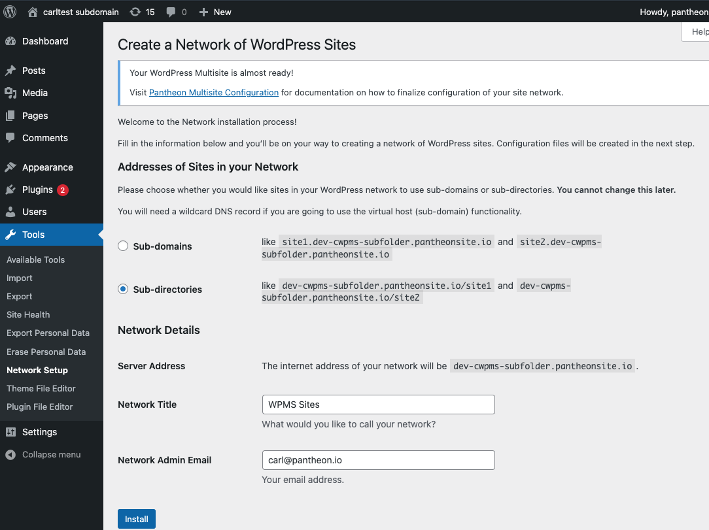
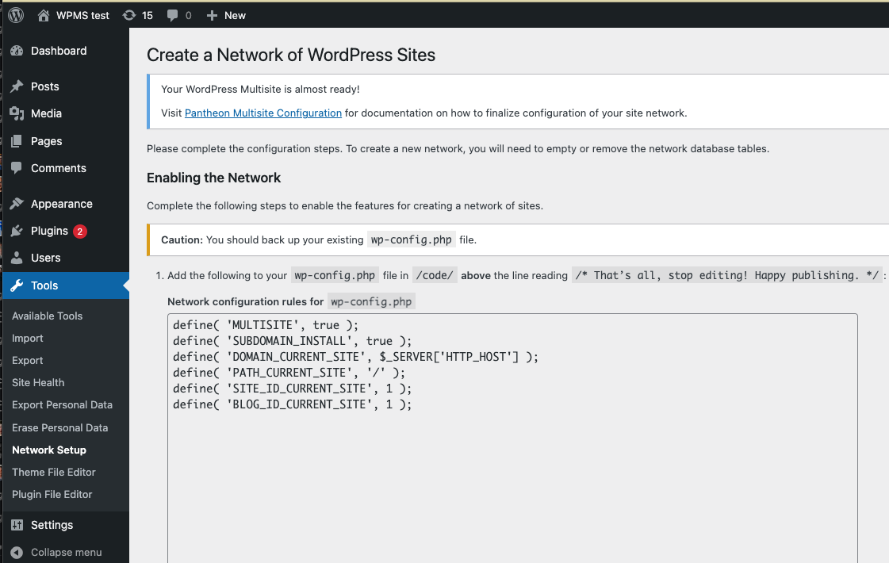
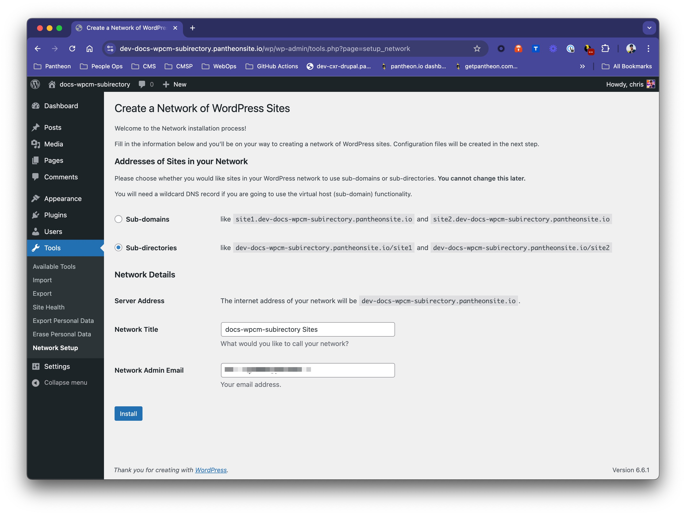
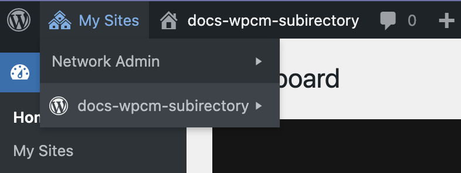

This section is intended for customers who have had a WordPress Multisite upstream created for them by a Pantheon employee. If you do not have a WordPress Multisite upstream, refer to the [introduction](/guides/multisite) page of this guide. After you create a new site on the Multisite upstream and visit the Dev environment's site URL, you should be redirected to the WordPress web-based installer.

<Alert title="Note" type="info">

Adjust placeholders in code snippets as needed throughout this guide. This includes placeholders such as `<site>` and `<env>` in Terminus commands, in addition to placeholders in brackets `<>` in larger code blocks.

</Alert>

## Install WordPress Multisite Via Terminus

Make sure [Terminus](/terminus) is installed and [authenticated](/terminus/install#authenticate) before you complete the steps below.

1. Set the site's connection mode to SFTP:

    ```bash{promptUser: user}
    terminus connection:set <site>.dev sftp
    ```

1. Use Terminus to execute the `wp core multisite-install` command. You can refer to the [WordPress documentation](https://developer.wordpress.org/cli/commands/core/multisite-install/) for more information.

      <Alert title="Note" type="info">

      The default behavior for this command is to create a WordPress Multisite with the **subdirectory** configuration. To create your network with the **subdomain** configuration, add the `--subdomains` flag.

      </Alert>

      ```bash{promptUser: user}
      terminus wp <site>.<env> -- core multisite-install --title=<site-title> --admin_user=<username> --admin_email=<email>
      ```

      After you successfully install a new WordPress Multisite, a message displays that is similar to the following:

      ```bash{outputLines: 2-6}
      terminus wp sitenetworks.dev -- core multisite-install --title="WordPress Multisite" --admin_user=aghost --admin_email=aghost@pantheon.io
      Admin password: abcdefgnotarealpassword
      Created single site database tables.
      Set up multisite database tables.
      Added multisite constants to 'wp-config.php'.
      Success: Network installed. Don't forget to set up rewrite rules (and a .htaccess file, if using Apache).
      ```

      The `wp core multisite-install` command that you ran modified the `wp-config.php` file. The modification sets the `DOMAIN_CURRENT_SITE` constant that assigns a specific URL to your WordPress Multisite which must be updated to work on Pantheon.

1. Navigate to **<Icon icon="code" /> Code** in the **<Icon icon="wrench" /> Dev** tab of your Site Dashboard.

1. Click **Connect with SFTP**.

1. Click **Open SFTP client**.

  If you run into issues, please refer to Pantheon's [SFTP documentation](/guides/sftp/sftp-connection-info).

1. Open the `code` folder in your SFTP client, and download your site's `wp-config.php` file.

1. Locate the configuration added by WP-CLI, and *modify* the line that sets `DOMAIN_CURRENT_SITE` to a hardcoded URL. We have provided a constant in `wp-config-pantheon.php`, `PANTHEON_HOSTNAME` that defaults to a dynamic URL for web requests (`$_SERVER['HTTP_HOST']`, when available), while providing a fallback for non-web requests (notably workflows like search and replace) that do not have a `$_SERVER['HTTP_HOST']` value.
  
  ```php:title=wp-config.php
  define( 'WP_ALLOW_MULTISITE', true );
  define( 'MULTISITE', true );
  define( 'SUBDOMAIN_INSTALL', false ); // Set this to TRUE for Subdomain installs.
  // Use PANTHEON_HOSTNAME if in a Pantheon environment, otherwise use HTTP_HOST.
  define( 'DOMAIN_CURRENT_SITE', defined( 'PANTHEON_HOSTNAME' ) ? PANTHEON_HOSTNAME : $_SERVER['HTTP_HOST'] );
  define( 'PATH_CURRENT_SITE', '/' );
  define( 'SITE_ID_CURRENT_SITE', 1 );
  define( 'BLOG_ID_CURRENT_SITE', 1 );
  ```

  Refer to the [`wp-config.php` documentation](/guides/php/wp-config-php#write-logic-based-on-the-pantheon-server-environment) if you have an environment specific configuration.

1. Save your changes and upload the `wp-config.php` file to Pantheon's **Dev** environment.

<Alert title="Note" type="info">

A warning may appear in the WordPress dashboard that you need to update your `.htaccess` file. Since Pantheon used Nginx and your site is already pre-configured for Multisite use by your Account Manager, you can ignore this warning.

</Alert>

## Install WordPress Multisite Via the GUI

Complete the steps below after spinning up a new WPMS site from the correct Custom Upstream in your workspace.

1. Navigate to the WordPress Admin dashboard, select **Tools**, and then select **Network Setup**.

  

1. Select either the **Sub-domains** or **Sub-directories** option.

1. Enter the **Network Title** and **Network Admin Email**, and then click **Install**.

1. Finalize the installation by following steps provided from the GUI or by following the next steps.

  

1. Navigate to **<Icon icon="code" /> Code** in the **<Icon icon="wrench" /> Dev** tab of your Site Dashboard.

1. Click **Connect with SFTP**.

1. Click **Open SFTP client**.

  If you run into issues, please refer to Pantheon's [SFTP documentation](/guides/sftp/sftp-connection-info).

1. Open the `code` folder in your SFTP client, and download your site's `wp-config.php` file.

1. Locate the `/* That's all, stop editing! Happy Pressing. */` line, and add the following code above this line to enable the WPMS configuration.

  ```php:title=wp-config.php
  define( 'WP_ALLOW_MULTISITE', true );
  define( 'MULTISITE', true );
  define( 'SUBDOMAIN_INSTALL', false ); // Set this to TRUE for Subdomains
  // Use PANTHEON_HOSTNAME if in a Pantheon environment, otherwise use HTTP_HOST.
  define( 'DOMAIN_CURRENT_SITE', defined( 'PANTHEON_HOSTNAME' ) ? PANTHEON_HOSTNAME : $_SERVER['HTTP_HOST'] );
  define( 'PATH_CURRENT_SITE', '/' );
  define( 'SITE_ID_CURRENT_SITE', 1 );
  define( 'BLOG_ID_CURRENT_SITE', 1 );

  /* That's all, stop editing! Happy Pressing. */
  ```

## Setting up Multisite on WordPress (Composer Managed) sites

The [Bedrock](https://roots.io/bedrock/)-based [WordPress (Composer Managed)](https://github.com/pantheon-systems/wordpress-composer-managed) upstream uses `Config::define()` and `config/application.php` instead of traditional `define()` statements in `wp-config.php`. You will not be able to use WP-CLI via Terminus to enable multisite as documented above in a standard multisite configuration. This section provides guidance on how to set up a WordPress Multisite using the WordPress (Composer Managed) upstream.

1. Set the site's connection mode to Git:

    ```bash{promptUser: user}
    terminus connection:set <site>.dev git
    ```
2. Open the `config/application.php` file in your site's codebase and add the following line anywhere _above_ the `Config::apply();` line:

	```php
	Config::define( 'WP_ALLOW_MULTISITE', true );
	```
3. Visit your development site's WordPress admin and navigate to **Tools** > **Network Setup**.
    
4. Choose **Sub-domains** or **Sub-directories** (depending on your needs), fill in the Network Title and Admin Email, and click **Install**.
5. You will be given instructions to update your `config/application.php` file. Below where you added the `WP_ALLOW_MULTISITE` line, copy and paste the code provided. The `SUBDOMAIN_INSTALL` value will be `true` or `false` depending on the option you chose in the previous step. For example, if you chose subdirectories, your `config/application.php` file should look like this:

	```php
	Config::define( 'MULTISITE', true );
	Config::define( 'SUBDOMAIN_INSTALL', false );
	// Use PANTHEON_HOSTNAME if in a Pantheon environment, otherwise use HTTP_HOST.
	Config::define( 'DOMAIN_CURRENT_SITE', defined( 'PANTHEON_HOSTNAME' ) ? PANTHEON_HOSTNAME : $_SERVER['HTTP_HOST'] );
	Config::define( 'PATH_CURRENT_SITE', '/' );
	Config::define( 'SITE_ID_CURRENT_SITE', 1 );
	Config::define( 'BLOG_ID_CURRENT_SITE', 1 );
	```
6. Save your changes and commit them to your Git repository. WordPress will prompt you to log back in after you push the changes.
7. Log into your site. When you log back into your WordPress admin dashboard, you will see a new **My Sites** menu item in the top left corner. This is where you can manage your network of sites. You now have a WordPress subdirectory multisite network set up on a WordPress (Composer Managed)-based upstream.
	

<Alert type="danger" title="Multisite Search and Replace with WordPress (Composer Managed)">

Currently, the built-in dashboard [WordPress Multisite Search and Replace](/guides/multisite/search-replace/) does not support Composer-based WordPress multisites. To perform a search and replace on a WordPress (Composer Managed) multisite, you will need to use WP-CLI via Terminus manually. For more information, see our [WordPress Multisite Search and Replace](guides/multisite/workflows/#run-wp-cli-search-replace-manually) guide.
</Alert>

## Develop the Multisite

Congratulations on setting up your first WordPress Multisite. When you log in to the WordPress Dashboard, you'll see a **My Sites** menu item in the toolbar:


You will have one site and you can create another if needed. If you chose to use WordPress Multisite with subdirectories, you'll be able to access the site right away. If you chose to use subdomains, you'll need to map a custom hostname to the environment before you can access the new environment.

<Accordion title="Mapping Custom Hostnames"  id="map-cust-hostname" icon="wrench">

### Map Custom Hostnames (subdomain configurations only)

Upon installation and configuration the main site will load properly (e.g., `dev-<example>.pantheonsite.io`). However, additional network sites created will fail to load because `pantheonsite.io` doesn't support sub-sub-domains (e.g., `<new-sub-site>.dev-<example>.pantheonsite.io`). WordPress Multisites using a subdomain configuration require custom domains to be mapped to each network site in order to load properly.

1. Access the domain's DNS settings wherever they are managed.
1. Create a wildcard CNAME `*.dev.example.com` that maps to the Dev environment's platform domain, `dev-<example>.pantheonsite.io`. Doing so ensures all hostnames mapped to the environment will load without additional DNS records.
1. Map domains to the Pantheon Dev environment using Terminus. For example:

    ```bash
    # add dev.example.com for the network's main site
    terminus domain:add <site>.dev dev.example.com

    # add subsite.example.com for a subsite on the network
    terminus domain:add <site>.dev subsite.example.com
    ```

1. Update the conditional `DOMAIN_CURRENT_SITE` definition in your `wp-config.php` file to accommodate the site's new domains.

After these steps are complete, both sites on the WordPress Multisite should load with their new URLs.

</Accordion>

Explore the WordPress Network Dashboard to become familiar with the variety of additional settings. You can review the options that are available for each site you create, manage users across WordPress Multisite, and learn about the network settings. After you explore the WordPress Network Dashboard, learn how to use the WordPress Multisite with the Pantheon Workflow.

## Troubleshooting

### "Undefined index: HTTP_HOST" PHP Warnings

If you see notices in your PHP logs similar to `PHP Warning: Undefined index: HTTP_HOST`, this is likely because there is some code in your configuration that is using `$_SERVER['HTTP_HOST']` without checking if it is set. This is a common issue with WP-CLI, as it does not have the same environment variables set as a web request. Instead of relying on `$_SERVER['HTTP_HOST']`, you can use the `PANTHEON_HOSTNAME` constant, which is set by Pantheon in `wp-config-pantheon.php` and is available in all environments.

```php
define( 'DOMAIN_CURRENT_SITE', PANTHEON_HOSTNAME );
```

## More Resources

* [Environment-Specific Configuration for WordPress Sites](/guides/environment-configuration/environment-specific-config)
* [WordPress Pantheon Cache Plugin Configuration](/guides/wordpress-configurations/wordpress-cache-plugin)
* [WordPress with Composer on Pantheon](/guides/wordpress-composer)
* [WordPress Multisite documentation](https://developer.wordpress.org/advanced-administration/multisite/)
* [WordPress Multisite Domain Mapping](https://developer.wordpress.org/advanced-administration/multisite/domain-mapping/)
