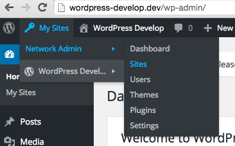

This section is intended for customers who have had a WordPress Multisite upstream created for them by a Pantheon employee. If you do not have a WordPress Multisite upstream, refer to the [introduction](/guides/multisite) page of this guide. After you create a new site on the Multisite upstream and visit the Dev environment's site URL, you should be redirected to the WordPress web-based installer.

<Alert title="Note" type="info">

Adjust placeholders in code snippets as needed throughout this guide. This includes placeholders such as `<site>` and `<env>` in Terminus commands, in addition to placeholders in brackets `<>` in larger code blocks.

</Alert>

## Install WordPress Multisite Via Terminus

Make sure [Terminus](/terminus) is installed and [authenticated](/terminus/install#authenticate) before you complete the steps below.

1. Set the site's connection mode to SFTP:

    ```bash{promptUser: user}
    terminus connection:set <site>.dev sftp
    ```

1. Use Terminus to execute the `wp core multisite-install` command. You can refer to the [WordPress documentation](https://developer.wordpress.org/cli/commands/core/multisite-install/) for more information.

      <Alert title="Note" type="info">

      The default behavior for this command is to create a WordPress Multisite with the **subdirectory** configuration. To create your network with the **subdomain** configuration, add the `--subdomains` flag.

      </Alert>

      ```bash{promptUser: user}
      terminus wp <site>.<env> -- core multisite-install --title=<site-title> --admin_user=<username> --admin_email=<email>
      ```

      After you successfully install a new WordPress Multisite, a message displays that is similar to the following:

      ```bash{outputLines: 2-6}
      terminus wp sitenetworks.dev -- core multisite-install --title="WordPress Multisite" --admin_user=aghost --admin_email=aghost@pantheon.io
      Admin password: abcdefgnotarealpassword
      Created single site database tables.
      Set up multisite database tables.
      Added multisite constants to 'wp-config.php'.
      Success: Network installed. Don't forget to set up rewrite rules (and a .htaccess file, if using Apache).
      ```

      The `wp core multisite-install` command that you ran modified the `wp-config.php` file. The modification sets the `DOMAIN_CURRENT_SITE` constant that assigns a specific URL to your WordPress Multisite which must be updated to work on Pantheon.

1. Navigate to **<Icon icon="code" /> Code** in the **<Icon icon="wrench" /> Dev** tab of your Site Dashboard.

1. Click **Connect with SFTP** to access the credentials for connecting to your preferred SFTP client.

1. Click **Open SFTP client**, and enter your password when prompted.

  If you run into issues, please refer to Pantheon's [SFTP documentation](/guides/sftp/sftp-connection-info).

1. Open the `code` folder in your SFTP client, and download your site's `wp-config.php` file.

1. Locate the configuration added by WP-CLI, and *modify* the line that sets `DOMAIN_CURRENT_SITE` from a hardcoded URL to a dynamic URL `$_SERVER['HTTP_HOST']`. This automatically detects the URL in each environment. You must replace this variable. For example:

  ```php:title=wp-config.php
  define( 'WP_ALLOW_MULTISITE', true );
  define( 'MULTISITE', true );
  define( 'SUBDOMAIN_INSTALL', false ); // Set this to TRUE for Subdomains
  $base = '/';
  define( 'DOMAIN_CURRENT_SITE', $_SERVER['HTTP_HOST'] );
  define( 'PATH_CURRENT_SITE', '/' );
  define( 'SITE_ID_CURRENT_SITE', 1 );
  define( 'BLOG_ID_CURRENT_SITE', 1 );
  ```

    Refer to the [wp-config-php documentation](/guides/php/wp-config-php#write-logic-based-on-the-pantheon-server-environment) if you have an environment specific configuration.

1. Save your changes and upload the `wp-config.php` file to Pantheon's **Dev** environment.

<Alert title="Note" type="info">

A warning may appear in the WordPress dashboard that you need to update your `.htaccess` file. Since Pantheon used Nginx and your site is already pre-configured for Multisite use by your Account Manager, you can ignore this warning.

</Alert>

## Install WordPress Multisite Via the GUI

Complete the steps below after spinning up a new WPMS site from the correct Custom Upstream in your workspace.

1. Navigate to the WordPress Admin dashboard, select **Tools**, and then select **Network Setup**.

  

1. Select either the **Sub-domains** or **Sub-directories** option.

1. Enter the **Network Title** and **Network Admin Email**, and then click **Install**.

1. Finalize the installation by following steps provided from the GUI or by following the next steps.

  

1. Navigate to **<Icon icon="code" /> Code** in the **<Icon icon="wrench" /> Dev** tab of your Site Dashboard.

1. Click **Connect with SFTP** to access the credentials for connecting to your preferred SFTP client.

1. Click **Open SFTP client**, and enter your User Dashboard password when prompted.

  If you run into issues, please refer to Pantheon's [SFTP documentation](/guides/sftp/sftp-connection-info).

1. Open the `code` folder in your SFTP client, and download your site's `wp-config.php` file.

1. Locate the `/* That's all, stop editing! Happy Pressing. */` line, and add the following code above this line to enable the WPMS configuration.

  ```php:title=wp-config.php
  define( 'MULTISITE', true );
  define( 'SUBDOMAIN_INSTALL', false ); // Set this to TRUE for Subdomains
  define( 'DOMAIN_CURRENT_SITE', $_SERVER['HTTP_HOST'] );
  define( 'PATH_CURRENT_SITE', '/' );
  define( 'SITE_ID_CURRENT_SITE', 1 );
  define( 'BLOG_ID_CURRENT_SITE', 1 );

  /* That's all, stop editing! Happy Pressing. */
  ```

## Develop the Multisite

Congratulations on setting up your first WordPress Multisite. When you log in to the WordPress Dashboard, you'll see a **My Sites** menu item in the toolbar:



You will have one site and you can create another if needed. If you chose to use WordPress Multisite with subdirectories, you'll be able to access the site right away. If you chose to use subdomains, you'll need to map a custom hostname to the environment before you can access the new environment.

<Accordion title="Mapping Custom Hostnames"  id="map-cust-hostname" icon="wrench">

### Map Custom Hostnames (subdomain configurations only)

Upon installation and configuration the main site will load properly (e.g., `dev-<example>.pantheonsite.io`). However, additional network sites created will fail to load because `pantheonsite.io` doesn't support sub-sub-domains (e.g., `<new-sub-site>.dev-<example>.pantheonsite.io`). WordPress Multisites using a subdomain configuration require custom domains to be mapped to each network site in order to load properly.

1. Access the domain's DNS settings wherever they are managed.
1. Create a wildcard CNAME `*.dev.example.com` that maps to the Dev environment's platform domain, `dev-<example>.pantheonsite.io`. Doing so ensures all hostnames mapped to the environment will load without additional DNS records.
1. Map domains to the Pantheon Dev environment using Terminus. For example:

    ```bash
    # add dev.example.com for the network's main site
    terminus domain:add <site>.dev dev.example.com

    # add subsite.example.com for a subsite on the network
    terminus domain:add <site>.dev subsite.example.com
    ```

1. Update the conditional `DOMAIN_CURRENT_SITE` definition in your `wp-config.php` file to accommodate the site's new domains.

After these steps are complete, both sites on the WordPress Multisite should load with their new URLs.

</Accordion>

Explore the WordPress Network Dashboard to become familiar with the variety of additional settings. You can review the options that are available for each site you create, manage users across WordPress Multisite, and learn about the network settings. After you explore the WordPress Network Dashboard, learn how to use the WordPress Multisite with the Pantheon Workflow.

## More Resources

- [Environment-Specific Configuration for WordPress Sites](/guides/environment-configuration/environment-specific-config)

- [WordPress Pantheon Cache Plugin Configuration](/guides/wordpress-configurations/wordpress-cache-plugin)

- [WordPress with Composer on Pantheon](/guides/wordpress-composer)
