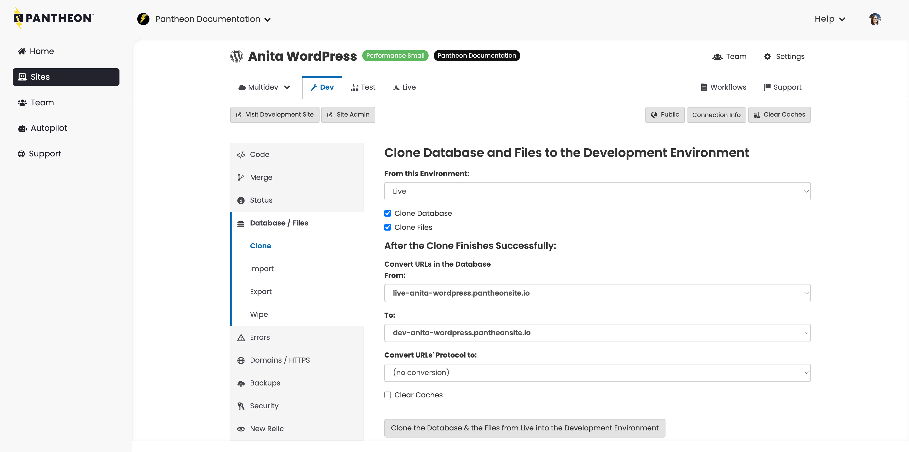

This section provides information on important Multisite fundamentals.

## Create Test and Live Environments from Dev
After you've configured a WordPress Multisite in the Dev environment, you'll want to promote it to Test and then Live. Before you use these environments, you'll need to initialize them.

WordPress stores full URLs in the database. These URLs can be links within the post content, as well as configuration values. This implementation detail means you need to perform a search and replace procedure when moving a database between environments. WP-CLI's `search-replace` command is a good tool for this job, in large part because it also gracefully handles URL references inside of PHP serialized data. Pantheon's [WordPress Multisite Search and Replace](/guides/multisite/search-replace) can handle this step for you and provides multiple configuration options depending on your desired workflow.

1. Configure the `search_replace` value in your `pantheon.yml` file based on what type of Multisite you are setting up and what your preferences are:

    * `true` for Subdirectory Multisite,
    * `custom` for Subdomain Multisite with a `sites.yml` file,
    * `convert` for a Subdomain Multisite to use Subdirectory for the Test and Live environments, or
    * `false` for no automatic URL conversion at all.

    Refer to the [WordPress Multisite Search and Replace](/guides/multisite/search-replace) guide for detailed instructions.

    <Alert title="Note" type="info">
        After July 31, 2023, true will be the default value for Multisite Search and Replace whether or not it exists in the pantheon.yml explicitly.
    </Alert>

2. [Go to the Site Dashboard](/guides/account-mgmt/workspace-sites-teams/sites#site-dashboard) and click the **<Icon icon="equalizer" /> Test** tab.

3. Click **Create Test Environment**.

  This takes a few moments.

4. Click **<Icon icon="externalLink" /> Visit Test Site**. This will open your Test site in a new browser tab with the URL `test-YOURSITE.pantheonsite.io`.

5. Deploy your code change from Dev to Test and refresh the Pantheon Dashboard.

6. Making sure that you've [configured your WordPress site to use Multisite](/guides/multisite/config/), use the [Database Workflow Tool](/guides/mariadb-mysql/database-workflow-tool) to clone the database from the Dev to the Test environment.

    

    <Alert title="Warning" type="danger">

    Pushing content up to Live should almost never be done to a launched site, as it can overwrite the environment configurations. Refer to [Using the Pantheon Workflow](/pantheon-workflow) for more information.

    </Alert>

7. Repeat the process for the Live environment.

## Run WP-CLI `search-replace` Manually

Terminus allows you to run WP-CLI commands yourself and, using that, you can manually run `wp search-replace`. The general pattern you'll want to follow is:

```bash
terminus remote:wp <site>.<env> -- search-replace "<old-domain>" "<new-domain>" --network --url=<old-domain>
```

**You should only need to run `wp search-replace` manually via Terminus if you are explicitly _not_ using the built-in [WordPress Multisite Search and Replace](/guides/multisite/search-replace).** Using WP-CLI with Terminus is simply a matter of calling Terminus with the correct `<site>` and `<env>` arguments:

In this example:

- `<old-domain>` is the domain currently stored in the database.
- `<new-domain>` is the new domain you'd like to replace the old domain with.
- `--network` tells WP-CLI to perform the procedure on all WordPress Multisite tables. Its default behavior is to limit search and replace to the current site.
- `--url=<old-domain>` sets the request context, which is how WordPress knows which site to load. Without this, you'll likely see “Error: Site not found.”

Refer to the [full documentation](https://developer.wordpress.org/cli/commands/search-replace/) for all supported features.

### Refresh Data from Live
Refreshing data in Test or Dev from Live is simply a matter of using the Database Clone feature in the Pantheon Dashboard. reversing the steps you took to initially create the Live environment when you have a production environment.

1. Clone the content from Live into Dev:

    ```bash
    terminus env:clone-content <site>.live dev
    ```

1. Run `wp search-replace` to update all domain configuration references:

    ```bash
    terminus remote:wp <site>.<env> -- search-replace <live-domain> <dev-domain> --network --url=<live-domain>
    ```

1. Flush the cache for the entire Dev environment:

    ```bash
    terminus env:cc <site>.dev
    ```

You can now develop against production data.

### Work with Large Databases
If you have a really large database (gigabytes and gigabytes) or dozens upon dozens of tables, you may notice that `wp search-replace` can take a really long time — or even time out.

To better understand what's going on, it's helpful to have some background knowledge.

`wp search-replace` is *probably* spending a lot of time processing data in the `post`  and `postmeta` tables. If you don't care about updating URL references within post data, then it may be iterating a bunch of data unnecessarily.

In a stock WordPress install (e.g. no custom plugins), there are a few key places URL configuration data is stored:

- `wp_blogs` table, `domain` column.
- `wp_site` table, `domain` column.
- `wp_options` table (for each site on the network), `home` and `site_url` option name.

Try running `wp search-replace` against this limited subset of data:

```bash
terminus remote:wp <site>.<env> -- search-replace <old-domain> <new-domain> wp_blogs wp_site $(terminus remote:wp <site>.<env> -- db tables "wp_*options" --network --url=<old-domain> | paste -s -d ' ' -) --url=<old-domain>
```

In this example:

1. we use `wp db tables` ([full documentation](https://developer.wordpress.org/cli/commands/db/tables/)) to list all database tables matching “wp_*options”.
2. `wp_blogs` and `wp_site` are appended to the list of tables we want to transform.
3. `wp search-replace` is limited to the table list specified, instead of the full database.

If the WordPress Multisite works as expected after you run `wp search-replace`, then you're good to go. If it doesn't quite work as expected, there may be some plugins storing URL data in other locations that you'll need to debug and further assess.

Ultimately, the key idea is to only perform a search and replace where you absolutely need it, instead of globally against the entire database.

##  Flush Cache Globally after Search and Replace
If you use Redis as a persistent storage backend for your object cache, you'll need to flush your cache each time you complete a set of search and replace operations to ensure it doesn't serve stale values.

With Terminus and WP-CLI, you can flush cache globally with one operation:

```bash
terminus remote:wp <site>.<env> -- cache flush
```

The Terminus command to clear all caches for an environment is:

```bash
terminus env:clear-cache <site>.<env>
```

Running into “Error: Site Not Found”? See [Troubleshoot](/guides/multisite/debug) for the cause and resolution.


<Alert title="Note" type="info">
Because the WordPress object cache stores its data as key => value pairs and WordPress Multisite simply adds the blog ID to the key, flushing cache is a global operation for those using persistent storage backends.
</Alert>

## Go for Launch
In reading through this guide and participating along the way, you're now fully up to speed on managing a WordPress Multisite on Pantheon. Check out the [Launch Essentials Guide](/guides/launch) when you're ready to push your site live — launching a WordPress Multisite isn't much different than launching a standard WordPress site.

Continue to the next page for some tips on how to manage networks and debug common issues.

## More Resources

- [Content Staging in WordPress](/content-staging#content-staging-in-wordpress)

- [Database Workflow Tool](/guides/mariadb-mysql/database-workflow-tool)

- [Developer Workflow](/workflows)
