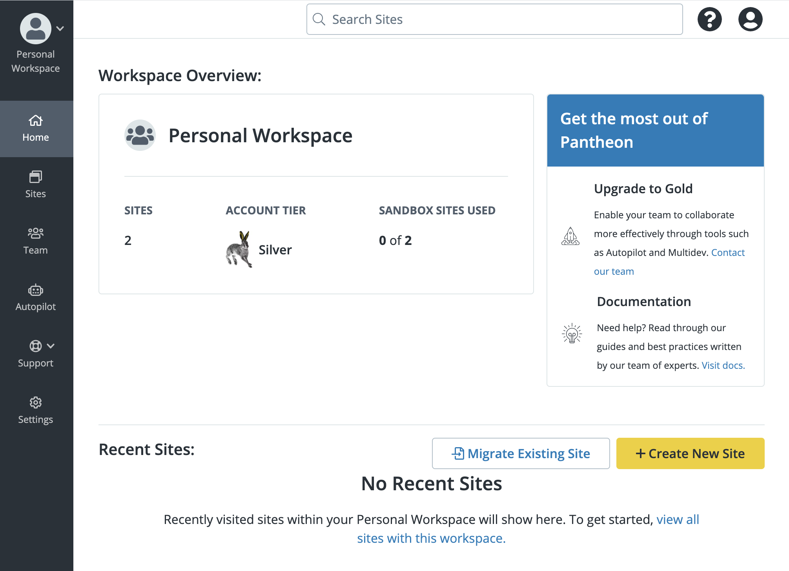

The new Pantheon Dashboard is WebOps in a single, fast Workspace. Easily visualize and manage sites, users, traffic, metrics, visual regression testing (VRT), and everything else to keep your developer experience smooth and uneventful.

## Get Access

Want to try the New Dashboard?

Click **Try the New Dashboard** in the User or Organization Dashboard to access the new Dashboard. 

Alternatively, you can navigate to your existing Dashboard, then add `/beta/workspace/` between `pantheon.io` and your [UUID](/glossary#uuid). For example: `pantheon.io/beta/workspace/de305d54-75b4-431b-adb2-eb6b9e546014`. You'll be immediately directed to the default Workspace on the New Dashboard. Click **Sites** on the left to access the Sites view.

<Alert title="Limited Availability" type="info" icon="leaf">

The New Dashboard is available as a Limited Availability feature release while additional features are in active development. Pantheon engineers are rolling out new functionality often.

</Alert>

## Features of the New Dashboard

### Autopilot

[Autopilot](https://pantheon.io/autopilot?docs) tracks and implements changes, and alerts you if something looks off. See the [Autopilot](/guides/autopilot) documentation to learn how to use Autopilot to handle your WebOps.

### Pantheon Support

The same great [Support](/support) you already love. The New Dashboard makes it easier to find the right resources, whatever your question is, wherever you are in your Workspace.

For quick access to the old Dashboard and Pantheon Documentation, <i className="fa fa-question-circle"></i>

## Sites

Select the **Sites** tab in the left-navigation menu to search for a Site, migrate an existing Site, or create a new Site. 

### Create a New Site

You can create a new Site from the new Dashboard homepage or from the **Site** tab. 

To create a Site, click **Create New Site**. You will be directed to the Classic Dashboard for Site creation. Click **Yes,Continue** to be directed to the  **Create Your Pantheon Site** page. For more information on Site creation, refer to the [Creating Sites](/create-sites) documentation. 

## Utility Navigation

Your user icon, Gravatar, or <i className="fa fa-user-circle"></i> by default, gives you quick access to your User Settings and information about who you're logged in as.

### Home

On the homepage, you have access to an overview of the Workspace that provides the following information:

* Workspace type
* Sites
* Account Tier

### Workspaces

Each Workspace is a portal for all your Site and Organization WebOps needs.

Switch between Workspaces to manages each one's Sites, Users, Upstreams, and settings.
