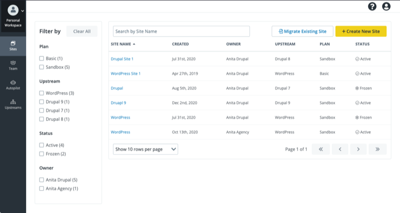
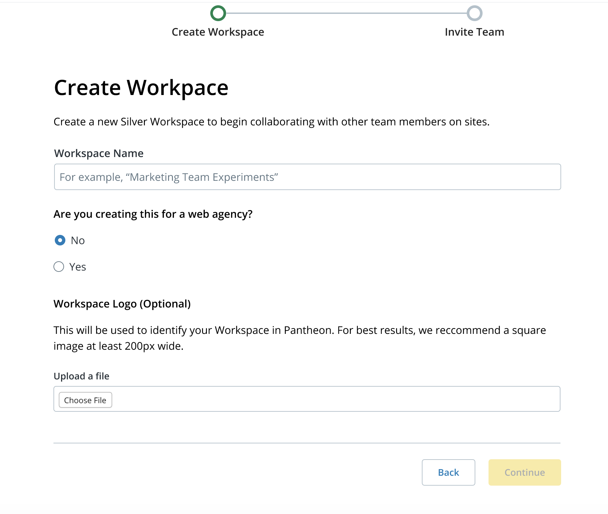
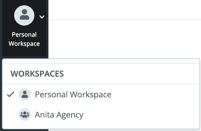
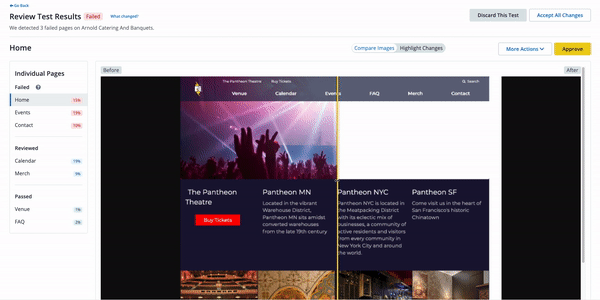

## What is a Workspace?

[<dfn id="worksp">Workspaces</dfn>](/guides/new-dashboard) are the improved version of the Legacy Dashboards, with Pantheon features and actions that are conveniently available in one place.

### Create a New Workspace

#### Organization Workspace

To create a new Workspace from the Dashboard, click the Organization’s name and icon in the upper left of the Global Primary Navigation, and select **Create New Workspace** from the drop-down menu. 

If you are creating the the Workspace for a web agency, you will be assigned a [Partner Trial Tier](https://pantheon.io/plans/partner-program). If the Workspace is not for an agency, you will be assigned a [Silver Tier Workspace](https://pantheon.io/plans/pricing).

### Switch Between Workspaces

If you're a member of multiple [Organizations](/organizations), you can stay logged in, and switch between Workspaces to work on personal projects or to work between Organizations.

Click the Organization’s name and icon in the upper left to switch between Workspaces:

## Sites

The **<i className="fa fa-window-restore"></i> Sites** tab shows a table of all the Sites your user has access to within the current Workspace. Filter by Plan, Upstream, Status, or owner from the left, or use the buttons in the upper right to migrate an existing site or to create a new site.

Click a table heading to sort the table by that heading.

## Team

By default, all users are assigned the Administrator role after the Workspace is created.

Manage team members and assign [roles and permissions](/change-management#roles-and-permissions) in the dashboard. If you're working with a [Partner Agency](https://pantheon.io/plans/partner-program?docs), add them as a Supporting Organization.

## Autopilot

[Autopilot](/guides/autopilot) is Visual Regression Testing (VRT) for every WordPress and Drupal Site within your Workspace.

Once it's enabled, use it to visually compare changes to the site. Visit the [Autopilot documentation](/guides/autopilot) for more information.

### Webhooks

Webhooks allows you to set up integrations from third-party applications and subscribe to different events in the [New Dashboard](/guides/new-dashboard). When an event is triggered, you will receive a notification. This feature is workspace-specific, so anyone who has Admin permissions to a particular workspace has access.

#### Create A Webhook

1. Navigate to the workspace where you want to set up a webhook > Click  **Settings** > Click **Webhooks**.

1. Click **+ Create New Webhook**.

1. Name your Webhook.

1. Fill in your Callback URL. This is provided by whichever third-party app you are using to create your webhook.

1. **Optional** Add a Secret Token. Some applications will require this, some will not; for those that do not require it, you can still choose to add one.

1. Choose a webhook event- either Visual Regression Tests (VRT) or Site Deployments. Please note that if you want to set up both webhook events, you need to repeat the process for both options.

1. Click **Create Webhook**.

On the Webhooks page, you have the option to enable or disable your Webhook, edit your Webhook, or delete it.

After you create your webhook, the app you used is automatically subscribed to it and you now have access to the output of the payload. The payload can be modified in several ways. For example, you can:
	
	- Hook into a Slack channel and get a notification whenever a site was deployed or a VRT result comes back.
    - Email a specific person when the VRT result comes through.
    - Trigger an alert every time Autopilot runs.

Access to Webhooks deployment alerts is available to all tiers. Gold Accounts and higher can subscribe to Autopilot events. Check out our [pricing page](https://pantheon.io/pricing?docs) and contact [Sales](https://pantheon.io/earlyaccess/autopilot?docs) to talk through what plan is best for your needs.

## Upstreams

Create a new Workspace-specific [Custom Upstream](/custom-upstream) using a GitHub or Bitbucket repository. Custom Upstreams all you to use an external repository as a template for your site.

1. To add a custom Upstream in the Organization Workspace, select the **Upstream** tab. 
1. On the Custom Upstreams page click **Add New Upstream**. The Create New Custom Upstream page is displayed. 
1. Enter the URL of your GitHub or Bitbucket repository. URLs from the pantheon-systems GitHub workspace will not work.
1. Select the **Framework** and **Initial Connection Mode**.
1. Add the desired name and a description. Adding a description is optional.
1. Click **Save**.

After the Upstream has been added to your Dashboard, select from the list of available Custom Upstreams and click **Create Site From Upstream**. 

Click **More** in the Custom Upstream to edit or delete. After you click **Edit Settings** you are directed to the Upstream Settings page. Modify the page and click **Save**.

To delete, click **Delete Upstream** from the **More** drop-down menu. 

## Support

Chat with Pantheon Support or access and create new Support tickets.

## Settings

Use the **Settings** tab to modify the Workspace name, logo, billing information, and if your Organization is configured for it, billing terms and instructions for your team.
