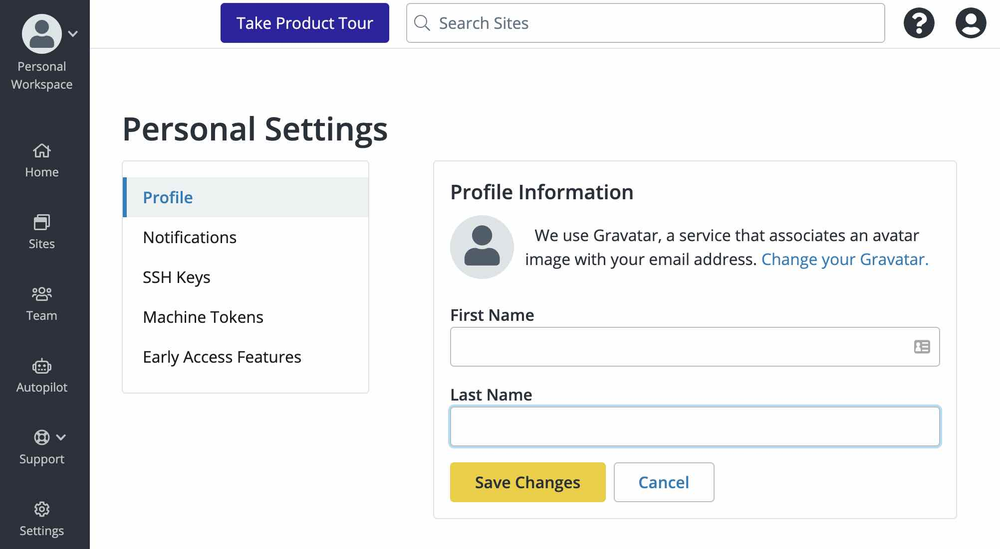

The Personal Settings of your profile help you control several key aspects of the Dashboard. To update your personal settings click the Gravatar in the upper right corner and then click **User Settings**.

## Profile

Update your name, email address, password, or [delete your account](/delete-account).

### Login Details

You can update the current email address or password associated with your Dashboard.

#### Email

To update the email address, click **Change Email Address**. Enter the updated email address in the **New Email Address** field and click **Save Changes**.

#### Password

To update the password, click **Change Password**. You are directed to a page where you are prompted to enter your current password and your desired new password. Enter the updated password in the **New Password** field, confirm your entry, and then click **Save Changes**.

When changing your password, make sure the new password meets the following requirements:

* At least 8 characters
* A mixture of both uppercase and lowercase letters
* A mixture of letters and numbers
* Inclusion of at least one special character. For example, use !, @, #, ?, %. Do not use < or > in your password.

You’ll need to log in again after your password is changed.

## Notifications

### Autopilot Email Notifications

<Partial file="autopilot/autopilot-email-notifications.md" />

## SSH Keys

SSH keys allow you to establish a secure connection between your computer and Pantheon. Visit the SSH Keys tab to review your existing configured keys, and add or revoke SSH keys. Follow the steps in [SSH Keys](/ssh-keys) to generate, add, and revoke SSH keys. 

## Machine Tokens

## Early Access Features

If you would like to be directed to the new dashboard interface when you log in to Pantheon, select **ON**. Otherwise to disable this feature, select **OFF**.

If you choose to use the new Dashboard, you will not be able to navigate to your User or Organization Dashboard. Certain features, such as site billing, are not currently available in the new Dashboard.
