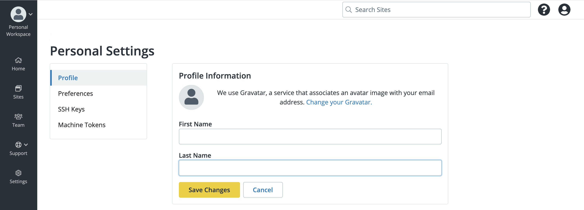

## Personal Settings

The Personal Settings of your profile help you control several key aspects of your with the dashboard. You can update your personal settings by clicking your avatar in the top-right corner and click **User Settings**.

### Profile
Update your name and email settings. 

### Preferences

You can use the option to choose whether you recieve email alerts for the following:
* Weekly activity Digest - Summary of Autopilot activity across all sites within the workspace that Autopilot is enabled
* Failed Visaul Regression Tests - Real-time email alerts for failed VRT test for a specified site  

Additonally, if you would like to be directed to the new dashboard interface when you log in to Pantheon, select **ON**. Otherwise to disable this feature, select **OFF**. 

