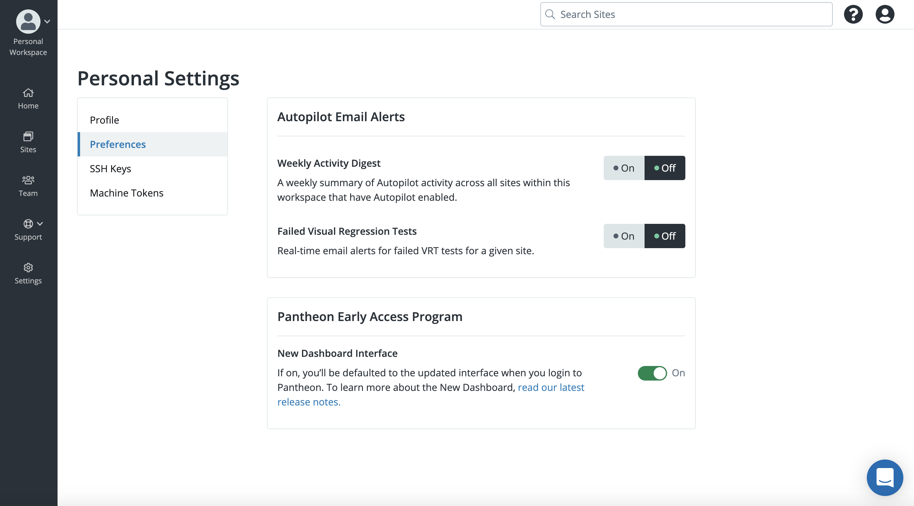

The Personal Settings of your profile help you control several key aspects of the Dashboard. To update your personal settings click the Gravatar in the upper right corner and then click **User Settings**.

## Profile

Update your name, email address, or [delete your account](/delete-account).  

### Login Details
You can update the current email address or password associated with your Dashboard. 

#### Email
To update the email address, click **Change Email Address**. Enter the updated email address in the **New Email Address** field and click **Save Changes**.

#### Password
To update the password, click **Change Password**. You are directed to a page where you are prompted to enter your current password and your desired new password. Enter the updated password in the **New Password** field, confrim your entry, and then click **Save Changes**.

When changing your password, make sure the new password meets the following requirements:

* At least 8 characters
* A mixture of both uppercase and lowercase letters
* A mixture of letters and numbers
* Inclusion of at least one special character. For example, use !, @, #, ?, %. Do not use < or > in your password.

You’ll need to log in again after your password is changed.

## Preferences

### Autopilot Email Alerts
You can choose whether you receive email notifications for the following:
* **Weekly activity Digest** - Summary of Autopilot activity across all sites within the workspace that Autopilot is enabled
* **Failed Visaul Regression Tests** - Real-time email alerts for failed VRT test for a specified site  

### Pantheon Early Access Program

If you would like to be directed to the new dashboard interface when you log in to Pantheon, select **ON**. Otherwise to disable this feature, select **OFF**. 

The Early Access option is recommended for Autopilot users. If you choose to use the new dashboard, you will not be able to navigate to your User organization and will not be able to view certain features. If you select the Early Access option, you will not be able to view Billing or older features.
