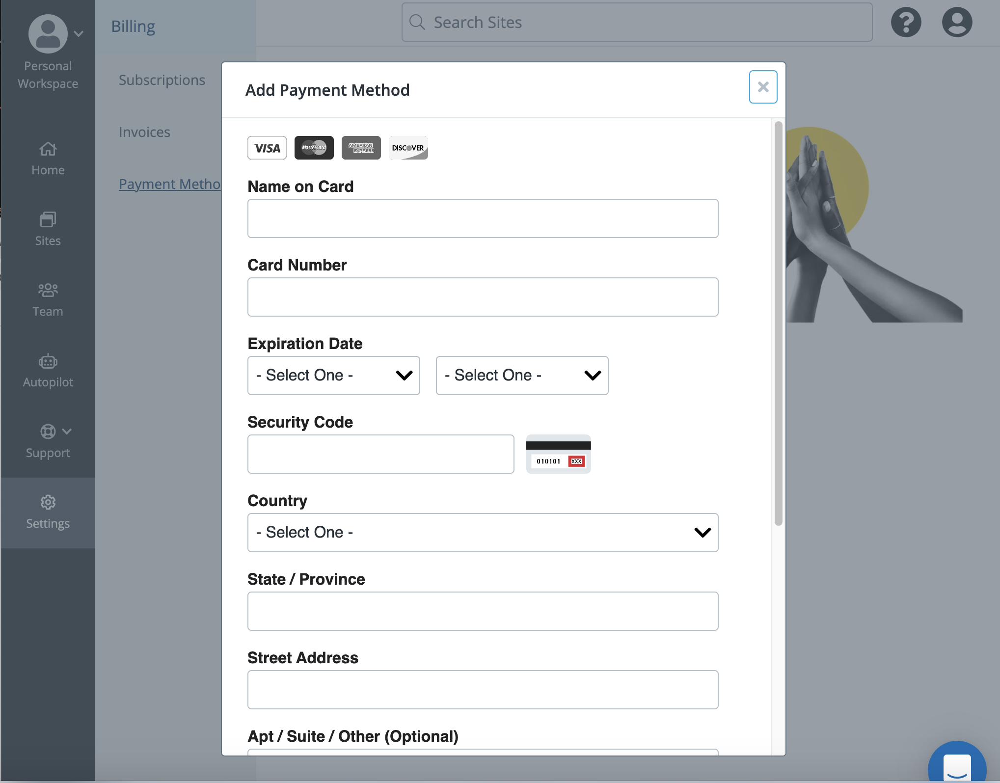

## Billing

### Site Subscriptions

You can manage the Site plans, view the plan history, and change the plan's billing cadence. Click **Subscriptions** to search and filter by Site plans and payment methods.

### Invoices

You can manage all the invoices in your workspace. Click **Invoices** to view the following information:

* Invoice date
* Invoice number
* Payment method
* Payment amount

### Payment Methods

You can use multiple payment methods in the workspace. To add a payment method, click **Add Payment Method**. 

