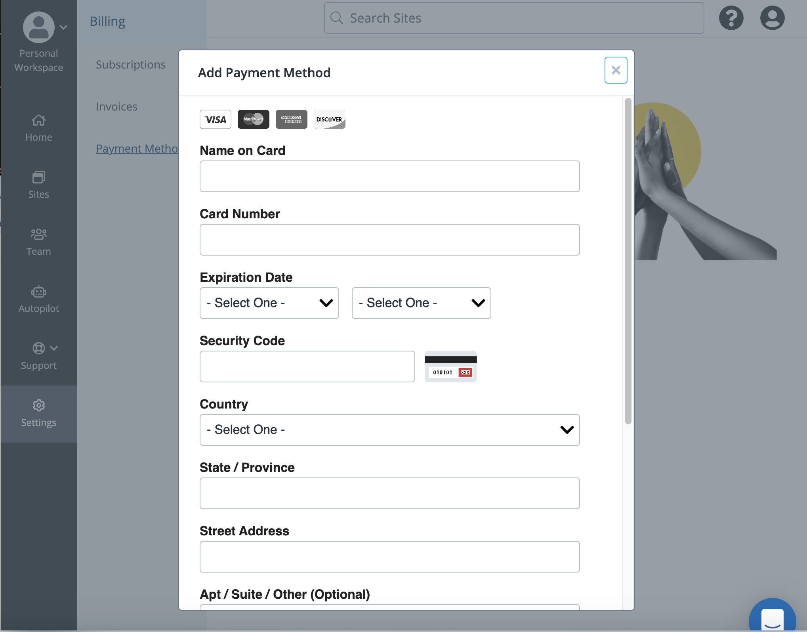

## Personal Workspace

### Site Subscriptions

You can manage the Site plans, view the plan history, and change the plan's billing cadence. Click **Subscriptions** to search and filter by Site plans and payment methods.

### Invoices

You can manage all the invoices in your workspace. Click **Invoices** to view the following information:

* Invoice date
* Invoice number
* Payment method
* Payment amount

### Payment Methods

You can use multiple payment methods in the workspace. To add a payment method, click **Add Payment Method**. 

## Organization Workspace
Workspace settings are visible to Admins only.

### Site Billing Terms
You can add optional payment and terms of service information for Sites built in your Workspace.

Users can purchase a site plan on a Sandbox site. Enter a site address in the **Customized Billing Instruction URL** field to direct users where they can view workspace billing instructions.

If a user attempts to update a site plan for any site that is not in a Sandbox, the user can view you administrators that can assist them. 

You can enter terms and conditions that are displayed to Workspace members.

