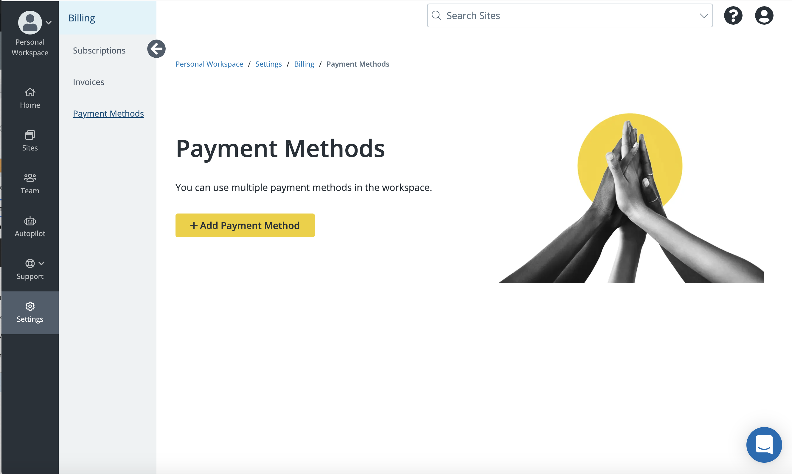

## Overview

Workspace Billing allows you to add and manage subscription plans, change billing frequency, view the billing history for each renewal, and update payment information, all in one place.

Workspace Billing is available in the New Dashboard for Personal Workspaces. Navigate to the Personal Workspace and click the **Settings** tab from the Primary Global Navigation. The Billing menu is displayed which grants you access to subscriptions, invoices, and payment methods.

## Frequently Asked Questions

### Who can use Workspace Billing?

Currently, Workspace Billing is available to all account tiers in your Personal Workspace.
