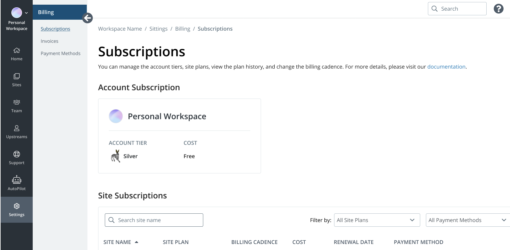

Navigate to the Billing menu from your Personal Workspace to manage invoices, site subscriptions, and payment methods available to your users.

## Billing

To access the Billing menu in your Personal Workpsace, click **Settings** in the Primary Global Navigation. From the Billing menu, click **Subscriptions**.

When there is no current payment method associated with a user, Workspace Billing for Personal Workspaces displays the [Payment Methods](#payment-methods) screen.

If a payment method is associated with a site subscription, sites will be listed in the [Site Subscriptions](#site-subscriptions) table.

## Subscriptions

The Subscriptions page catalogs your access to sites in your Personal Workspace and the payment methods used.

Subscriptions can be sorted by the following information:

* Site name
* Site plan
* Billing cadence
* Cost
* Payment method

### Account Subscription

The account tier and cost is displayed on the Subscriptions page. You can view updates to the Personal Workspace account tier. Currently, you can not edit or manage account tiers with Workspace Billing. 

### Site Subscriptions

By default, sites are listed by name. You can sort according to your preference. For more information on a site in your Personal Workspace, you can click the site name in the Site Subscriptions table or click the **Sites** tab. Additionally, you can filter sites by site plan or payment method.

### Change Site Plan

You can upgrade and change site plans. Upgrades will change your site's resources and access to features immediately. The card associated with your site will be charged a prorated amount for the remainder of the current billing period. You can view site plan changes from the actions menu

Site plan downgrades will change your site's resources and access to features immediately. Beginning on the next billing cycle, the associated card will be charged for the new site plan. No prorated refunds or credits will be issued for site downgrades.

You can view site plan changes on the Subscriptions page.

### Change Billing Cadence

You can select either an annual or a monthly billing cadence. Click the [Site Billing](/site-billing) tab of the New Dashboard, to transfer site ownership and payment responsibility.

#### Roles & Permissions

The permission to manage a site's plan is granted only to the roles of **Site Owner**. Other roles do not have access to change the site plan. For more information, refer to [Role-Based Permissions & Change Management](/change-management/#site-level-roles-and-permissions).

If you need to assume site and billing ownership, the current Site Owner must [transfer it to you directly](/site-billing#transfer-ownership-and-billing-for-this-site).
