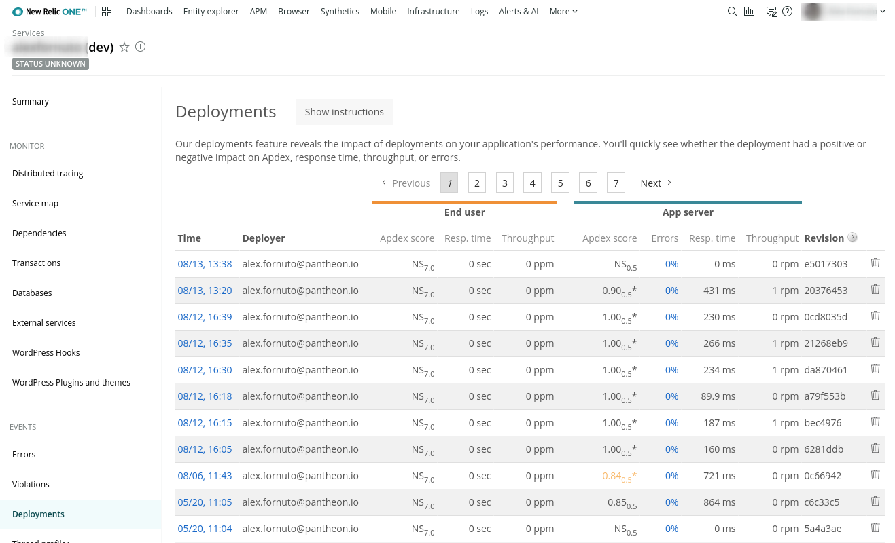

New Relic is a powerful tool for monitoring the performance of a WordPress or Drupal site. It provides insight into how efficiently a website is using resources, and where improvements can be made in the application. Pantheon offers New Relic Pro within the Site Dashboard on all sites for free.

In this guide, we'll automatically label code changes to your site in New Relic's Deployment page using Pantheon's Quicksilver hooks. This creates a traceable connection between performance changes and code deployments, allowing developers to see if a code change positively or negatively impacted performance.

## Activate New Relic Pro

1. From the Site Dashboard, click **<span class="glyphicons glyphicons-eye-open"></span> New Relic**.
2. Click **Activate New Relic Pro**. The Site Dashboard will begin showing New Relic data shortly after an environment receives web requests.
3. Click the **<span class="glyphicons glyphicons-new-window-alt"></span> Go to New Relic** button.

## Configure Quicksilver Hook to Record Deployments
Next, we'll use Pantheon's Quicksilver hooks to run our example [New Relic script](https://github.com/pantheon-systems/quicksilver-examples/blob/master/new_relic_deploy/new_relic_deploy.php) immediately after code is synced on Dev or a Multidev environment and after code is deployed to Test and Live. The script configured in this guide applies a label to the Deployment page in New Relic.

In the commands below, replace `<site>` with your Pantheon site name.

1. If you haven't done so already, [clone your Pantheon site repository](/git#clone-your-site-codebase) and navigate to the project's root directory:

  ```bash
  terminus connection:info <site>.dev --fields='Git Command' --format=string
  cd <site>
  ```

1. Set the connection mode to Git:

  ```bash
  terminus connection:set <site>.dev git
  ```

1. Create a copy of [Pantheon's `new_relic_deploy.php`](https://github.com/pantheon-systems/quicksilver-examples/blob/master/new_relic_deploy/) script in the project's private path:

  ``` bash
  mkdir private
  mkdir private/scripts
  curl https://raw.githubusercontent.com/pantheon-systems/quicksilver-examples/master/new_relic_deploy/new_relic_deploy.php --output ./private/scripts/new_relic_deploy.php
  ```

1. Create a `pantheon.yml` file if one doesn't already exist in your root directory.

1. Paste the following workflow into your `pantheon.yml` file to hook into the platform after code is synced on Dev/Multidev and deployed to Test/Live to fire off the New Relic integration script:

  ```yaml
  api_version: 1

  workflows:
    # Log to New Relic when deploying to test or live.
    deploy:
      after:
        - type: webphp
          description: Log to New Relic
          script: private/scripts/new_relic_deploy.php
    # Also log sync_code so you can track new code going into dev/multidev.
    sync_code:
      after:
        - type: webphp
          description: Log to New Relic
          script: private/scripts/new_relic_deploy.php
  ```

   <Alert title="Note" type="info">

   `api_version` should be set once in [`pantheon.yml`](/pantheon-yml/). If you have an existing `pantheon.yml` with this line, don't add it again.

   </Alert>

1. [Add, commit, and push](/git#push-changes-to-pantheon) changes to the Dev environment:

  ```bash
  git add private/scripts/new_relic_deploy.php
  git commit -am "Adding deployment recording to New Relic"
  git push origin master
  ```

    In the terminal, you should see that your `pantheon.yml` file is being applied. Even this initial code push should appear in your Dev environment's New Relic account, on the **Deployments** tab:

    

    You can also view deployments from the Overview tab:

    

1. Once you've tested and confirmed there are no issues, deploy your new commit to Test and Live. From now on, your deploys will be recorded in New Relic.

## Conclusion
This is a fast way to integrate New Relic and Pantheon. The [Quicksilver Examples](https://github.com/pantheon-systems/quicksilver-examples) repository provides many more ways to automate development, so please take advantage of them and extend them to fit your workflow.
