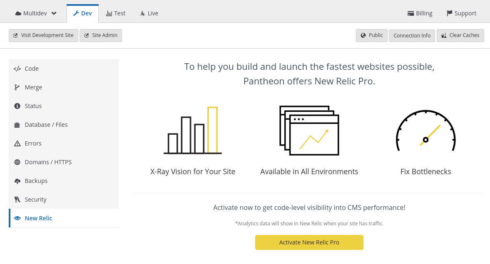
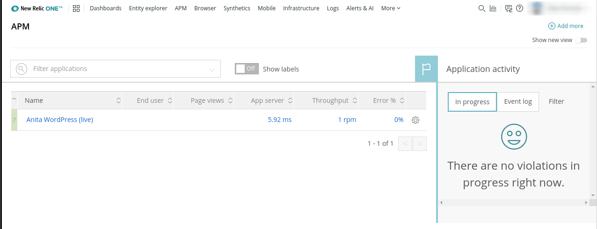
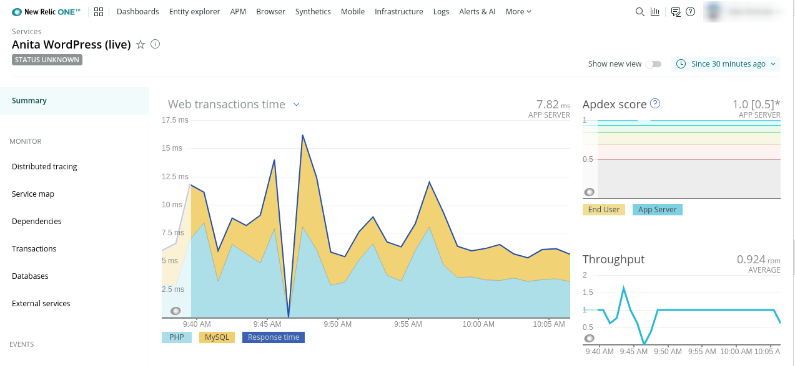

This section provides steps on how to activate and configure your New Relic&reg; account.

## Activate New Relic&reg; Performance Monitoring

New Relic&reg; is automatically enabled for all application containers added to the site, including Multidev environments. You can activate New Relic&reg; in the Site Dashboard if you or a team member previously disabled it.

1. Select the <i className="fa fa-eye"></i> **New Relic** tab on your Site Dashboard, and then click **Activate New Relic Pro**:

  

1. Visit your site in the browser a couple of times to generate data in New Relic&reg;.

1. Allow a few minutes to pass and then navigate to the **New Relic** tab on your Dashboard and click **Go to New Relic**.

## Configure New Relic&reg; Performance Monitoring Access

1. Go to the <i className="fa fa-eye"></i> **New Relic** tab on your Site Dashboard, and click **Go to New Relic**:

  

1. Ignore the **Get started** button, and select **APM** from the menu at the top:

  

1. Agree to the New Relic&reg; Terms of Service to access the data for your site:

  

  

### Who is the New Relic&reg; account associated with?

- If the site owner is a **user**, the site owner's name and email address are used to create the New Relic&reg; account.

- If the site owner is an **organization**, the name and email address of the organization's Pantheon user who activates New Relic&reg; is used to create the New Relic&reg; account.

In both cases, there is not a one-to-one mapping between Pantheon users and New Relic&reg; users. Every Pantheon user who selects **Go to New Relic** from the Pantheon dashboard is logged in as the same New Relic&reg; user.

## Configure Ping Monitors for Availability

New Relic&reg; provides a free availability monitoring service within their Synthetics tool suite at the Lite service level. This basic monitoring check sends a request to designated URLs from configured locations at given intervals and alerts you via email when a response fails. 

To configure this service:

1. Click **New Relic** and then click **Go to New Relic** from the target environment within the Site Dashboard on Pantheon.

1. Select **Synthetics** from the menu bar at the top of the page.

1. Click **Add new** on the **Monitors** tab (default) and enter the details for the URL you want to monitor.

1. Select the locations you wish to check the site from. We recommend picking locations that correspond to your site's visitors to reduce the risk of false positives due to long-distance networking issues.

1. Set the frequency for checks. We suggest 5 minutes.

1. Provide an email address for notifications.

1. Click **Create my monitor**.

Pantheon can provide New Relic&reg; Ping monitoring for free as part of the service. However, more advanced monitoring — full browser testing, or scripted interactions — are only available to customers on an annual contract at an additional cost. Review [New Relic Ping Monitors](/guides/pagerduty/monitor/) for more details.

## More Resources

- [New Relic&reg; Ping Monitors](/guides/pagerduty/monitor/)

- [New Relic&reg; Labelling with Quicksilver](/guides/new-relic/new-relic-quicksilver)

- [New Relic&reg; FAQ](/guides/new-relic/new-relic-faq)
