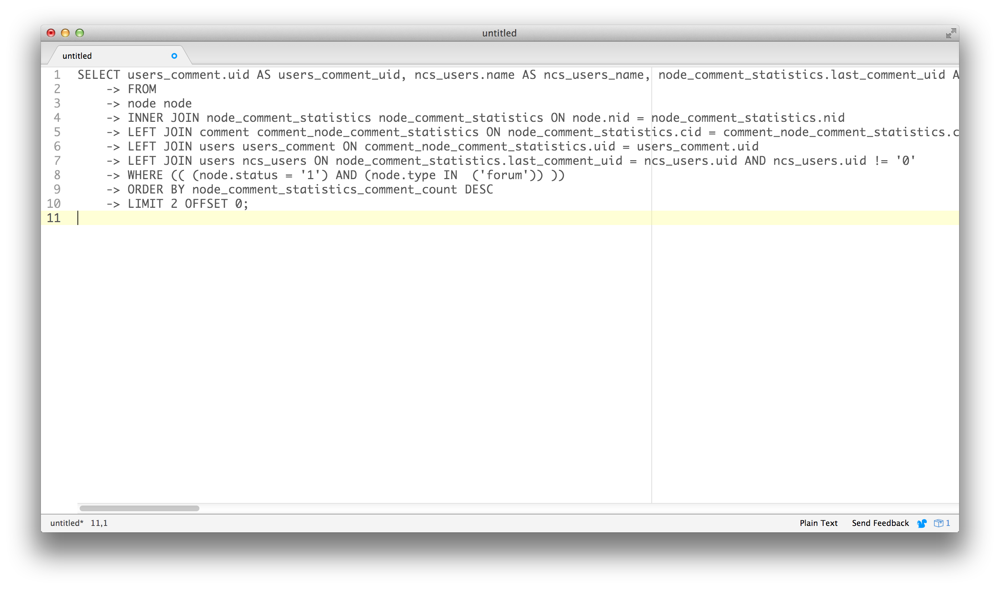
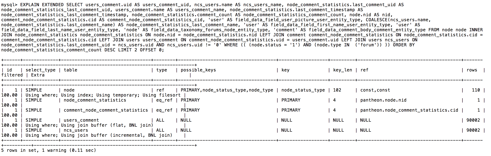
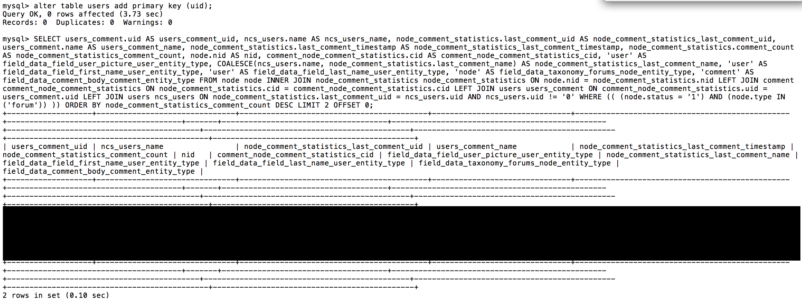

This sections provides information on how to solve MySQL issues with New Relic&reg;.

Modern reporting services that are integrated with your site help speed up the process of going through MySQL and PHP slow logs to find issues. There are a few different systems to choose from- at Pantheon we use [New Relic&reg; Performance Monitoring](/guides/new-relic). The information below explains how you can troubleshoot MySQL databases with New Relic&reg; APM.

## Open New Relic&reg; Performance Monitoring

1. Navigate to the Site Dashboard of the site you suspect is having problems with MySQL query performance.

1. Select the environment: Dev, Test, or Live.

1. Click the **New Relic** tab, and then select **Go to New Relic**.

## Investigate Activity

1. Select the application the issue has been reported on (Dev/Test/Live). By default New Relic&reg; Performance Monitoring lists your **Applications**.

1. Use the graph to locate the time period in which the issue occurred. This is usually visually apparent through large spikes in the graph. If it is not apparent, use the New Relic&reg; time period selection tool to broaden your search (30 min, 60 min, 3 hours, etc.) until you find the problem.

1. Highlight the spike in activity you want to investigate. New Relic&reg; will reload the page with the time frame you've selected.

1. Click **Transactions**. It is sorted by **Most Time Consuming** by default, but this can be a false positive, as it measures a sum of time loading specific transactions, not the time per individual transaction. If a particular item is called 10x more than another, but loads quickly, it's **sum** will send it to the top of the list even if it's behaving properly.

1. Choose **Slowest average result time**. This will re-sort the order, bringing the slowest performing items to the top.

### Drupal Sites

At times, systems like Drupal's Watchdog appear at the top of the results for slow result time. In general, this is an indication that the MySQL database is under duress. Look for complex entities, such as Panels and Views, or custom functionality that's specific to the site in question.

## Review Log Entries

1. Click the most likely subject to review the details of that transaction. Scroll down, and note the transaction traces.

1. Select the worst transaction trace to review a complete stack trace of that particular transaction.

1. Click **SQL statements** to get a more detailed breakdown.

1. Scroll through the results until you find something suspicious.

1. Locate the path of the suspicious entry near the bottom of the page to get details on how and where the issue is occurring.

    - The New Relic&reg; Performance Monitoring trace does not give the full query. New Relic&reg; trace information only shows the query with placeholders, which cannot be executed against MySQL as is. To do that, you'll need to look in the MySQL slow log, described in the section below.

### Review the Slow Log

1. Navigate back to the site's panel on the Dashboard and get the SFTP connection information.

1. Follow the steps in the [MySQL Access](/guides/mariadb-mysql/mysql-access#frequently-asked-questions) doc to connect to MySQL via SFTP through your terminal or an FTP program that supports the SFTP protocol.

1. [Download database log files](/guides/logs-pantheon/access-logs#database-log-files) and review the `mysql-slow-query.log` file.

1. Search for the query within the log. If it isn't there, download and unzip any applicable archived slow logs (for example, `mysqld-slow-query.log-20160606`) and search there. The archived slow logs are created by date and time, so look for the one that corresponds with the trace you are working with.

1. Use the information from the New Relic&reg; trace to find the full query in the slow log. Tips: 

    - Choose a distinctive part of the query. The example here uses `grep -c users_comment.uis AS users_comment_uid` to get the number of times that field has been included in the slow log.

    - If the log is small enough (or if you have enough RAM), you can load it into your favorite text editor or IDE instead.

 ​

1. Close out the SFTP session and get the MySQL CLI information for the Test MySQL server. If the Test server has major differences from your Live server, you can either connect to Live (not recommended) or clone your Live database to your Dev or Test environment via your Pantheon Dashboard.  

1. Connect to the MySQL server of your choice and run the query.

 

    - Tips for reviewing the query:

         - If the results confirm your suspicions, as the one above does, dig deeper to find out why the query is not functioning properly. Type [EXPLAIN](https://dev.mysql.com/doc/refman/5.7/en/explain.html) and then re-paste the query. MySQL will display extended information on how it’s [executing the query](https://dev.mysql.com/doc/refman/5.7/en/using-explain.html). 
         
         - Look for odd things. For example, the one below doesn't look that bad, except that the users table is referenced twice via alias and there isn't a single key index being used to search them. Looking at that table with a MySQL `describe` command shows that there is no primary key set on the UID field.

        

        
        Now that the problem has been found, it can be addressed. In this case, simply adding in the primary key and re-running the query gets a much improved query performance of 0.10 seconds.
        
        

## Recap

1. Use New Relic&reg; Performance Monitoring to narrow and identify periods of time that have high load and/or slow response times.

1. Narrow down the scope to one of those time periods and find the worst performing transactions.

1. Go into the SQL trace to discover long running queries within those transactions.

1. Use SFTP to download the appropriate MySQL Slow Log and retrieve the query in its entirety.

1. Connect to a safe MySQL server via CLI and run the query to test the performance.

1. Use the `EXPLAIN` and `EXPLAIN EXTENDED` MySQL command to get additional information if the query result is poor. You can also examine the MySQL tables for structural issues using the `DESCRIBE` and `ANALYZE` commands.

1. Correct the issue when you discover it. The fix may be to adjust the SQL query itself, or it can be within the application by redoing code or configurations that are creating the errant query.

## More Resources

- [Troubleshoot New Relic&reg;](/guides/new-relic/troubleshoot-new-relic)

- [New Relic&reg; FAQ](/guides/new-relic/new-relic-faq)
