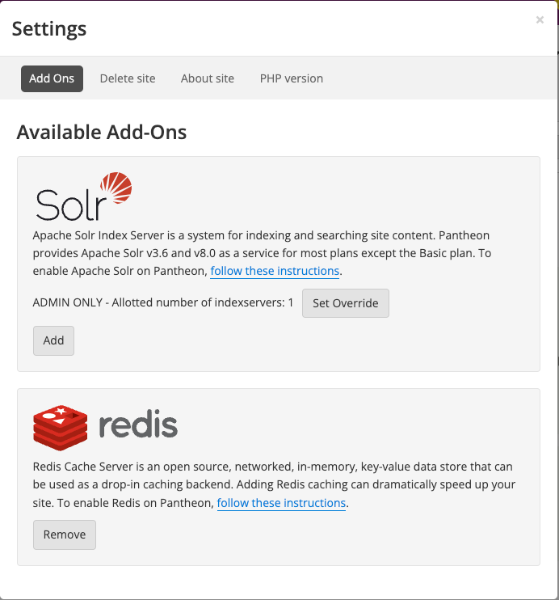

<Alert title="Early Access Software" type="info">

Pantheon's Object Cache Pro is available for [Early Access](/guides/support/early-access/) participants. Features for Object Cache Pro are in active development. However, Object Cache Pro is a stable product and is in use on production sites. Refer to the email you received when you signed up for Object Cache Pro Early Access if you have questions. Please review Pantheon's [Software Evaluation Licensing Terms](https://legal.pantheon.io/#contract-hkqlbwpxo) for more information about access to our software.

</Alert>

## Before You Begin

Before you can install and activate Object Cache Pro, verify that you have:

- A working site on Pantheon with Redis enabled.

	- You can [activate Redis](/guides/object-cache/enable-object-cache) either from the Pantheon dashboard or with Terminus.

- You have received an email in response to [signing up for the Early Access program](https://forms.gle/3EpZcELcYqB2VRKC8). The email should contain a download link and a license token. Throughout this process the license token will be displayed as `<LICENSE-TOKEN>`.

### Activate Redis on the Dashboard

1. Navigate to your **Pantheon Site Dashboard**, select **Settings**, and then select **Add Ons**.

1. Click the **Add** button under **Redis**. It might take a couple of minutes for the Object Cache server to come online. You will see a success message in a green box stating that Redis has been enabled.



### Activate Redis with Terminus

Run the command below to enable Redis via the command line with Terminus:

```bash{promptUser: user}
terminus redis:enable <site>
```

## Installation and Configuration for Regular WordPress Sites

1. Open the email you received after signing up for Early Access Object Cache Pro on Pantheon.

	<Alert title="Note" type="info">

	This link will always point to the latest version of Object Cache Pro. Be sure to store it in a safe place so you never miss out on updates to Object Cache Pro.

	</Alert>

1. Click the link in the email and download the file to install the Object Cache Pro plugin.

1. Unzip the file and add it to your WordPress install as you normally would.

	- There are some configuration options that you must add to set it up the plugin now that you have Object Cache Pro in your codebase. All of these options are stored in your `wp-config.php` in the root of your site repository.

1. Add the license token into your `wp-config.php` file. Note that the license key will be provided by the platform in the future. Currently, you are responsible for adding it to your repository. Open the `wp-config.php` file and add the values below to the `WP_REDIS_CONFIG` constant somewhere above the `/* That's all, stop editing! Happy Pressing. */` line at the bottom of the file.

	```php
		/**
		 * Object Cache Pro config
		 */
		define( 'WP_REDIS_CONFIG', [
			'token' => '<LICENSE-TOKEN>',
		] );
	```

1. Add Object Cache Pro configuration options after `define( 'WP_REDIS_CONFIG', [` in `wp-config.php` for a **standard WordPress** site. Note that there are more [configuration options](https://objectcache.pro/docs/configuration-options) that can be added. We recommend using the below settings which are optimized for Pantheon if you don't know specifically what each option does. The full, recommended contents of the `WP_REDIS_CONFIG` constant are:

	```php
		'token' => '<LICENSE-TOKEN>',
		'host' => $_SERVER['CACHE_HOST'] ?? '127.0.0.1',
		'port' => $_SERVER['CACHE_PORT'] ?? 6379,
		'database' => $_SERVER['CACHE_DB'] ?? 0,
		'password' => $_SERVER['CACHE_PASSWORD'] ?? null,
		'maxttl' => 86400 * 7,
		'timeout' => 1.0,
		'read_timeout' => 1.0,
		'debug' => false,
		'analytics' => [
			'enabled' => true,
			'persist' => true,
			'retention' => 3600, // 1 hour
			'footnote' => true,
			],
	```

1. Make sure you `git push` your changes up to your repository before you activate the plugin.

1. Activate the Object Cache Pro plugin and enable Redis in the plugin from the WordPress Admin, locally with WP-CLI, or via Terminus.

	**WordPress Admin:**

	1. Navigate to the **Plugins** page, activate **Object Cache Pro**, then go to the **Object Cache** page in the **Settings** menu.
	1. Ensure that you are in an environment with file write permissions (either SFTP mode, if activating on your Pantheon Dev environment or in a local development environment).
	1. Click the **Enable** button. This will create the `object-cache.php` drop-in file.
	1. Commit the change.

		- Make the commit in SFTP mode if you did this in your Pantheon Dev environment.
		- Commit the file to your repository if you did this locally.

	**WP-CLI:**

	Refer to the [WP-CLI guide](/guides/wp-cli/install-wp-plugins-themes#install-wordpress-plugins) for instructions.

	**Terminus:**

	1. Open your terminal.
	1. Run the following commands:

		```bash{promptUser: user}
		terminus connection:set sftp
		terminus wp -- <site>.<env> plugin activate object-cache-pro
		terminus wp -- <site>.<env> redis enable
		terminus env:commit <site>.<env> --message="Add Object Cache Pro drop-in"
		terminus connection:set git
		```

	1. Run the `git pull` command if you did not create the file locally.

1. Navigate to `/wp-admin/options-general.php?page=objectcache` to see the current status of Object Cache Pro on your site as well as live graphs of requests, memory usage, and more.

	<Alert title="Note" type="info">

	 Subsites do not get their own configuration or graphs if you are using WordPress Multisites. Navigate to `/wp-admin/network/settings.php?page=objectcache` to view network-wide configuration and graphs. This is the only screen throughout the network that displays this information.

	 </Alert>

## Installation and Configuration for Composer-Managed WordPress Sites

Refer to the [official Object Cache Pro documentation](https://objectcache.pro/docs/composer-installation) for full configuration instructions.

1. Create the authentication token and add your license token to Composer. You can do this automatically with the following command or create it manually with the steps below.

	```bash{promptUser: user}
	composer config --auth http-basic.objectcache.pro token <LICENSE-TOKEN>
	```

	**Manually:**

	1. Create an `auth.json` file in your directory.

	1. Add the following code to the `auth.json` file.

		```json
		{
			"http-basic": {
				"objectcache.pro": {
					"username": "token",
					"password": "<LICENSE-TOKEN>"
				}
			}
		}
		```

1. Commit the `auth.json` to your repository:

	 ```bash{promptUser: user}
	git add auth.json && git commit -m "Add Object Cache Pro auth token."
	```

1. Add the Object Cache Pro repository to your `composer.json` file's `repositories` section. Your final `repositories` section should look something like this:

	```json
		repositories: [
			{
			"type": "composer",
			"url": "https://objectcache.pro/repo/"
			},
			{
			"type": "composer",
			"url": "https://wpackagist.org",
			"only": [
				"wpackagist-plugin/*",
				"wpackagist-theme/*"
					]
			},
			{
			"type": "path",
			"url": "upstream-configuration"
			}
			],
	```

1. Install Object Cache Pro via Composer using one of the methods listed below.

	**Locally with Composer:**

	Run the command below:

	```bash{promptUser: user}
	composer require rhubarbgroup/object-cache-pro --ignore-platform-reqs
	```

	- The `--ignore-platform-reqs` flag is being passed because Object Cache Pro expects that Redis is running on the machine that the plugin is being installed on. This is likely an untrue assumption on your local machine (but it might be true inside the container or virtual machine you are using for local development, more on that later). The ignore flag allows you to install the plugin while bypassing the platform (local machine) requirements.

	**Locally with Lando:**

	Run the command below inside your development environment where Redis _does_ exist. The Lando machine already has the Redis PHP extension installed. This allows you to run the command without flags. For example, if you're using Lando:

	```bash{promptUser: user}
	lando composer require rhubarbgroup/object-cache-pro
	```

	<Alert title="Note" type="info">

	Using Composer commands locally while requiring Object Cache Pro via Composer necessitates adding the `--ignore-platform-reqs` flag to all local `composer require`, `composer update`, and `composer install` commands.

	</Alert>

1. Commit the changes to your repository:

	```bash{promptUser: user}
	git add composer.* && git commit -m "Require Object Cache Pro"
	```

1. Add the license token your `config/application.php` file. Note that in the future, the license key will be provided by the platform. Currently, you are responsible for adding it to your repository.

1. Open your `config/application.php` file to add configuration values to Object Cache Pro for your site.

1. Locate the `Config::apply()` line at the bottom of the file and add the following code above the line:

	```php
		/**
		 * Object Cache Pro config
		 */
		Config::define( 'WP_REDIS_CONFIG', [
			'token' => '<LICENSE-TOKEN>',
		] );
		```

You can put this directly under the `WP_DEBUG` rules so it looks like this:

		```php
		/**
		 * Debugging Settings
		 */
		Config::define('WP_DEBUG_DISPLAY', false);
		Config::define('WP_DEBUG_LOG', false);
		Config::define('SCRIPT_DEBUG', false);
		ini_set('display_errors', '0');

		/**
		 * Object Cache Pro config
		 */
		Config::define( 'WP_REDIS_CONFIG', [
			'token' => '<LICENSE-TOKEN>',
		] );
	```

1. Add Object Cache Pro configuration options after `Config::define( 'WP_REDIS_CONFIG', [` in `config/application.php` for **WordPress (Composer Managed)** sites. The full, recommended contents of the WP_REDIS_CONFIG constant are:

	```php
		'token' => '<LICENSE-TOKEN>',
		'host' => $_SERVER['CACHE_HOST'] ?? '127.0.0.1',
		'port' => $_SERVER['CACHE_PORT'] ?? 6379,
		'database' => $_SERVER['CACHE_DB'] ?? 0,
		'password' => $_SERVER['CACHE_PASSWORD'] ?? null,
		'maxttl' => 86400 * 7,
		'timeout' => 1.0,
		'read_timeout' => 1.0,
		'debug' => false,
		'analytics' => [
			'enabled' => true,
			'persist' => true,
			'retention' => 3600, // 1 hour
			'footnote' => true,
		],
	```
1. Make sure you `git push` your changes up to your repository before you activate the plugin.

1. Activate the plugin and enable Redis in the plugin. You can activate the Object Cache Pro plugin from the WordPress Admin, locally with WP-CLI, or via Terminus.

	**WordPress Admin:**

	1. Navigate to the **Plugins** page, activate **Object Cache Pro**, then go to the **Object Cache** page in the **Settings** menu.
	1. Ensure that you are in an environment with file write permissions (either SFTP mode, if activating on your Pantheon Dev environment or in a local development environment).
	1. Click the **Enable** button. This will create the `object-cache.php` drop-in file.
	1. Commit the change.

		- Make the commit in SFTP mode if you did this in your Pantheon Dev environment.
		- Commit the file to your repository if you did this locally.

	**WP-CLI:**

	Refer to the [WP-CLI guide](/guides/wp-cli/install-wp-plugins-themes#install-wordpress-plugins) for instructions.

	**Terminus:**

	1. Open your terminal.
	1. Run the following commands:

		```bash{promptUser: user}
		terminus connection:set sftp
		terminus wp -- <site>.<env> plugin activate object-cache-pro
		terminus wp -- <site>.<env> redis enable
		terminus env:commit <site>.<env> --message="Add Object Cache Pro drop-in"
		terminus connection:set git
		```

	1. Run the `git pull` command if you did not create the file locally.

1. Navigate to `/wp-admin/options-general.php?page=objectcache` to see the current status of Object Cache Pro on your site as well as live graphs of requests, memory usage, and more.

	- If you are using WordPress Multisite, subsites do not get their own configuration or graphs. Navigate to `/wp-admin/network/settings.php?page=objectcache` to view network-wide configuration and graphs. This is the only screen throughout the network that displays this information.

## Installing Object Cache Pro on WordPress Multisite

When using WordPress Multisite, the recommended installation is to install Object Cache Pro as an `mu-plugin`. This allows Object Cache Pro to handle each individual site separately, while also allowing Super Admins to flush the network cache.

### Traditional WordPress Multisite
For normal WordPress installations, you will need to do the following:

1. Move the `object-cache-pro` plugin directory to your `wp-content/mu-plugins/` folder.
1. Add a line in `wp-content/mu-plugins/loader.php` to point to `object-cache-pro/object-cache-pro.php` under the `pantheon-mu-plugin/pantheon.php` line in the `$pantheon_mu_plugins` array. The result should look like this:

	```php
	// Add mu-plugins here.
	$pantheon_mu_plugins = [
		'pantheon-mu-plugin/pantheon.php',
		'object-cache-pro/object-cache-pro.php',
	];
	```
### Composer-Managed WordPress Multisite
For Composer-managed WordPress multisites using the [WordPress (Composer Managed) upstream](/guides/wordpress-composer/pre-ga/wordpress-composer-managed), the only change is to add a line to your `composer.json` file.

1. In the `"extra"` section of your `composer.json`, add `"rhubarbgroup/object-cache-pro"` to the installer path for `"web/app/mu-plugins/{$name}"`. Your final `"installer-paths"` might look like this:

	```json
    "installer-paths": {
      "web/app/mu-plugins/{$name}/": [
        "type:wordpress-muplugin",
        "rhubarbgroup/object-cache-pro"
      ],
      "web/app/plugins/{$name}/": ["type:wordpress-plugin"],
      "web/app/themes/{$name}/": ["type:wordpress-theme"]
    },
	```

### Additional Considerations
- When installed as a `mu-plugin`, Object Cache Pro handles each subsite separately. The dashboard widget applies to the current site and none of the other sites on the network.
- Flushing the network cache from the network admin will flush all caches across the network.
- Subsites do not get their own configuration or graphs.
- If installed as a normal plugin on a WordPress multisite, the Flush cache button in the subsite dashboard widget flushes the cache of the entire network, not just the subsite cache.
- You will need to manually click the "Enable Cache" button in the Network Admin Object Cache Pro settings page while in SFTP mode to enable Object Cache Pro or use the Terminus commands above and commit the `object-cache.php` drop-in to your repository.
- As noted in the [Caveats](https://wordpress.org/documentation/article/must-use-plugins/#caveats) section of the Must Use Plugins documentation in the Developer Hub, `mu-plugin`s do not receive plugin update notifications and updates need to be handled manually.

	<Alert title="Note" type="info">

	You can use Object Cache Pro's documentation to [hide the dashboard widget](https://objectcache.pro/docs/customizations#dashboard-widget).

	</Alert>

### More Resources About `mu-plugin`s

* [Create a WordPress MU-Plugin for Actions and Filters](/guides/wordpress-configurations/mu-plugin)
* [Must Use Plugins](https://wordpress.org/documentation/article/must-use-plugins/)