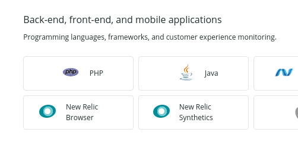
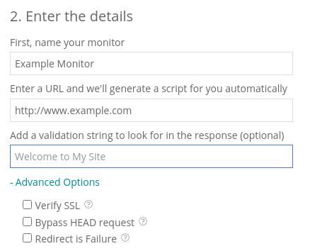
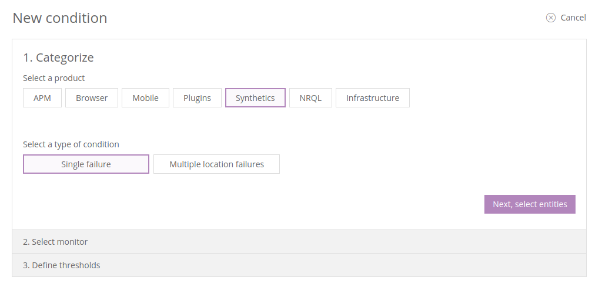
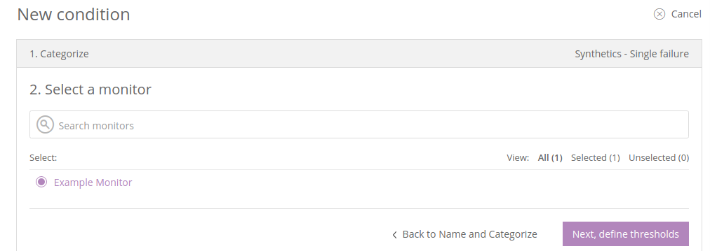

In this lesson, we'll set up a new ping monitor to periodically check the site's availability in New Relic Synthetics.

## Create a Monitor
1. Navigate to the ** Live** environment in your Site Dashboard, and click ** New Relic** then ** Go to New Relic**.
1. Select **Synthetics** from the menu bar at the top of the page.
1. Under **Back-end, front-end, and mobile applications**, select **New Relic Synthetics**

  

1. Enter the details for the URL you want to monitor (e.g. `https://www.example.com`).

  

1. Select the locations you wish to check the site from. We recommend picking locations that correspond to your site's visitors to reduce the risk of false-positives due to long-distance networking snafus.
1. Set the frequency for checks. We suggest 5 minutes.
1. Click **Create my monitor**.
1. We'll setup notifications in a [later lesson](/guides/pagerduty/notify) with PagerDuty.

Pantheon can provide New Relic ping monitoring for free as part of the service. However, more advanced monitoring — full browser testing, or scripted interactions — is only available to customers on an annual contract and requires an additional cost. Contact our sales team or your dedicated account manager for details.

## Configure Alert Policy
Now that you have a monitor setup in New Relic to periodically check your Pantheon site, you'll need to configure alerts for downtime incidents:

1. Navigate to the ** Live** environment in your Site Dashboard, and click ** New Relic** then ** Go to New Relic**.
1. Select **Alerts & AI** > **Policies** from the menu bar at the top of the page.
1. Select **Create a policy**
1. Enter a name for this alert policy, such as the site name (e.g., `example.com`) and an incident preference (We suggest **By policy**), then click **Create alert policy**.
1. Select **Create a condition**, and choose **Synthetics** and either **single failure** or **multiple location failures**, then **Next, select entities

  

1. Select the monitor that you created in [the previous step](#create-a-monitor) and **Next, define thresholds**
1. Click **Advanced Options** and check **Verify SSL**.
1. Click **Create a condition**.
1. Select **Synthetics** and **Monitor failure** then click **Next, select entities**:

  

7. Select your new monitor, then **Next, define thresholds**:

  

8. Enter a name for the condition, like "Live Availability", and click **Create condition**.

<Partial file="monitor-alerts.md" />
