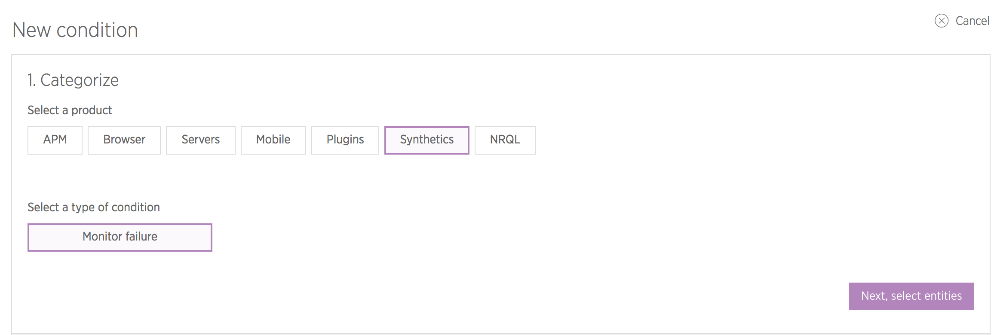

In this lesson, we'll set up a new ping monitor to periodically check the site's availability in New Relic Synthetics.

## Create a Monitor
1. Navigate to the ** Live** environment in your Site Dashboard, and click ** New Relic** then ** Go to New Relic**.
2. Select **Synthetics** from the menu bar at the top of the page.
3. From the **Monitors** tab (default), click **Add new**, and enter the details for the URL you want to monitor (e.g. `https://www.example.com`).
4. Select the locations you wish to check the site from. We recommend picking locations that correspond to your site's visitors to reduce the risk of false-positives due to long-distance networking snafus.
5. Set the frequency for checks. We suggest 5 minutes.
6. Leave the email field empty for alerts. We'll setup notifications in a [later lesson](/guides/pagerduty/notify) with PagerDuty.
7. Click **Create my monitor**.

Pantheon can provide New Relic ping monitoring for free as part of the service. However, more advanced monitoring — full browser testing, or scripted interactions — is only available to customers on an annual contract and requires an additional cost. Contact our sales team or your dedicated account manager for details.

## Configure Alert Policy
Now that you have a monitor setup in New Relic to periodically check your Pantheon site, you'll need to configure alerts for downtime incidents:

1. Navigate to the ** Live** environment in your Site Dashboard, and click ** New Relic** then ** Go to New Relic**.
2. Select **Alerts** > **Alert policies** from the menu bar at the top of the page.
3. Enter a name for this alert policy, such as the site name (e.g., `example.com`), then click **Create policy**.
4. Click **Advanced Options** and check **Verify SSL**.
5. Click **Create a condition**.
6. Select **Synthetics** and **Monitor failure** then click **Next, select entities**:

  

7. Select your new monitor, then **Next, define thresholds**:

  

8. Enter a name for the condition, like "Live Availability", and click **Create condition**.

<Partial file="monitor-alerts.md" />
