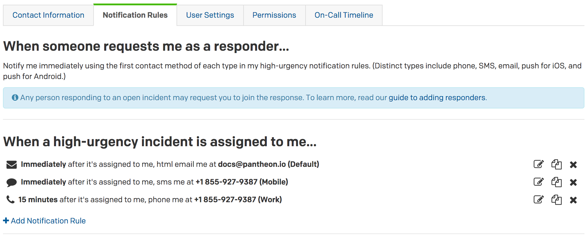
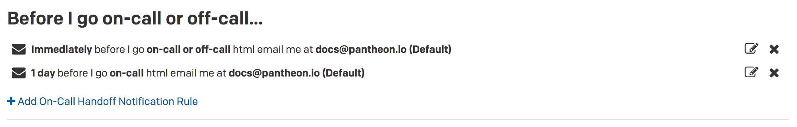
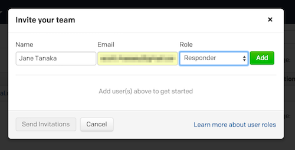
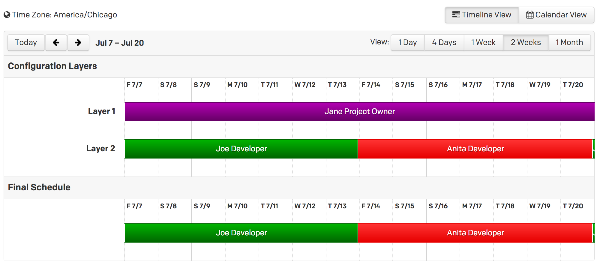

In this lesson we'll use PagerDuty to create an on-call schedule and escalation policy to automate parts of an incident response procedure in the event of a monitor failure.

If you are managing a high profile site, using PagerDuty is an excellent way to ensure your team is immediately aware of changes in a site's status.

## Add User Contact Info and Notification Rules
1. [Sign up for a PagerDuty account](https://signup.pagerduty.com/accounts/new) if you do not have one already. This is a paid service, but you can get started for free on a 14-day trial.

2. Login to your PagerDuty account and go to **Configuration** > **Users**.
3. Setup your user profile and contact information. Add your name, a job title, your time zone, phone number, SMS number and an email address:

  

4. Go to the **Notification Rules** tab and setup your notification rules. The default is alerting everything at once. Click the edit () buttons to adjust the rules to your preference, for example:

  

  There is also a handy setting which alerts a user when they are about to go on call. We kept the default setting, which sends an email 24 hours before the user's on-call shift starts:

  

5. Click **Add Users** to invite more team members:

  

Users can have different roles, allowing them, for example, to administrate schedules or alert policies. For team members with the Developer job title, we suggest the **Responder** role. Each member then can set up their own alert policies, or you can for them.

## Create Schedule
Next, we'll create an on-call Schedule, to configure a scaleable custom alert workflow:

1. Login to your PagerDuty account and go to **Configuration** > **Schedules**, then click **+ Add Schedules**.

    <Alert title="Note" type="info">

    Schedules have **Layers**, which allow for different people or teams to provide additional backup. If the lowest layer agent does not respond to an alert, it will rollover to the next layer. It's a good idea to have one or more layers of fallbacks.

    </Alert>

2. Add the first layer for whoever you want to be the last point of contact and a second layer for team members in the on-call rotation to be the first point of contact:

  

  This configuration notifies the on-call shift, either Joe or Anita, when an incident occurs. If the on-call shift does not acknowledge the incident within a certain amount of time, Jane will be alerted as a fallback.

3. At the top of the page, name this schedule. We suggest using the domain name, like "example.com".

4. Click **Create Schedule**.

  Refer to the the **Final Schedule** at the bottom of the page to see who's on call and the first point of contact:

  

## Create Escalation Policy
When an incident is created, PagerDuty uses an escalation policy to determine who to contact. An escalation policy can alert PagerDuty users directly, as well as alerting teams and schedules. Since you just created a schedule for your team, this is what your simple policy will alert.

1. Login to your PagerDuty account and go to **Configuration** > **Escalation**.

2. Click the **** icon next to the existing **Default** policy and select **Edit**.

3. Rename the default policy so it's project specific (e.g., `example.com`) and add your new **example.com** schedule:

  

4. Click **Save**.
