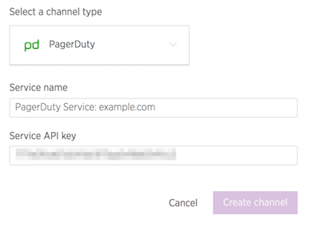

In this lesson, we'll configure PagerDuty as a notification channel for our New Relic monitor, so that failures immediately open a new incident and notify on-calls per your team's schedule and escalation policy.

## Create New Service in PagerDuty
Now we'll add a Service, which is any application, component, or team you wish to open incidents against:

1. In your PagerDuty account navigate to  **Configuration** > **Services**, then click **Add New Service**.
2. Enter a name. We suggest using the domain name (e.g., `example.com`) so it's easy to identify services for all your projects over time.
3. Select **New Relic** from the **Integration Type** dropdown menu.
4. Enter a name for the integration, such as "example.com".
5. Click **Add Service**.
6. Copy the integration key to your clipboard.

## New Relic Notification Channels
Now we'll hookup our PagerDuty service as a notification channel for our alert policy in New Relic:

1. Navigate to the ** Live** environment in your Site Dashboard, and click ** New Relic** then ** Go to New Relic**.
2. Go to **Alerts** > **Notification Channels** from the menu bar at the top of the page.
3. Select **PagerDuty** from the dropdown menu, enter a service name and paste the integration key copied in the previous section:

  
