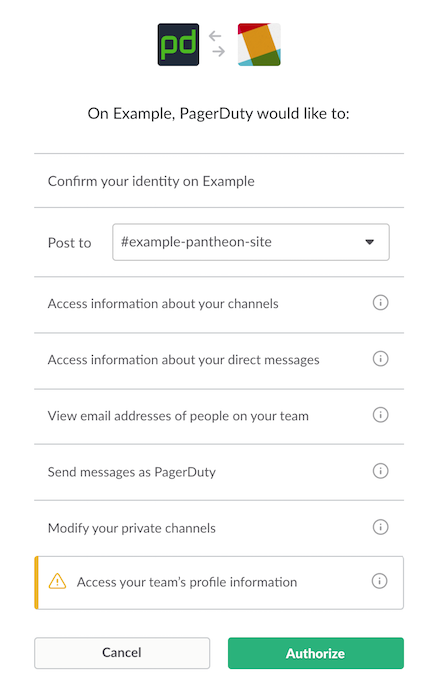
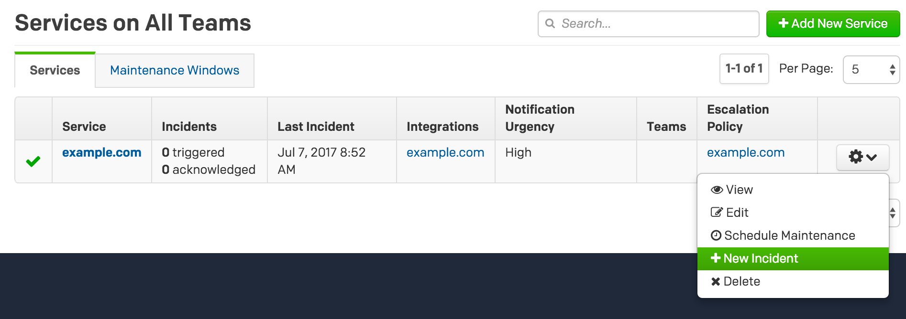
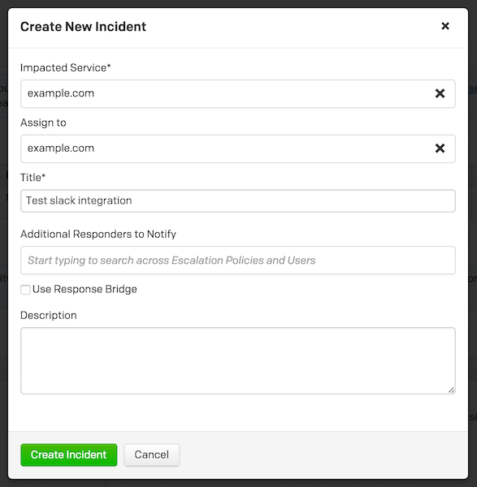
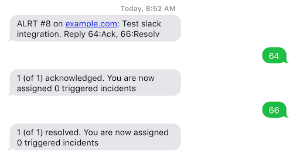
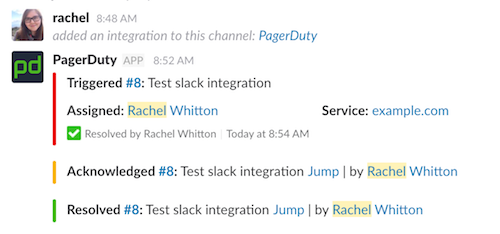

In this lesson, we'll add the Slack extension to PagerDuty so your team can acknowledge and resolve incidents within a channel.

1. Login to your PagerDuty account and go to **Configuration** > **Extensions**, then click **+ New Extension**.
2. For the new service, use the following configuration:

 - Select **Slack** as extension type
 - Enter "example.com" as the name of the extension
 - Select **example.com** as the service
 - Select Actions available to **any Slack user**
 - Check all 3 options: Resolves, Acknowledgements, Assignment Changes

3. Click Authorize:

  

4. Select the channel to which you’d like PagerDuty to send messages and then Authorize the integration. We recommend using project specific channels:

    

5. Go to **Configuration** > **Services**, and click the **** icon next to your existing service then click **+ New Incident**:

  

6. Create a new incident:

  

This will automatically send notifications to whoever is on-call via SMS and email immediately, in addition to showing up in Slack. The person on-call can acknowledge and resolve the incident through email, SMS, Slack, or from within PagerDuty.

