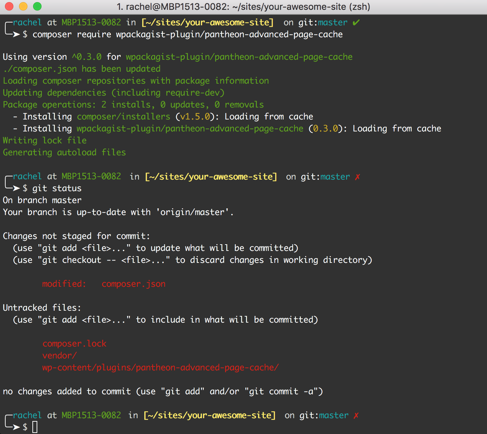
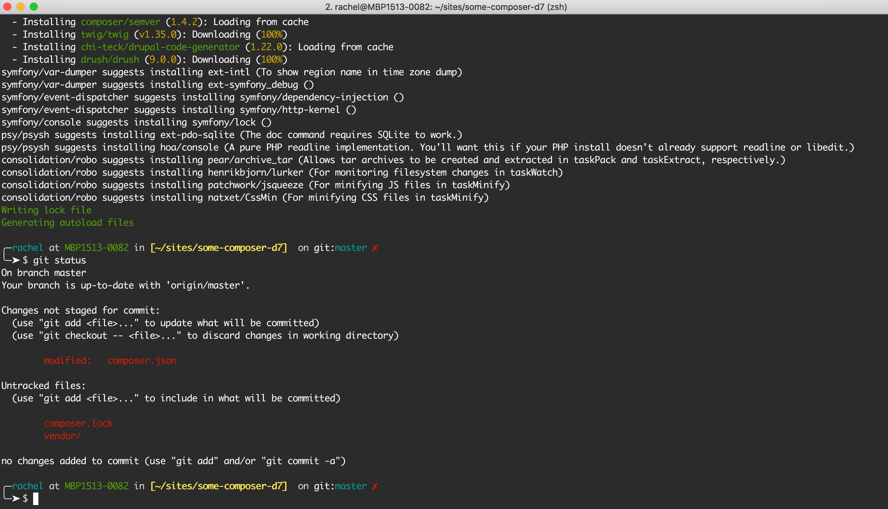

In this guide, you'll learn how to use Composer in small doses with WordPress and Drupal 7 so you can work towards best practices achieved by more advanced implementations. This allows you to continue using Pantheon's one-click core updates in the Site Dashboard while managing non-core dependencies with Composer.

## Before You Begin

- Read [Composer Fundamentals and Workflows](/composer)
- Install [Composer](https://getcomposer.org/doc/00-intro.md#installation-linux-unix-osx) and [Git](https://git-scm.com/downloads) locally
- Create a WordPress or Drupal 7 site on Pantheon

<Partial file="notes/partial-composer-adoption-warning.md" />

- Set the site's connection mode to Git within the Site Dashboard or via [Terminus](/terminus):

  ```bash{promptUser: user}
  terminus connection:set <site>.<env> git
  ```

- Create a local clone of your site code, and navigate to it in your terminal

## Initialize and Configure Composer

Use the `init` command to create a `composer.json` file that includes the appropriate package repository, then configure installation paths for dependencies like plugins and modules:

<TabList>

<Tab title="WordPress" id="wp-init" active={true}>

1. If you haven't done so already, [clone your Pantheon site repository](/git/#clone-your-site-codebase) and navigate to the project's root directory. Replace `<site_name>` with your site's name (e.g., `your-awesome-site`):

  ```bash{promptUser: user}
  SITE=<site_name>
  `terminus connection:info $SITE.dev --fields='Git Command' --format=string`
  cd $SITE
  ```

1. Initialize composer to create a `composer.json` file with the WordPress package repository:

  ```bash{promptUser: user}
  composer init --repository=https://wpackagist.org --no-interaction
  ```

1. Edit the `composer.json` to add extra configuration that specifies installation paths for WordPress plugins and themes.

  <Alert title="Note" type="info">

  Since Pantheon does not support Git submodules <Popover title="Git submodules" content="Some Composer packages are added as Git submodules, which place a Git repository within a subdirectory of your site’s repository." />, we recommend using the provided script `remove-git-submodules` to remove any `.git` directories upon install and update.

  </Alert>

  ```json:title=composer.json
  {
    "repositories": [
      {
        "type": "composer",
        "url": "https://wpackagist.org"
      }
    ],
    "require": {},
    "extra": {
      "installer-paths": {
        "wp-content/plugins/{$name}/": ["type:wordpress-plugin"],
        "wp-content/themes/{$name}/": ["type:wordpress-theme"]
      }
    },
    "scripts": {
      "remove-git-submodules": "find . -mindepth 2 -type d -name .git | xargs rm -rf",
      "post-install-cmd": [
        "@remove-git-submodules"
      ],
      "post-update-cmd": [
        "@remove-git-submodules"
      ]
    }
  }
  ```

1. Commit the `composer.json` file to version control with Git:

  ```bash{promptUser: user}
  git add composer.json
  ```

  ```bash{promptUser: user}
  git commit -m "Create composer.json with WP repo and install paths"
  ```

1. Push your new file to Pantheon:

  ```bash{promptUser: user}
  git push origin master
  ```

</Tab>

<Tab title="Drupal 7" id="d7-init">

1. If you haven't done so already, [clone your Pantheon site repository](/git/#clone-your-site-codebase) and navigate to the project's root directory. Replace `<site_name>` with your site's name (e.g., `your-awesome-site`):

  ```bash{promptUser: user}
  SITE=<site_name>
  `terminus connection:info $SITE.dev --fields='Git Command' --format=string`
  cd $SITE
  ```
<Partial file="d7-composer-init.md" />

1. Commit the `composer.json` file to version control with Git:

  ```bash{promptUser: user}
  git add composer.json
  ```

  ```bash{promptUser: user}
  git commit -m "Create composer.json with D7 repo and install paths"
  ```

1. Push your new file to Pantheon:

  ```bash{promptUser: user}
  git push origin master
  ```

</Tab>

</TabList>

Anything you aren't managing with Composer is installed and maintained using the standard techniques such as using the WordPress or Drupal admin interfaces. Continue applying one-click core updates from Pantheon in the Site Dashboard.

## Require Dependencies

Use the `require` command to add new dependencies to your project, such as libraries or themes. This command modifies your `composer.json` file by including the specified dependency and it's compatible version.

Note that Pantheon does not run `composer install` on the platform, so you need to install and commit the dependencies.

<TabList>

<Tab title="WordPress" id="wp-require-papc-id" active={true}>

#### Install a Plugin

1. Require the plugin, [Pantheon Advanced Page Cache](https://wordpress.org/plugins/pantheon-advanced-page-cache/) for example, with Composer:

  ```bash{promptUser: user}
  composer require wpackagist-plugin/pantheon-advanced-page-cache
  ```

1. Review modified files using `git status`, you should see the module has been installed in the `wp-content/plugins` directory like so:

  

  Notice a missing dependency was also installed, `composer/installers`. This package is needed to support the installation paths configured in the previous section, and needs to be tracked in version control.

1. Commit your work to version control with Git:

  ```bash{promptUser: user}
  git add .
  ```

  ```bash{promptUser: user}
  git commit -m "Require pantheon-advanced-page-cache ^0.3.0 "
  ```

1. Push your changes to Pantheon:

  ```bash{promptUser: user}
  git push origin master
  ```

1. Navigate to the **<span class="glyphicons glyphicons-wrench"></span> Dev** environment of the Site Dashboard.

1. Click the **Site Admin <span class="glyphicons glyphicons-new-window-alt"></span>** button and login.

1. Navigate to **Plugins** and activate Pantheon Advanced Page Cache.

</Tab>

<Tab title="Drupal 7" id="d7-require-papc-id">

#### Install Site Local Drush

The following example shows you how to install a site local Drush. You can use this method to require contrb modules, themes, and libraries.

1. First, require the `composer/installers` package to support the installation paths configured in the previous section:

  ```bash{promptUser: user}
  composer require composer/installers
  ```

1. Require Drush with Composer:

  ```bash{promptUser: user}
  composer require drush/drush
  ```

1. Review modified files using `git status`:

  

1. Commit your work to version control with Git:

  ```bash{promptUser: user}
  git add .
  ```

  ```bash{promptUser: user}
  git commit -m "Require drush and composer/installers"
  ```

1. Push your changes to Pantheon:

  ```bash{promptUser: user}
  git push origin master
  ```

</Tab>

</TabList>

## Next Steps

If your use case doesn't require the more advanced Build Tools method, continue using Composer to manage any number of your non-core dependencies while preserving Pantheon's one-click core updates. This is only supported for Drupal 7 and WordPress. This is not supported on Drupal 8 as it will break one-click updates due to excessive conflicts.

If you're ready to learn best practices for Composer on Pantheon, follow the [Build Tools](/guides/build-tools) guide.
