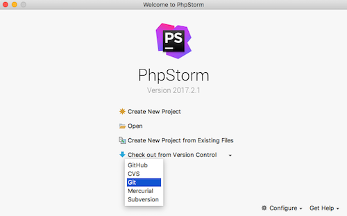
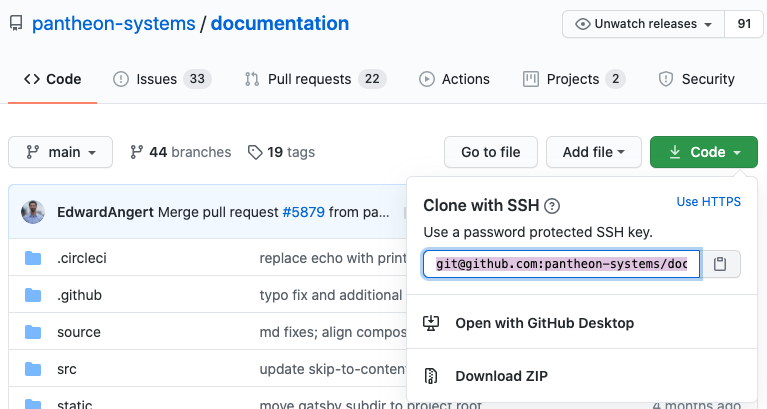
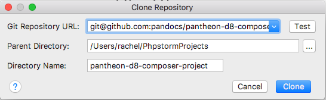
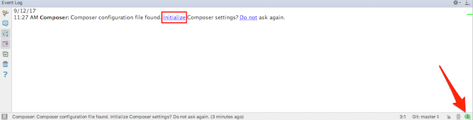
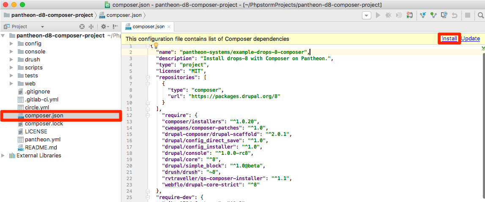
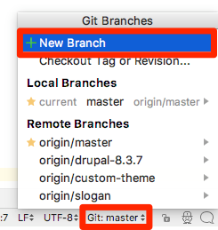
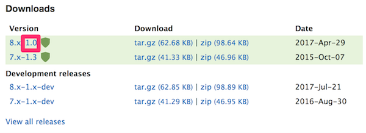
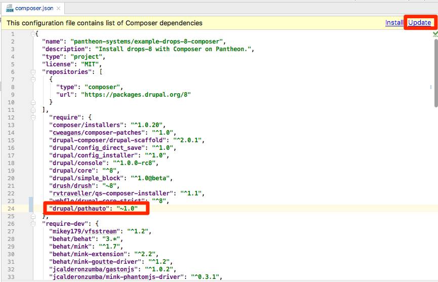
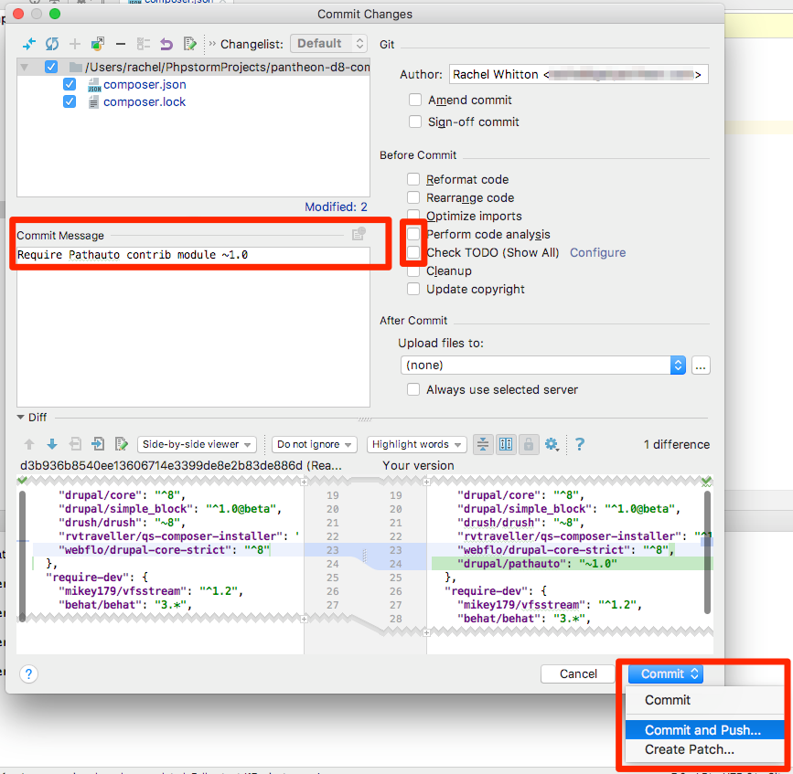
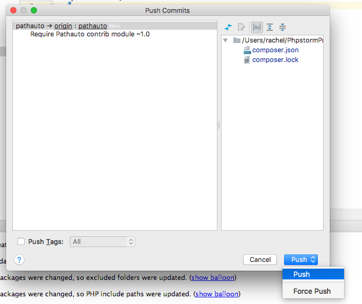

[JetBrains PhpStorm](https://www.jetbrains.com/phpstorm/) is a commercial PHP IDE that you can configure to work with your Pantheon sites. This guide explains how to use the [Composer integration](https://confluence.jetbrains.com/display/PhpStorm/Composer+Support+in+PhpStorm) of JetBrains PhpStorm to install Drupal 8 dependencies.

## Before You Begin
Be sure that you:

* Install [JetBrains PhpStorm](https://www.jetbrains.com/phpstorm/)
* Install [Composer](https://getcomposer.org/)
* Create a Composer-managed following the [Build Tools](/guides/build-tools) guide, which describes how to use build tools such as [GitHub](https://github.com/) and [CircleCI](https://circleci.com/) with [Composer](/guides/composer) on Pantheon.

## Create A New Project

1. Open PhpStorm, and in the "Welcome to PhpStorm" screen, select **Check out from Version Control** > **Git**:

   

2. Open the GitHub project page for the site you created following the [Build Tools](/guides/build-tools) guide. Copy the repository's SSH URL to your clipboard:

    

3. In PhpStorm, paste the repository's SSH URL in the **Git Repository URL** field (the **Directory Name** field will automatically populate after pasting the URL):

   

4. Click the **Clone** button and wait for PhpStorm to download your repository from GitHub.
5. Reply **Yes** when PhpStorm asks whether you want to open the project.

## Initialize Composer
1. After opening the project, check the event log by clicking the message icon from the lower right side of the window. Click **Initialize**:

  

2. PhpStorm should catch the settings correctly, so you can simply confirm with **OK**:

  

3. Open `composer.json` and select **Install** from the top right:

  

  If this is the first time you use PhpStorm's Composer integration, you'll see the "Composer Settings" window in which you need to set or confirm your local Composer installation. PhpStorm needs to know where it can find this tool on your computer and you can point it either to the `composer` executable or a `composer.phar` archive. Confirm your local installation then click **OK**:

  

## Enable Drupal Support
1. After installing Drupal using Composer in the previous section, you should get a message to Enable Drupal Support. Click **Enable**:

  

2. Add a check to **Enable Drupal integration** then click the `...` button to browse your local filesystem:

  

3. Navigate to the project's installation path, then select the `web` subdirectory and click **Open**:

  

4. Select 8 for Drupal version, then click **Ok**:

  

5. After enabling Drupal Support, check your messages for a prompt to set Drupal-style formatting. Click **Set it**:

  

## Install Dependencies via Composer
PhpStorm's Composer integration has a search interface available at **Tools** > **Composer** > **Manage Dependencies ...**. You can type the name of any package hosted on the [PHP Package Repository](https://packagist.org/) in the search field.

Unfortunately, this interface cannot be used to install dependencies from custom repositories defined in `composer.json`:

```json
"repositories": [
  {
    "type": "composer",
    "url": "https://packages.drupal.org/8"
  }
],
```

This means that if your Composer extension is not on the PHP Package Repository, you have to add it manually to the `composer.json` file. Dependencies are added to the `require` section and for each package you need to specify either an exact version number or [a version constraint](https://getcomposer.org/doc/articles/versions.md).

1. Click **Git:Master** from the bottom right corner, then click **+ New Branch**:

  

2. Checkout a new branch for your specific task, in this example we name it `pathauto` since that's the name of the module we're adding:

  

3. Determine the latest available stable version from the [Pathauto](https://www.drupal.org/project/pathauto) project page:

   

4. Add `drupal/panthauto` your `composer.json` file with a version constraint of `~1.0`, then click **Update** to start the download and installation process:

   

   Composer package names always follow a "vendor/name" convention. All packages in the Drupal repositories have "drupal" as the vendor and the Drupal project name as their package name (e.g., `drupal/pathauto`).

5. Wait for a confirmation message from Composer.

## Open PR and Deploy to Multidev
Now it's time to deploy and test the newly installed module. The Pull Request workflow demonstrated in the [Build Tools](/guides/build-tools) guide encourages the mental model where only files unique to the project are tracked as part of the project's main "source" repository.

For this example, that means we only care about changes made to the `composer.json` file and the `composer.lock` file. We don't want to track the actual code of the Pathauto module within our repository, we want Composer to build it for us based on our version constraints.

1. Navigate to **VCS** > **Commit..** Note only two files are listed as changed:
2. Disable default options to perform a code analysis and check TODOs. Enter a commit message and then select **Commit and Push..**:

  

3. Click **Push**:

  

4. Go to the project page on GitHub. Select **Compare & pull request**:

  

5. Open a Pull Request from the `pathauto` branch to `master`, suggesting edits to two files:

  

6. The commit will be built by CircleCI and deployed to a new Multidev environment on Pantheon. Check the PR for a new comment containing links to the Multidev environment and site.

Follow your teams standard review process for accepting changes into master, which is built and deployed to Dev.
