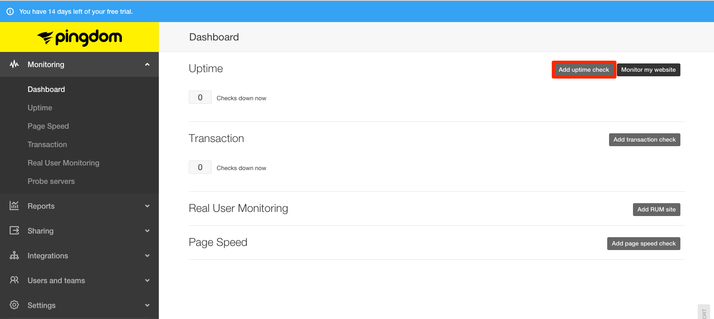

Monitoring services, such as [Pingdom](https://www.pingdom.com/), allow those responsible for site performance and uptime to know when a website is having problems delivering content. Pingdom provides several different types of uptime and performance checks.

In this guide, we will create and configure the simplest check for a website, an [Uptime Check](https://www.pingdom.com/product/uptime-monitoring), which pings a page and verifies a response. Additional checks include a [Page Speed](https://www.pingdom.com/product/page-speed) check, which tracks page load time, and [Real User Monitoring](https://www.pingdom.com/product/performance-monitoring), which measures other important performance metrics.

## What You’ll Need

- At least a paid Starter plan on Pingdom. It's OK if you don't have one yet, this guide goes over the signup process. For a free alternative to Pingdom, checkout [New Relic&reg; Performance Monitoring](/new-relic#configure-ping-monitors-for-availability).

- A Drupal or WordPress site on Pantheon to monitor.

## Create a Pingdom Account

1.  On [Pingdom's homepage](https://www.pingdom.com), click **Sign Up** or if available, **Start your Free 14-Day Trial**.

2.  Review and choose from available plans and select either monthly or discounted annual billing. For this guide, we selected the **Pingdom Starter account**. Plans can be upgraded at anytime.

    Add your credit card information. If you chose the free trial, you have until the end of the trial time to try Pingdom before the card is billed. Once you've read and agreed to Pingdom's [services agreement](https://www.pingdom.com/legal/software-service-agreement), click **START FREE TRIAL** to continue.

    Now we will log in and set up monitoring. Click the **SET UP YOUR MONITORING** button to go directly to the Pingdom dashboard.

## Create a Basic Uptime Check

1.  When you first load the Pingdom dashboard, it will try to guide you through adding your website, and creating checks. Because this guide explains how to manually create checks, we suggest you skip this.

2.  The left navigation menu contains the different types of monitoring checks, reports, and a few other features. From the [main user dashboard](https://my.pingdom.com/dashboard) or from the left navigation's **Monitoring** > **Uptime** sub-menu, click on **Add uptime check**:

    

3.  In the modal that opens, add the following information where indicated:

    - **Name of Check:** An easily recognizable name for the check, e.g. "www.example.com Home Page.”

    - **Check Interval:** How often Pingdom will check the site. While one minute is the minimum and acceptable to use, often a check every 5 minutes or more is adequate, and will allow for brief network throughput issues. Remember, these checks also will appear in web access logs, so too many checks may make it harder to debug other issues.

    - **Check Type:** You can monitor several different things with Pingdom: email services, network components such as DNS or specific ports, or a website. Choose **Web**.

    - **URL/IP:** On the **Required** tab, enter the URL for the website. If your site is using HTTPS, select that dropdown option. From the **Optional** tab, you can add user credentials and expected response text. This is very useful if you are using Varnish to cache a site; you can create a simple PHP script which queries the database and returns a specific value to determine if the site is functioning as expected.

    - **Test From:** Select the region. We suggest you select the region where the majority of the site's users are located.

    - **Alerting Settings:** You can create teams, or assign alerts directly to users. It's better to create teams within Pingdom, rather than a forwarding email address (e.g. monitoring@example.com), as each user can set up their own alerting preferences. For now, select yourself.

    - **When down, alert after:** 1-5 minutes, depending on the risk of false positives. If you are aware your site is having performance issues, it isn’t helpful to be reminded constantly, so sometimes a longer time period before being alerted ensures you are only notified of a severe failure.

    - **Resend alert every:** This controls how often alerts are repeated. Never, 1 or 2 down cycles is adequate for most developers. It’s assumed that you will be working on the issue, and won't need to be alerted to an issue you're currently handling. It becomes noise during a potentially stressful time.

    - **Alert when back up.** Leave this checked. You may not be the one responding to the issue, but you probably want to know when it’s back up. Sometimes intermittent issues result in a site going up and down within a few minute period.

3.  Click **Create check** when you are done. You will now see a new check in the dashboard, from the **Uptime** page:

    

## Review your Check
Let the check run a while (a few hours), then you can access reports for each site in either the left navigation menu or the individual check dropdown menu.

Let’s look at a site that is having some trouble to see how Pingdom can help.

- Item 1 tells us when the issue started occurring, which we can attempt to correlate to any recent changes or external events.

- Item 2 provides the site's response to the check and Pingdom’s attempt to determine the root cause of the downtime. In this case, we see that the site returned a 200, which is a successful response, but took so long that Pingdom considered it a timeout:

    

This could point to a scaling, performance, or something simple, like lack of caching. Sometimes a server error will be returned, which can be connected to a PHP or permissions error.

The Test Log Results will also display which regions encountered downtime. Sometimes the root cause of downtime is not related to site performance, as when a regional DNS server encounters issues. This report is helpful determining an incident when a certain region of users encounter downtime while others do not.

## Customize Alerts

Before finishing, each user should customize how they receive alerts. Here I added my mobile telephone number, so I also get text alerts as well as email notifications.

<Partial file="monitor-alerts.md" />

## Conclusion
Pingdom has a few more checks and features we did not cover. Depending on your plan it provides a site status page, multi-tier alerting schedules, and API access for custom integration.

When a site is having issues, Pingdom lets the right people know quickly and provides good data to help find solutions. It's a good practice to use services like Pingdom on all high-value sites.
