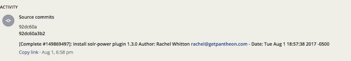

Pivotal's project management application, [Pivotal Tracker](https://www.pivotaltracker.com) is a simple but powerful tool designed for agile teams which may need to balance several projects at once, but need short term clarity into work-in-progress. It provides rich reporting and velocity estimation, and is very easy to get started with, as well as offering considerable customization.

In this guide, we'll connect a Pivotal Tracker project to a site on Pantheon. When changes are pushed to Pantheon that reference the Tracker issue, the commit message will appear in the issue's activity log. Additionally, we can change story status, allowing us to complete stories with our commit messages.

## Before You Begin

Be sure to:

- Have an active pivotal tracker account
- Have a Drupal or WordPress site on Pantheon, with a local clone of the repository.
- Locally install [Terminus](/terminus):

  ```bash{promptUser: user}
  curl -O https://raw.githubusercontent.com/pantheon-systems/terminus-installer/master/builds/installer.phar && php installer.phar install
  ```

- Install the [Terminus Secrets Plugin](https://github.com/pantheon-systems/terminus-secrets-plugin):

  ```bash{promptUser: user}
  curl https://github.com/pantheon-systems/terminus-secrets-plugin/archive/1.x.tar.gz -L | tar -C ~/.terminus/plugins -xvz
  ```

## Create a Machine User in Pivotal Tracker

As a best practice, start by creating a new machine user in Tracker. This user is referred to as a "machine user" because the account is used to automatically parse commit messages on Pantheon using a PHP script and send them to Pivotal Tracker.

1. Login to your Tracker instance and click on your username in the top right dropdown, then navigate to **Accounts** > **Manage Account** > **Account Members** and click **Add Member**.

2. Enter a name and email address for the machine user, then add them to an existing project. Then click **Create users**.

  We suggest naming machine users relative to their function, in this example we name our new user `Automation User`. Add this account to an existing project if you have one. The email needs to be an account you have access to:

  

3. Sign in as the machine user and navigate to the profile page. Save the API token for the next steps:

   

## Prepare your site: Securely Store User Credentials on Pantheon

Next, we need to provide Pantheon with the credentials for our new machine user in Pivotal Tracker. We'll securely store these values in the [private path](/private-paths/#private-path-for-files) of Pantheon's filesystem.

We use the filesystem private path in this section because we don't want to track sensitive data like passwords in the codebase with git.

1. First, let's check for existing secrets using Terminus (replace `<site>`):

  ```bash{promptUser: user}
  SITE=<site>
  terminus secrets:list $SITE.dev
  ```

  If no existing keys are found, run the following to create a new `secrets.json` file and upload it to Pantheon:

  ```bash{outputLines: 2}
  echo '{}' > secrets.json
  `terminus connection:info $SITE.dev --field=sftp_command`
  ```

  If the `files/private` directory doesn't exist, create it:

  ```bash{promptUser: user}
  mkdir files/private
  ```

  Put the secrets file into the `private` directory:

  ```bash{outputLines: 1-3}
  sftp> cd files/private
  sftp> put secrets.json
  sftp> bye
  rm secrets.json
  ```

  Otherwise, continue to the next step.

2. Use Terminus to write your Pivotal Tracker URL value in the private `secrets.json` file (replace `<token value>`):

  ```bash{promptUser: user}
  terminus secrets:set $SITE.dev tracker_token <token value>
  ```

<Alert title="Note" type="info">

When it comes to keeping production keys secure, the best solution is to use a key management service like [Lockr](/guides/lockr) to automatically encrypt and secure keys on distributed platforms such as Pantheon.

</Alert>

## Configure Quicksilver Hook

Next we'll add Pantheon's example [Quicksilver](/quicksilver) integration script for Pivotal Tracker to the [private path](/private-paths/#private-path-for-code) of your site's codebase. The private path within the codebase is tracked in version control and is accessible by PHP, but not the web.

1. If you haven't done so already, [clone your Pantheon site repository](/git/#clone-your-site-codebase) and navigate to the project's root directory:

  ```bash{promptUser: user}
  `terminus connection:info $SITE.dev --fields='Git Command' --format=string`
  cd $SITE
  ```

2. Set the connection mode to Git:

  ```bash{promptUser: user}
  terminus connection:set $SITE.dev git
  ```

3. Create a copy of [Pantheon's `pivotal_integration.php`](https://github.com/pantheon-systems/quicksilver-examples/tree/master/pivotal-tracker) in the project's private path:

  ```bash{promptUser: user}
  mkdir private
  mkdir private/scripts
  curl https://raw.githubusercontent.com/pantheon-systems/quicksilver-examples/master/pivotal-tracker/pivotal_integration.php --output ./private/scripts/pivotal_integration.php
  ```

4. Create a `pantheon.yml` file if one doesn't already exist in your root directory.
5. Paste the following workflow into your `pantheon.yml` file to hook into the platform upon code being pushed to fire off the Pivotal Tracker integration script:

    ```yaml:title=pantheon.yml
    api_version: 1

    workflows:
      sync_code:
        after:
          - type: webphp
            description: Pivotal Integration
            script: private/scripts/pivotal_integration.php
    ```

    <Alert title="Note" type="info">

    `api_version` should be set once in [`pantheon.yml`](/pantheon-yml). If you have an existing `pantheon.yml` with this line, don't add it again.

    </Alert>

6. [Commit and push](/git/#push-changes-to-pantheon) changes to the Dev environment:

  ```bash{promptUser: user}
  git commit -am "Create private/scripts/pivotal_integration.php and configure platform hooks"
  git push origin master
  ```

## Test Pivotal Tracker Integration on Pantheon

1. Create a test story in an existing or new Pivotal Tracker project. Copy the issue ID:

  

  <Alert title="Note" type="info">

  In a separate terminal window, run `terminus workflow:watch $SITE` to see the process unfold in real time (optional).

  </Alert>

2. Push a code change to Pantheon containing the Pivotal Tracker story ID in the commit message in brackets (e.g., [#149869497]). This workflow will trigger `pivotal_integration.php` script, which will search commits for possible issue IDs and comment when found.

3. You should see the change appear in the Activity log of the story:

 

The Pivotal Tracker API will also change story status by including "fixed", "completed", or "finished" within the square brackets, in addition to the story ID. You may use different cases or forms of these verbs, such as "Fix" or "FIXES", and they may appear before or after the story ID. In Pivotal vernacular, for features, one of these keywords will put the story in the finished state. For chores, it will put the story in the accepted state. The square brackets can appear anywhere in the commit message. Examples:

```none
  [Completed #149869497] adding requested feature.
  I finally [finished #148528125] this functionality.
  This commit [fixes #148528125]
```

If code is automatically tested and deployed when pushed to the origin repository in your organization, use the keyword "delivers" and feature stories will be put in the "delivered" state, rather than "completed."

```none
[Delivers #148528125] Small bug fix.
```

## Conclusion

In this guide, we covered a simple but time-saving integration between [Pivotal Tracker](https://www.pivotaltracker.com) and Pantheon. There are similar ways to integrate other project management applications using [Quicksilver hooks](https://github.com/pantheon-systems/quicksilver-examples). Additionally, you can use continuous integration tools such as [CircleCI](https://pantheon.io/docs/guides/build-tools/) if you use an external repository such as GitHub. Using these integrations will give clarity into work being performed across your team, while saving time by automating your development workflow.
