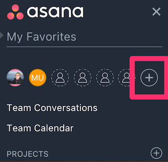
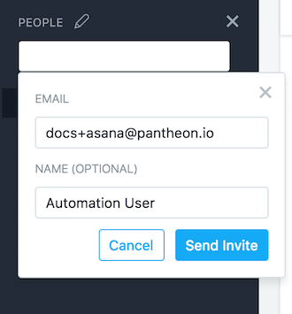
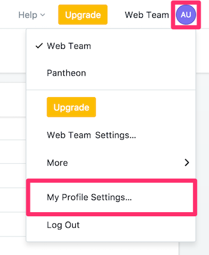
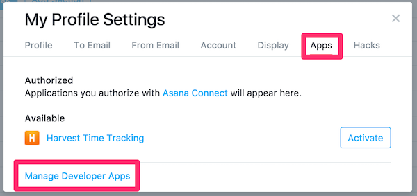
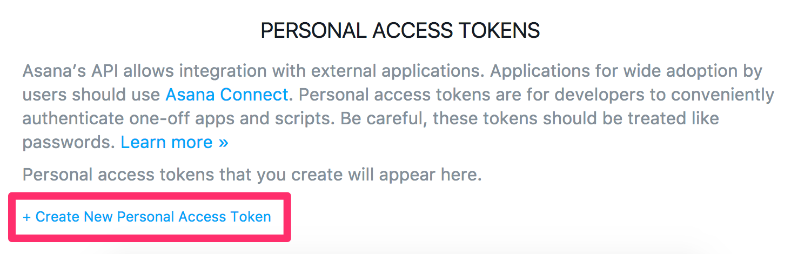
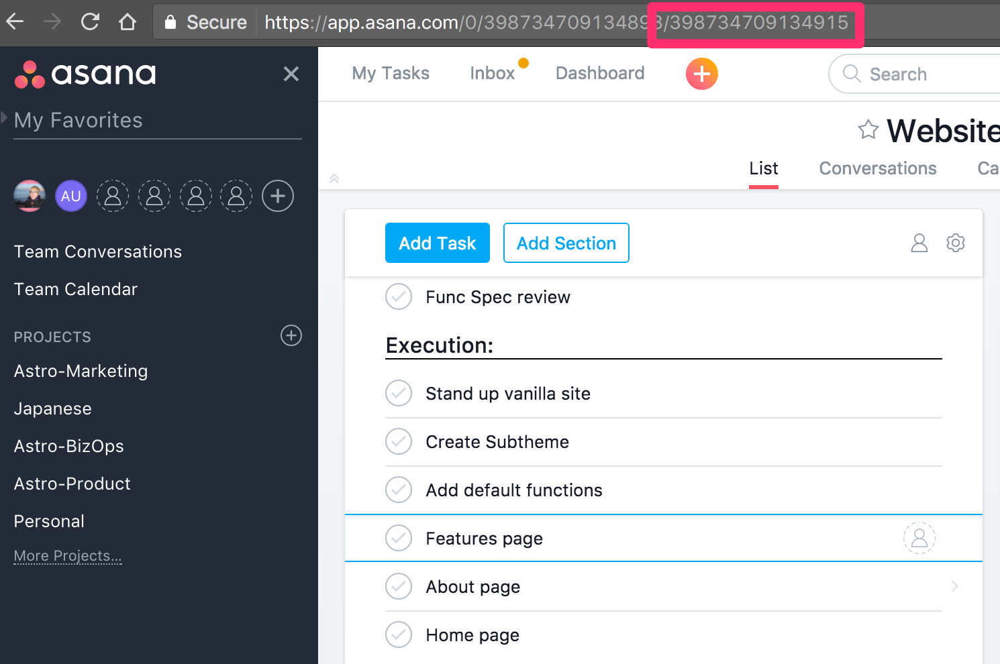
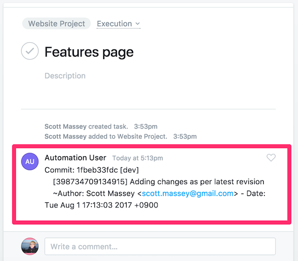

This section provides information on how to use Quicksilver to integrate Asana with Pantheon.

[Asana](https://asana.com) is a flexible project management tool that helps teams collaborate on projects. You can spin up and manage projects quickly and easily with the Asana user interface.

The sections below provide steps on how to use Quicksilver to connect your Asana to a website project on Pantheon. You can push changes that include the Asana task's unique ID to Pantheon, and the commit message will appear within the task.

## Before You Begin

Be sure that you:

- Have a Drupal or WordPress site on Pantheon

- Install [Terminus](/terminus):

  ```bash{promptUser: user}
  curl -O https://raw.githubusercontent.com/pantheon-systems/terminus-installer/master/builds/installer.phar && php installer.phar install
  ```

- [Generate a Machine Token](https://dashboard.pantheon.io/machine-token/create): Navigate to the **User Dashboard**, select **Account**, select **Machine Tokens**, and then authenticate Terminus:

  ```bash{promptUser: user}
  terminus auth:login --machine-token=‹machine-token›
  ```

- Install the [Terminus Secrets Plugin](https://github.com/pantheon-systems/terminus-secrets-plugin):

  ```bash{promptUser: user}
  curl https://github.com/pantheon-systems/terminus-secrets-plugin/archive/1.x.tar.gz -L | tar -C ~/.terminus/plugins -xvz
  ```

## Create a Machine User in Asana

Create a new machine user in Asana. This user is referred to as a "machine user" because the account is used to automatically create comments out of commit messages on Pantheon using a PHP script.

1. Select **<span class="glyphicon glyphicon-plus-sign"></span>** from the menu on the left, next to existing team members:

   

1. Enter a name and email address for the machine user, which acts as the intermediary between Asana and the Pantheon Site Dashboard. Then click **Send Invite**.

  We suggest naming machine users relative to their function; in this example we name our new user `Automation User`. The email needs to be an account you have access to:

   

1. Check the address used in the last step for an email from Asana. Click the **Accept Invite** button and follow prompts to set the machine user's password. You should be logged in as the machine user.

1. Click on your profile in the top right, and select **My Profile Settings**:

   

1. Select **Apps**, then select **Manage Developer Apps**:

   

1. Scroll down to **Personal Access Tokens**, then click **+ Create New Personal Access Token**:

   

1. Give the token a name which denotes it's purpose and save the string generated for the next steps.

## Securely Store User Credentials on Pantheon

You must provide Pantheon with the credentials for our new machine user. The credentials are securely stored in the [private path](/guides/secure-development/private-paths/#private-path-for-files) of Pantheon's filesystem.

We use the filesystem private path in this section because we don't want to track sensitive data like passwords in the codebase with Git.

In the commands below, replace `<site>` with your site name, `<user>` with your Asana machine account username, and `<password>` with its password.

1. Check for existing secrets using Terminus:

   ```bash{promptUser: user}
   SITE=<site_name>
   terminus secrets:list $SITE.dev
   ```

  If no existing keys are found, execute the following to create a new `secrets.json` file and upload it to Pantheon:

   ```none
   $ echo '{}' > secrets.json
   $ `terminus connection:info $SITE.dev --field=sftp_command`
   sftp> put ./files/private secrets.json
   sftp> bye
   $ rm secrets.json
   ```

  Otherwise, continue to the next step.

1. Write the machine user's token to the private `secrets.json` file:

   ```bash{promptUser: user}
   terminus secrets:set $SITE.dev asana_access_token '<API token>'
   ```

<Alert title="Note" type="info">

When it comes to keeping production keys secure, the best solution is to use a key management service like [Lockr](/guides/lockr) to automatically encrypt and secure keys on distributed platforms such as Pantheon.

</Alert>

## Configure Quicksilver Integration

You must add Pantheon's example [Quicksilver](/guides/quicksilver) integration script for Asana to the [private path](/guides/secure-development/private-paths#private-path-for-code) of your site's codebase. The private path within the codebase is tracked in version control and is accessible by PHP, but not the web.

1. [Clone your Pantheon site repository](/guides/git/git-config#clone-your-site-codebase) if you haven't done so already, and then navigate to the project's root directory:

   ```bash{promptUser: user}
   terminus connection:info $SITE.dev --fields='Git Command' --format=string`
   cd $SITE
   ```

1. Set the connection mode to Git:

   ```bash{promptUser: user}
   terminus connection:set $SITE.dev git
   ```

1. Create a copy of [Pantheon's `asana_integration.php`](https://github.com/pantheon-systems/quicksilver-examples/tree/master/asana_integration) in the project's private path:

   ```bash{promptUser: user}
   mkdir private
   mkdir private/scripts
   curl https://raw.githubusercontent.com/pantheon-systems/quicksilver-examples/master/asana_integration/asana_integration.php --output ./private/scripts/asana_integration.php
   ```

1. Create a `pantheon.yml` file if one doesn't already exist in your root directory.

1. Add the following workflow into your `pantheon.yml` file to hook into the platform when code is pushed to trigger the Asana integration script:

   ```yaml:title=pantheon.yml
   #always include the api version
   api_version: 1

   workflows:
     sync_code:
       after:
         - type: webphp
           description: Asana Integration
           script: private/scripts/asana_integration.php
   ```

    <Alert title="Note" type="info">

    `api_version` should be set once in [`pantheon.yml`](/pantheon-yml). If you have an existing `pantheon.yml` with this line, don't add it again.

    </Alert>

1. [Commit and push](/guides/git/git-config#push-changes-to-pantheon) changes to the Dev environment:

   ```bash{promptUser: user}
   git add .
   git commit -m "Create private/scripts/asana_integration.php and configure platform hooks"
   git push origin master
   ```

## Test Asana Integration on Pantheon

1. Copy the ID for a task you're working on. The ID is the last part of the open task's URL:

    

1. Push a code change to Pantheon containing the Asana task ID in the commit message in brackets (e.g., [398734709134915]). This workflow will trigger `asana_integration.php` script, which will search commits for possible task IDs and comment in Asana when found.

   ```bash{promptUser: user}
   git commit -m "[398734709134915] Adding changes as per latest revision"
   ```

1. Return to the issue in Asana to see a message from our machine user:

    

## GitHub and Asana

If you use GitHub, you can further integrate with [Unito](https://unito.io/asana-sync/), a free integration service. This can reduce a few steps in the development process for your team.

## More Resources

- [Pantheon YAML Configuration Files](/pantheon-yml)
- [Lockr](/guides/lockr)
- [Private Paths for Files and Code](/guides/secure-development/private-paths)
