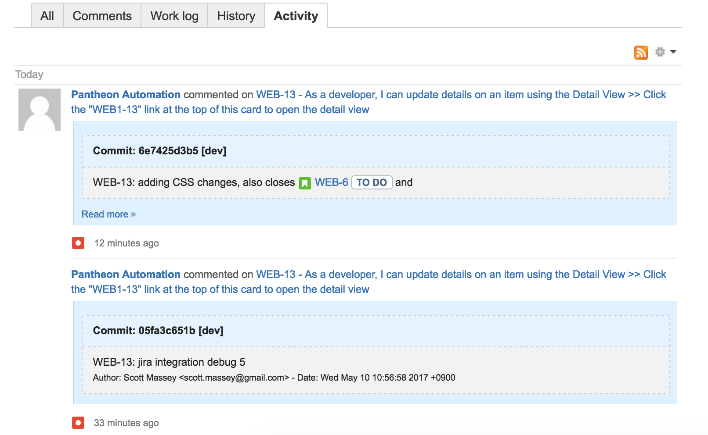

This section provides information on how to use Quicksilver to integrate Jira with Pantheon.

Atlassian's [Jira](https://www.atlassian.com/software/jira) issue tracking is one of the most common applications used to manage projects for application development teams. It is part of a [larger suite of tools](https://www.atlassian.com/legal/privacy-policy/product-family). Jira is extremely customizable, through manual configuration or the use of installable plugins. It allows for integration with tools in the Atlassian suite as well as other common development tools.

The sections below provide steps on how to use Quicksilver to connect a Jira instance to a website project on Pantheon. You can push changes that include the Jira issue ID to Pantheon, and the commit message will appear on the Jira issue's activity log.

## Before You Begin

Be sure that you:

- Have a Drupal or WordPress site on Pantheon

- Install [Terminus](/terminus):

  ```bash{promptUser: user}
  curl -O https://raw.githubusercontent.com/pantheon-systems/terminus-installer/master/builds/installer.phar && php installer.phar install
  ```

- [Generate a Machine Token](https://dashboard.pantheon.io/machine-token/create): Navigate to the **User Dashboard**, select **Account**, select **Machine Tokens**, and then authenticate Terminus:

  ```bash{promptUser: user}
  terminus auth:login --machine-token=‹machine-token›
  ```

- Install the [Terminus Secrets Plugin](https://github.com/pantheon-systems/terminus-secrets-plugin):

  ```bash{promptUser: user}
  curl https://github.com/pantheon-systems/terminus-secrets-plugin/archive/1.x.tar.gz -L | tar -C ~/.terminus/plugins -xvz
  ```

## Create a Machine User in Atlassian

Create a new machine user in your Atlassian Cloud instance. This user is referred to as a "machine user" because the account is used to automatically create comments out of commit messages on Pantheon using a PHP script.

1. [Sign up for an Atlassian Cloud account](https://www.atlassian.com/software/jira/try) if you do not have one already.

1. Login to your Atlassian Cloud instance, click <i class="fa fa-gear"></i> in the upper panel, and then select **User management**.

1. Enter a name and email address for the machine user, which acts as the intermediary between Jira and the Pantheon Site Dashboard. Then click **Create users**.

  We suggest naming machine users relative to their function, in this example we name our new user `Pantheon Automation`. The email needs to be an account you have access to:

    

1. Check the address used in the last step for an email from Atlassian. The username is provided here. Click the **Set my password** button and follow prompts to set the machine user's password.

## Securely Store User Credentials on Pantheon

You must provide Pantheon with the credentials for your new machine user. These credentials are securely stored in the [private path](/guides/secure-development/private-paths#private-path-for-files) of Pantheon's filesystem.

We use the filesystem private path in this section because we don't want to track sensitive data like passwords in the codebase with git.

In the commands below, replace `<site>` with your site name, `<example>` with your Atlassian project name, `<user>` with your machine account username in Jira, and `<password>` with its password.

1. Check for existing secrets using Terminus:

   ```bash{promptUser: user}
   terminus secrets:list <site>.dev
   ```

  If no existing keys are found, run the following to create a new `secrets.json` file and upload it to Pantheon:

   ```none
   $ echo '{}' > secrets.json
   $ `terminus connection:info <site>.dev --field=sftp_command`
   sftp> put ./files/private secrets.json
   sftp> bye
   $ rm secrets.json
   ```

  Otherwise, continue to the next step.

1. Use Terminus to write your Jira URL value in the private `secrets.json` file:

   ```bash{promptUser: user}
   terminus secrets:set <site>.dev jira_url 'https://<example>.atlassian.net'
   ```

1. Write the machine username to the private `secrets.json` file:

   ```bash{promptUser: user}
   terminus secrets:set <site>.dev jira_user <user>
   ```

1. Add the machine user's password to the private `secrets.json` file:

   ```bash{promptUser: user}
   terminus secrets:set <site>.dev jira_pass <password>
   ```

<Alert title="Note" type="info">

When it comes to keeping production keys secure, the best solution is to use a key management service like [Lockr](/guides/lockr) to automatically encrypt and secure keys on distributed platforms such as Pantheon.

</Alert>

## Configure Quicksilver Integration

You must add Pantheon's example [Quicksilver](/guides/quicksilver) integration script for Jira to the [private path](/guides/secure-development/private-paths#private-path-for-code) of your site's codebase. The private path within the codebase is tracked in version control and is accessible by PHP, but not the web.

In the commands below, replace `<site>` with your Pantheon site name.

1. [Clone your Pantheon site repository](/guides/git/git-config#clone-your-site-codebase) if you haven't done so already, and navigate to the project's root directory:

   ```bash{promptUser: user}
   terminus connection:info <site>.dev --fields='Git Command' --format=string`
   cd <site>
   ```

1. Set the connection mode to Git:

   ```bash{promptUser: user}
   terminus connection:set <site>.dev git
   ```

1. Create a copy of [Pantheon's `jira_integration.php`](https://github.com/pantheon-systems/quicksilver-examples/tree/master/jira_integration) in the project's private path:

   ```bash{promptUser: user}
   mkdir private
   mkdir private/scripts
   curl https://raw.githubusercontent.com/pantheon-systems/quicksilver-examples/master/jira_integration/jira_integration.php --output ./private/scripts/jira_integration.php
   ```

1. Create a `pantheon.yml` file if one doesn't already exist in your root directory.

1. Paste the following workflow into your `pantheon.yml` file to hook into the platform when code is pushed to trigger the Jira integration script:

   ```yaml:title=pantheon.yml
   #always include the api version
   api_version: 1

   workflows:
     sync_code:
       after:
         - type: webphp
           description: Jira Integration
           script: private/scripts/jira_integration.php
   ```

    <Alert title="Note" type="info">

    `api_version` should be set once in [`pantheon.yml`](/pantheon-yml). If you have an existing `pantheon.yml` with this line, don't add it again.

    </Alert>

1. [Commit and push](/guides/git/git-config#push-changes-to-pantheon) changes to the Dev environment:

   ```bash{promptUser: user}
   git add .
   git commit -m "Create private/jira_integration.php and configure platform hooks"
   git push origin master
   ```

## Test Jira Integration on Pantheon

1. Create a test issue in an existing or new Jira project and take note of the issue ID.

1. Optional: Run `terminus workflow:watch` in a separate terminal window to see the next process unfold in real time.

1. Push a code change that contains the Jira issue ID in the commit message. This workflow will trigger `jira_integration.php` script, which will search commits for possible issue IDs and comment in Jira when found.

    You can also reference multiple issue IDs in a single commit:

      ```bash{promptUser: user}
      git commit -m "WEB-113: This commit also fixes WEB-29 and WEB-3"
      ```

1. Return to the issue in Jira to see a message from our machine user:

    

## External Repositories

You can also connect your Jira and Pantheon-integrated site to an external repository such as Atlassian's [Bitbucket](https://confluence.atlassian.com/adminjiracloud/getting-started-with-bitbucket-and-jira-cloud-776830280.html) or [GitHub](https://confluence.atlassian.com/adminjiracloud/connect-jira-cloud-to-github-814188429.html). These integrations will provide better insight and clarity into work being performed, while saving time by automating communication within your team.

## More Resources

- [Pantheon YAML Configuration Files](/pantheon-yml)
- [Lockr](/guides/lockr)
- [Private Paths for Files and Code](/guides/secure-development/private-paths)
