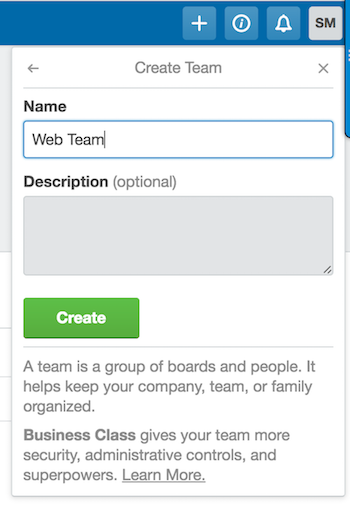

This section provides information on how to integrate Trello with Pantheon using Quicksilver.

[Trello](https://trello.com) is a project management tool which helps teams to collaborate on projects in an agile framework.

The sections below provide steps on how to use Quicksilver to connect your Trello instance to a website project on Pantheon. You can push changes that include a Trello card's unique ID to Pantheon, and the commit message will appear in the card.

## Before You Begin

Be sure that you:

- Have a Drupal or WordPress site on Pantheon

- Install [Terminus](/terminus/install#install-terminus)

- [Generate a Machine Token](https://dashboard.pantheon.io/machine-token/create): Navigate to the **User Dashboard**, select **Account**, select **Machine Tokens**, and then authenticate Terminus:

  ```bash{promptUser: user}
  terminus auth:login --machine-token=‹machine-token›
  ```

- Install the [Terminus Secrets Plugin](https://github.com/pantheon-systems/terminus-secrets-plugin)

## Create a Machine User in Trello

Create a new machine user in your Trello instance. This user is referred to as a "machine user" because the account is used to automatically create comments out of commit messages on Pantheon using a PHP script.

1. Login to your Trello instance, click <i class="fa fa-plus"></i> in the upper panel, and then select **Create Personal Team** or **Create Business Team**, depending on your plan. Add a team name and click **Create** to create a team if you haven't done so already.

    

    If you already have a team, select it from your dashboard.

1. Click **Add Members**, and then select **Add by name or email**.

1. Enter a name and email address for the machine user, which acts as the intermediary between Trello and the Pantheon Site Dashboard.

  We suggest naming machine users relative to their function, in this example we name our new user `Automation User`. The email needs to be an account you have access to:

    

1. Login as the new "Automation User" and make sure you're a team member on the relevant board:

    

1. Copy the machine user's API key from [here](https://trello.com/app-key), then click the link to manually generate a Token:

    

1. Save your key and token for use in the next section.

## Securely Store User Credentials on Pantheon

You must provide Pantheon with the credentials for our new machine user. These credentials are securely stored in the [private path](/guides/secure-development/private-paths#private-path-for-files) of Pantheon's filesystem.

We use the filesystem private path in this section because we don't want to track sensitive data like passwords in the codebase with git.

1. Check for existing secrets using Terminus (replace `<site>` with your site name):

   ```bash{promptUser: user}
   SITE=<site>
   terminus secrets:list $SITE.dev
   ```

  If no existing keys are found, execute the following to create a new `secrets.json` file and upload it to Pantheon:

   ```none
   $ echo '{}' > secrets.json
   $ `terminus connection:info $SITE.dev --field=sftp_command`
   sftp> put ./files/private secrets.json
   sftp> bye
   $ rm secrets.json
   ```

  Otherwise, continue to the next step.

1. Use Terminus to store the Automation User's API key in the the private `secrets.json` file (replace `<API key>`):

   ```bash{promptUser: user}
   terminus secrets:set $SITE.dev trello_key '<API key>'
   ```

1. Use Terminus to store the Automation User's token in the the private `secrets.json` file (replace `<Token>`):

   ```bash{promptUser: user}
   terminus secrets:set $SITE.dev trello_token '<Token>'
   ```

<Alert title="Note" type="info">

When it comes to keeping production keys secure, the best solution is to use a key management service like [Lockr](/guides/lockr) to automatically encrypt and secure keys on distributed platforms such as Pantheon.

</Alert>

## Configure Quicksilver Integration

You must add Pantheon's example [Quicksilver](/guides/quicksilver) integration script for Trello to the [private path](/guides/secure-development/private-paths#private-path-for-code) of your site's codebase. The private path within the codebase is tracked in version control and is accessible by PHP, but not the web.

1. [Clone your Pantheon site repository](/guides/git/git-config#clone-your-site-codebase) if you haven't done so already, and navigate to the project's root directory:

   ```bash{promptUser: user}
   terminus connection:info $SITE.dev --fields='Git Command' --format=string`
   cd $SITE
   ```

1. Set the connection mode to Git:

   ```bash{promptUser: user}
   terminus connection:set $SITE.dev git
   ```

1. Create a copy of [Pantheon's `trello_integration.php`](https://github.com/pantheon-systems/quicksilver-examples/tree/master/trello_integration) in the project's private path:

   ```bash{promptUser: user}
   mkdir private
   mkdir private/scripts
   curl https://raw.githubusercontent.com/pantheon-systems/quicksilver-examples/master/trello_integration/trello_integration.php --output ./private/scripts/trello_integration.php
   ```

1. Create a `pantheon.yml` file if one doesn't already exist in your root directory.

1. Paste the following workflow into your `pantheon.yml` file to hook into the platform when code is pushed to trigger the Trello integration script:

   ```yaml:title=pantheon.yml
   #always include the api version
   api_version: 1

   workflows:
     sync_code:
       after:
         - type: webphp
           description: Trello Integration
           script: private/scripts/trello_integration.php
   ```

    <Alert title="Note" type="info">

    `api_version` should be set once in [`pantheon.yml`](/pantheon-yml). If you have an existing `pantheon.yml` with this line, don't add it again.

    </Alert>

1. [Commit and push](/guides/git/git-config#push-changes-to-pantheon) changes to the Dev environment:

   ```bash{promptUser: user}
   git add .
   git commit -m "Create private/scripts/trello_integration.php and configure platform hooks"
   git push origin master
   ```

## Test Trello Integration on Pantheon

1. Create a test issue in an existing or new Trello project. Copy the issue ID, which is located in the Trello card's URL:

    

1. Optional: Run `terminus workflow:watch $SITE` in a separate Terminal window to see the process unfold in real time.

1. Push a code change to Pantheon containing the Trello card ID in the commit message in brackets (e.g., `[4K2zqr1A]`). This workflow will trigger `trello_integration.php` script, which will search commits for possible issue IDs and comment in Trello when found.

   ```bash{promptUser: user}
   git commit -m "[4K2zqr1A]: Require wp-redis as dropin via Composer"
   ```

1. Return to the issue in Trello to see a message from our machine user:

    

## External Repositories

You can also connect your Trello and Pantheon-integrated site to an external repository such as [GitHub](http://help.trello.com/article/1065-using-the-github-power-up). This integration allows you to attach pull requests, issues, and commits directly to your Trello cards from within the Trello dashboard.

## More Resources

- [Git on Pantheon](/guides/git)
- [Pantheon YAML Configuration Files](/pantheon-yml)
- [Lockr](/guides/lockr)
- [Private Paths for Files and Code](/guides/secure-development/private-paths)
