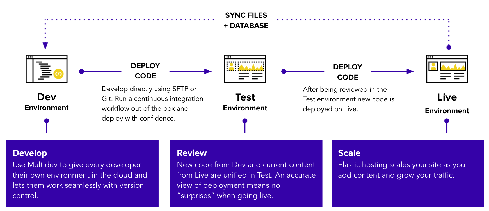

Next, we'll learn about the Dev, Test, Live workflow.

Every Pantheon site comes with three separate environments— Dev, Test, Live—which are represented by tabs on your dashboard.

<Alert title="Note" type="info">

Agencies have access to additional development environments under the <Icon icon={"cloud"} text={"Multidev"} /> tab.

</Alert>

If you aren’t already on a Site Dashboard, go to **Personal Workspace** > **Sites** tab, and select the site you want to work with.

##  Dev

By default, you’ll find yourself on this tab. This is your development environment. It provides access to a stand-alone copy of your site, with its own codebase, database, and files.

Within the safety of this isolated environment, you can edit code and make updates to your site. All development on your Pantheon sites starts here.

##  Test

This environment is for reviewing the changes made in your Dev environment with the most recent content from your live site.

To use the Test environment for this purpose, you first push new code “up” from your Dev environment and clone recent content (from your installed CMS) “down” from your Live environment.

##   Live

This environment is for your live site, where content creators actively post and upload media files. After passing review, you push your new code “up” from the Test environment to this Live environment. For more details, see [The Site Dashboard](/sites), or the condensed glossary below.

The following links are located within your Dev, Test, and Live environment tabs:

- **Code:** Switch between SFTP Connection Mode and Git Connection Mode. Obtain SFTP Connection Info, and commit changes to your Dev environment. (This link is only accessible within your Dev environment.)

- **Commit Log:** See a list of all code changes by viewing the commits. Click an individual commit to see the log message and list of changes.

- **Deploys:** View a deploy log for the environment. (This link is only accessible within your Test and Live environments.)

- **Merge:** If you have a Multidev environment, use this tab to merge branches into your master branch. (This tab is only accessible within your Dev environment.)

- **Status:** Check this page on a regular basis (especially before you go live the first time) to catch common problems and follow best-practice recommendations for site configuration.

- **Database / Files:** Workflow tools are provided to clone your database and files between environments with the click of a button.

  - **Clone:** Clone the database and/or files from one environment to another.

  - **Import:** Replace your current database and files with an archive.

  - **Export:** Package and download your database and files in an archive.

  - **Wipe:** Reset the database and files, and start fresh with your codebase.

- **Errors:** Check this page to see if there are any critical PHP errors on your site. You can find more error logs by connecting via SFTP.

- **Domains/HTTPS:** Add custom domains to your site, enable SSL and manage certificates. (This feature is only available on paid plans.)

- **Backup:** Create a backup of the environment.

  - **Backup Log:** View existing backups of the environment. Click the <Icon icon={"download-alt"} text={"Download"}/> icon to download individual archives within a backup.

  - **Backup Schedule:** Schedule daily or weekly automatic backups of the environment. (This feature is only available on paid plans.)

- **Security:** Set a password for accessing this environment.

- **New Relic:** Use this server-side performance monitoring tool to identify bottlenecks and optimize your site.

