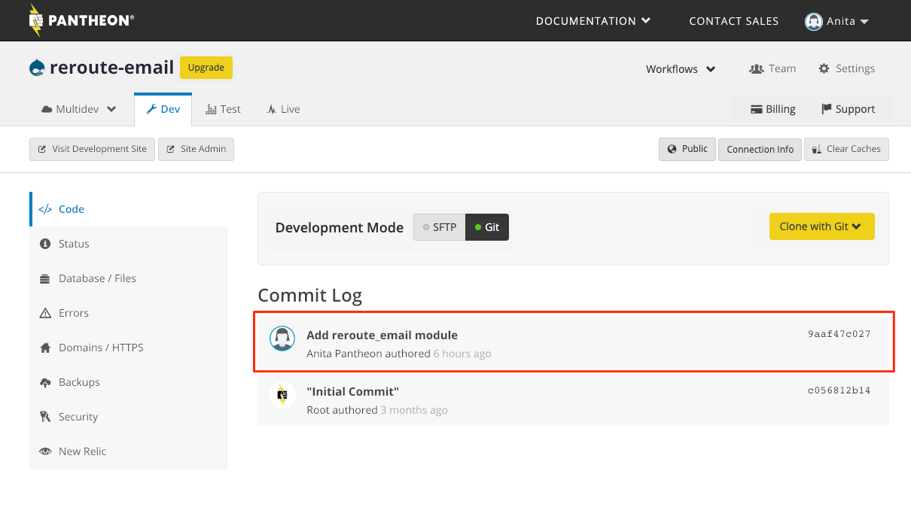
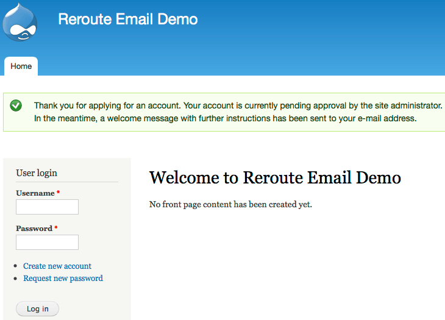
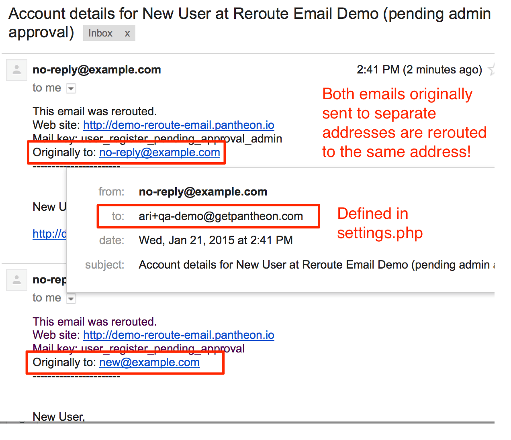

If your Drupal site sends outbound email, you don't want to accidentally spam your users or customers from your Dev or Test environments. Maybe your site has a complex editorial workflow that alerts people when action is required, or maybe you’re redesigning email templates for your drip marketing campaign. Whatever your use case, you’ll want to make sure that you’re not accidentally spamming customers during debugging or quality assurance testing, and you’ll want to add the [Reroute Email](https://www.drupal.org/project/reroute_email) module to your dev toolkit.

Pantheon makes it easy to pull the Live database to other environments with the push of a button. However, if you mistakenly forget to manually change a setting stored in the database—you guessed it—you could accidentally spam folks during debugging or quality assurance testing.

Fortunately, Reroute Email is easy to setup so settings persist per environment, even when moving the database between environments. Install and enable it in all environments, configure it via [settings.php](/settings-php) with [environmental variables](/read-environment-config), and never worry about spamming users during debugging or testing again.

As an added bonus, you’ll be able to funnel all dev and testing emails to a single inbox—no more logging in to a bunch of email accounts just to test your business expectations.

## Installation

Download and install as usual. You can use [SFTP](/sftp) on Pantheon or the [Drupal UI](/cms-admin/#drupal-admin-interface) to install a module, but my preference is to stay in Git mode, keep those automated backups running on Dev, and stay on the command line whenever possible.

I chose [Drupal 7 as a start state](/start-state/#importing-an-existing-site) and performed a [git clone](/git) of my Pantheon site.
```bash{promptUser: user}
cd sites
git clone [pantheon git clone ssh connection string]
cd site-name
mkdir sites/all/modules/contrib
```

I added a `contrib` directory to help keep modules organized. In the next step, Drush knows to download contrib modules into that directory.

```bash{promptUser: user}
drush dl reroute_email
```

The following line isn’t necessary, but it’s a good idea to use `git status` to understand the state of your local Git repository, especially if you’re new to Git. If you’re just starting with Git, I encourage you to do a `git status` between each of the steps.

```bash{outputLines: 2-8}
git status
On branch master
Your branch is behind 'origin/master' by 3 commits, and can be fast-forwarded.
  (use "git pull" to update your local branch)
Untracked files:
  (use "git add <file>..." to include in what will be committed)

        sites/all/modules/contrib/
```

Add the module to git.

```bash{promptUser: user}
git add sites/all/modules/contrib/reroute_email
```

Commit and push the module to Pantheon.

```bash{promptUser: user}
git commit -m "Add reroute_email module"
git push origin master
```

Now check your Site Dashboard and you’ll see that the module’s code has been deployed to your Dev environment.



## Configuration

If you don’t have a settings.php file, copy the default.settings.php file.  You can copy the file however you like, but my preference is from the command line:

```bash{promptUser: user}
cp sites/default/default.settings.php sites/default/settings.php
```

Using your favorite editor or IDE (lately I use [vim](http://www.vim.org) or [atom.io](https://atom.io)), open settings.php, and add the following:

```php
if (defined('PANTHEON_ENVIRONMENT')) {
  if (PANTHEON_ENVIRONMENT == 'live') {
    // Do not reroute email on Live
    $conf['reroute_email_enable'] = 0;
  }
  else {
    // Reroute email on all Pantheon environments but Live
    $conf['reroute_email_enable'] = 1;
    $conf['reroute_email_address'] = "youremail+qa-" . PANTHEON_ENVIRONMENT . "@example.com";
    $conf['reroute_email_enable_message'] = 1;
  }
}

if (!defined('PANTHEON_ENVIRONMENT')) {
  // Reroute email when site is not on Pantheon (local install)
  $conf['reroute_email_enable'] = 1;
  $conf['reroute_email_address'] = "youremail+qa-local@example.com";
  $conf['reroute_email_enable_message'] = 1;
}
```

A few notes:

- In order for the snippet to work as intended, **the module must be enabled in all environments.**
- The config in settings.php overrides any settings in the Drupal Admin UI.
- The PANTHEON_ENVIRONMENT variable changes the reroute_email settings based on environment.
- If your site isn't on Pantheon look for available [Superglobals](https://secure.php.net/manual/en/language.variables.superglobals.php) to aid in configuration.
- For the email address, I chose to not create several new email addresses, although you can definitely do that.
- I used my existing email address, taking advantage of the plus sign so I can have “extra” email addresses that are all delivered to my existing email address. It’s not a new trick, but it’s a handy feature [baked into Gmail](https://gmail.googleblog.com/2008/03/2-hidden-ways-to-get-more-from-your.html) and some other mail services. If you’re taking this route, you’ll also want to set up [email filters](https://support.google.com/mail/answer/6579?hl=en) to skip the inbox and label it appropriately based on the `To:` header.

For more about Reroute Email’s settings, see the README.txt that ships with the module.

### Stage and Commit Settings.php

```bash{promptUser: user}
git add sites/default/settings.php
git commit
```

I’ve chosen not to use the -m flag with the commit so I can use my text editor to write a longer, more informative commit message that communicates exactly what my intent is:

```none
Configure reroute_email via settings.php

Intercept all outgoing emails for all environments but Live and reroute to QA email addresses so I never spam customers during testing again!

* Do not reroute email on Live
* Reroute email on all other Pantheon environments
* Reroute email on non-Pantheon environments (local)

**Note:** In order for the settings.php config to work correctly, the reroute_email module must be enabled in all environments.

Project page: https://www.drupal.org/project/reroute_email
```

Next, push the code to Pantheon.

```bash{promptUser: user}
git push origin master
```

Push the code to Test and Live and enable the module in all environments.
You can do this through the Site Dashboard and the Drupal Admin UI (/admin/modules) or by using [Terminus](/terminus) and drush:

```bash{promptUser: user}
terminus auth:login
terminus drush <site>.test -- en reroute_email -y
terminus env:deploy <site>.test --sync-content --cc --updatedb --note="Intial deploy. Reroute Email demo"
terminus env:deploy <site>.live --cc --updatedb --note="Intial deploy. Reroute Email demo"
terminus drush <site>.test -- en reroute_email -y
terminus drush <site>.live -- en reroute_email -y
```

Now the Dev environment’s settings page for reroute_email (/admin/config/development/reroute_email) should look something like this:


If you don’t see what you’re expecting, review your settings.php and ensure the commit is showing on your Dashboard:


## Go Forth and Test

That’s it! Now when Drupal sends out an email from any environment (except Live), it will get rerouted to the email address specified in settings.php. Our settings.php will make sure email is not rerouted on Live, so it’s business as usual. Make sure you’re using a [SMTP gateway](/email/#outgoing-email) on Live to ensure email deliverability.

### See Reroute Email In Action

To see exactly what we did, I forked a new [MultiDev](/multidev) Multidev environment called ```demo``` and requested a new account:



Requesting a new account fires off two emails: one to the requestor and another to the site owner; both are successfully rerouted to the email address defined in settings.php:



## See Also

[Manage Email Handling for Development or Testing](https://www.drupal.org/node/201981)
