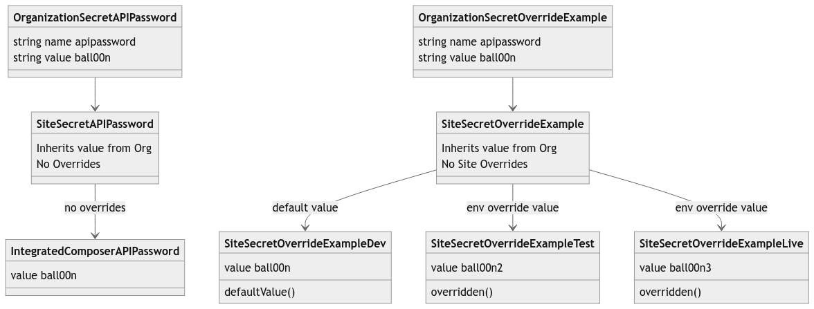

<dl>

<dt>Secret</dt>

<dd>

A key-value pair that should not be exposed to the general public, typically something like a password, API key, or other sensitive information that should not be added to version control.

</dd>

<dt>Secret type1</dt>

<dd>
This represents how the secret is used.  A secret can only have one type.

Current types are:

  * `runtime`: This secret type can be retreived directly from your application code.  This is the recommended type if you want your application to be able to use the secret while it's operating.

  * `env`: This type is used to set environment variables. Environment variables are currently only supported for Integrated Composer builds; setting environment variables on the application server is unsupported.

  * `composer`: This secret type is specifically used for authentication when pulling Composer packages from private repositories.  This is the recommended method for installing private composer packages.

</dd>

<dt>Secret Scope</dt>

<dd>
A secret's scope is the answer to the question "Where is the secret's value available?". Once set, a secret's scope cannot be changed. The secret must be deleted and recreated.

  * `ic`: This secret will be readable by the Integrated Composer runtime. You should use this scope to get access to your private repositories.

  * `web`: this secret will be readable by the application runtime.

  * `user`: this secret will be readable by the user. This scope should be set if you need to retrieve the secret value at a later stage.

</dd>

<dt>Owning Entity</dt>

<dd>

* **Organization-owned secrets** - Organization-owned secrets are available to every site and environment that are associated with the owning organization. A common use-cases is for a CI system and infrastructure that's shared among all sites in an organization. Note that secrets from "Supporting" Organizations are explicitly ***not shared*** with the sites they support. Sites receive secret key/value pairs from their Primary Organization only.

* **Site-owned secrets** - Site-owned secrets are available to the site and all of its environments. A common use-case is Github tokens that a site's composer build can use to access private repos referenced in the composer file.

* **Environment override** - Environment overrides provide overrides to a secret value for a specific environment. A common use case for this are API keys that are different in production and non-production environments.

</dd>

<dt>Value Resolution</dt>

<dd>

1. Organization values are resolved first. They form the base value for the key-pair's value resolution.

3. Site values are resolved second and secret values set on the site level will override secret values set for the organization. To return the secret to it's organization value, simply delete the site value.

4. Environmental overrides are resolved finally and if the override exists, it will become the value provided to the calling function.

5. Each secret's value can be no larger than 16k (16384 Bytes)

</dd>

</dl>

**Notes**
1: Note that you can only set one type per secret and this cannot be changed later (unless you delete and recreate the secret).
