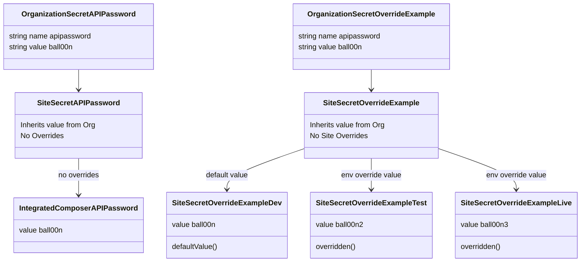

**IMPORTANT: when Pantheon Secrets goes into GA, it will be part of terminus core. Until then, this plugin invormation covers [THIS REPOSITORY]( https://github.com/pantheon-systems/terminus-secrets-manager-plugin).**

# Terminus Secrets Manager Plugin

Pantheon’s Secrets Manager Terminus plugin is key to maintaining industry best practices for secure builds and application implementation. Secrets Manager provides a convenient mechanism for you to manage your secrets and API keys directly on the Pantheon platform.

## Table of Contents

- [Overview](#overview)
  * [Key Features](#key-features)
  * [Early Access](#early-access)
- [Concepts](#concepts)
  * [Secret](#secret)
  * [Secret type](#secret-type)
  * [Secret scope](#secret-scope)
  * [Owning entity](#owning-entity)
  * [Site-owned secrets](#site-owned-secrets)
  * [Organization-owned secrets](#organization-owned-secrets)
  * [Environment override](#environment-override)
- [The life of a secret](#the-life-of-a-secret)
- [Plugin Usage](#plugin-usage)
  * [Secrets Manager Plugin Requirements](#secrets-manager-plugin-requirements)
  * [Installation](#installation)
  * [Site secrets Commands](#site-secrets-commands)
  * [Organization secrets Commands](#organization-secrets-commands)
  * [Help](#help)
- [Rate Limiting](#rate-limiting)
- [Use Secrets with Integrated Composer](#use-secrets-with-integrated-composer)
  * [Mechanism 1: Oauth Composer authentication](#mechanism-1-oauth-composer-authentication)
  * [Mechanism 2: HTTP Basic Authentication](#mechanism-2-http-basic-authentication)
- [Use Secrets in Drupal through the Key module](#use-secrets-in-drupal-through-the-key-module)


## Overview

### Key Features

- Securely host and maintain secrets on Pantheon

- Create and update secrets via Terminus

- Use private repositories in Integrated Composer builds

- Ability to set a `COMPOSER_AUTH` environment variable and/or a Composer `auth.json` authentication file with Terminus commands

- Ability to define site and org ownership of secrets

- Propagate organization-owned secrets to all the sites in the org

- Ability to define the degree of secrecy for each managed item

- Secrets are encrypted at rest

### Early Access

The Secrets Manager plugin is available for Early Access participants. Features for Secrets Manager are in active development. Pantheon's development team is rolling out new functionality often while this product is in Early Access. Visit the [Pantheon Slack channel](https://slackin.pantheon.io/) (or sign up for the channel if you don't already have an account) to learn how you can enroll in our Early Access program. Please review [Pantheon's Software Evaluation Licensing Terms](https://legal.pantheon.io/#contract-hkqlbwpxo) for more information about access to our software.

## Concepts

### Secret

A key-value pair that should not be exposed to the general public, typically something like a password, API key, or the contents of a peer-to-peer cryptographic certificate. SSL certificates that your site uses to serve pages are out of scope of this process and are managed by the dashboard in a different place. See the documentation for SSL certificates for details.

### Secret type

This is a field on the secret record. It defines the usage for this secret and how it is consumed. Current types are:

- `runtime`: this secret will be used to retrieve it in application runtime using API calls to the secret service. This type is not yet in use in Early Access, but will be the recommended way to set information like API keys for third-party integrations in your application.

- `env`: this secret will be used to set environment variables in the application runtime. This type is not yet in use in Early Access.

- `composer`: this secret type is used for composer authentication to private packages.

- `file`: this type allows you to store files in the secrets. This type is not yet in use in Early Access.

Note that you can only set one type per secret and this cannot be changed later (unless you delete and recreate the secret).

### Secret scope

This is a field on the secret record. It defines the components that have access to the secret value. Current scopes are:

- `ic`: this secret will be readable by the Integrated Composer runtime. You should use this scope to get access to your private repositories.

- `web`: this secret will be readable by the application runtime.

- `user`: this secret will be readable by the user. This scope should be set if you need to retrieve the secret value at a later stage.

Note that you can set multiple scopes per secret, but scopes cannot be changed later (unless you delete and recreate the secret).

### Owning entity

Secrets are currently either owned by a site or an organization. Within that owning entity, the secret may have zero or more environment overrides.

### Site-owned secrets

This is a secret set for a specific site using the site ID. Based on the type and scope, this secret will be loaded on the different scenarios that will be supported by Secrets in Pantheon.

### Organization-owned secrets

This is a secret set not for a given site but for an organization. This secret will be inherited by ALL sites OWNED by this organization. 

**Note**: Secrets owned by [Supporting Organizations](https://docs.pantheon.io/agency-tips#become-a-supporting-organization) won't apply to sites they support. Only the Owner organization's secrets will apply.

### Environment override

In some cases it will be necessary to have different values for the secret when that secret is accessed in different Pantheon environments. You may set an environment override value for any existing secret value. 

**Note**: If the secret does not exist, there is no secret environment to override, and you will get an error.



## The life of a secret

When a given runtime (e.g. Integrated Composer or an environment php runtime) fetches secrets for a given site (and env), the process will be as follows:

- Fetch secrets for site (of the given type and scopes).

- Apply environment overrides (if any) based on the requesting site environment.

- If the site is owned by an organization:

    - Fetch the organization secrets.

    - Apply environment overrides (if any) based on the requesting site environment.

    - Merge the organization secrets with the site secrets (the following example will describe this process in more detail).

Let's go through this with an example: assume you have a site named `my-site` which belongs to an organization `my-org`. You also have another site `my-other-site` which belongs to your personal Pantheon account.

When Integrated Composer attempts to get secrets for `my-other-site` it will go like this:
- Get the secrets of scope `ic` for `my-other-site`.
- Apply environment overrides for the current environment (see **Note** below).
- Look at `my-other-site` owner. In this case, it is NOT an organization so there are no organization secrets to merge.
- Process the resulting secrets to make them available to Composer.

On the other hand, when Integrated Composer attempts to get secrets for `my-site`, it will go like this:
- Get the secrets of scope `ic` for `my-site`.
- Apply environment overrides for the current environment (see **Note** below).
- Look at the site owner. It determines it is the organization `my-org`.
- Get the secrets for the organization `my-org` with scope `ic`.
- Apply the environment overrides to those secrets for the current environment (see **Note** below).
- Merge the resulting organization secrets with the site secrets with the following caveats:
    - Site secrets take precedence over organization secrets. This means that the value for site-owned secret named `foo` will be used instead of the value for an org-owned secret with the same name `foo`.
    - Only the secrets for the OWNER organization are being merged. If the site has a Supporting Organization, it will be ignored.
- Process the resulting secrets to make them available to Composer.

**Note:** Due to platform design, the "environment" for Integrated Composer will always be either `dev` or a multidev. It will never be `test` or `live`. Therefore we do not recommend using environment overrides for Composer access. The primary use-case for environment overrides is for the CMS key-values and environment variables that need to be different between your live and non-live environments.

## Plugin Usage

### Secrets Manager Plugin Requirements

Secrets Manager requires the following:

- A Pantheon account
- A site that uses [Integrated Composer](https://docs.pantheon.io/guides/integrated-composer) and runs PHP >= 8.0
- Terminus 3.0+

### Installation

Terminus 3.x has built in plugin management.

Run the command below to install Terminus Secrets Manager.

```
terminus self:plugin:install terminus-secrets-manager-plugin
```

### Site secrets Commands

#### Set a secret

The secrets `set` command takes the following format:

- `Name`
- `Value`
- `Type`
- `One or more scopes`


**Run the command below to set a new secret in Terminus:**

```
terminus secret:site:set <site> <secret-name> <secret-value>

[notice] Success
```

```
terminus secret:site:set <site> file.json "{}" --type=file

[notice] Success
```

```
terminus secret:site:set <site> <secret-name> --scope=user,ic

[notice] Success
```

Note: If you do not include a `type` or `scope` flag, these values will be set to the defaults (`runtime` and `user` respectively).


**Run the command below to update an existing secret in Terminus:**

```
terminus secret:site:set <site> <secret-name> <secret-value>

[notice] Success
```

Note: When updating an existing secret, `type` and `scope` should NOT be passed as they are immutable. You should delete and recreate the secret if you need to update those properties.


**Add or update an environment override for an existing secret in Terminus:**

```
terminus secret:site:set <site>.<env> <secret-name> <secret-value>

[notice] Success
```

Note: You can add an environment override only to existing secrets; otherwise, it will fail.


#### List secrets

The secrets `list` command provides a list of all secrets available for a site. The following fields are available:

- `Name`
- `Scope`
- `Type`
- `Value`
- `Environment Override Values`
- `Org Values`

Note that the `value` field will contain a placeholder value unless the `user` scope was specified when the secret was set.

**Run the command below to list a site’s secrets:**


```
terminus secret:site:list <site>

 ------------- ------------- ---------------------------
  Secret name   Secret type   Secret value
 ------------- ------------- ---------------------------
  secret-name   env           secrets-content
 ------------- ------------- ---------------------------
```

```
terminus secret:site:list <site> --fields="*"

 ---------------- ------------- ------------------------------------------ --------------- ----------------------------- --------------------
  Secret name      Secret type   Secret value                               Secret scopes   Environment override values   Org values
 ---------------- ------------- ------------------------------------------ --------------- ----------------------------- --------------------
  foo              env           ***                                        web, user
  foo2             runtime       bar2                                       web, user                                     default=barorg
  foo3             env           dummykey                                   web, user       live=sendgrid-live
 ---------------- ------------- ------------------------------------------ --------------- ----------------------------- --------------------
 ```

#### Delete a secret

The secrets `delete` command will remove a secret and all of its overrides.

**Run the command below to delete a secret:**

```
terminus secret:site:delete <site> <secret-name>

[notice] Success
```

**Run the command below to delete an environment override for a secret:**

```
terminus secret:site:delete <site>.<env> <secret-name>

[notice] Success
```

#### Generate file for local development

The secrets `local-generate` command will generate a json file useful for local development emulation of secrets.

**Run the command below to get a json file:**

```
terminus secret:site:local-generate <site> --filepath=./secrets.json
[notice] Secrets file written to: ./secrets.json. Please review this file and adjust accordingly for your local usage.
```

### Organization secrets Commands

#### Set a secret

The secrets `set` command takes the following format:

- `Name`
- `Value`
- `Type`
- `One or more scopes`

**Run the command below to set a new secret in Terminus:**

```
terminus secret:org:set <org> <secret-name> <secret-value>

[notice] Success
```

```
terminus secret:org:set <org> file.json "{}" --type=file

[notice] Success
```

```
terminus secret:org:set <org> <secret-name> --scope=user,ic

[notice] Success
```

Note: If you do not include a `type` or `scope` flag, their defaults will be `runtime` and `user` respectively.

**Run the command below to update an existing secret in Terminus:**

```
terminus secret:org:set <org> <secret-name> <secret-value>

[notice] Success
```

Note: When updating an existing secret, `type` and `scope` should NOT be passed as they are immutable. You should delete and recreate the secret if you need to update those properties.

**Add or update an environment override for an existing secret in Terminus:**

```
terminus secret:org:set --env=<env> <org> <secret-name> <secret-value>

[notice] Success
```

Note: You can add an environment override only to existing secrets; otherwise, it will fail.


#### List secrets

The secrets `list` command provides a list of all secrets available for an organization. The following fields are available:

- `Name`
- `Scope`
- `Type`
- `Value`
- `Environment Override Values`

Note that the `value` field will contain a placeholder value unless the `user` scope was specified when the secret was set.

**Run the command below to list a site’s secrets:**


```
terminus secret:org:list <org>

 ------------- ------------- ---------------------------
  Secret name   Secret type   Secret value
 ------------- ------------- ---------------------------
  secret-name   env           secrets-content
 ------------- ------------- ---------------------------
```


```
terminus secret:org:list <org> --fields="*"

 ---------------- ------------- ------------------------------------------ --------------- -----------------------------
  Secret name      Secret type   Secret value                               Secret scopes   Environment override values
 ---------------- ------------- ------------------------------------------ --------------- -----------------------------
  foo              env           bar                                        web, user
  foo2             runtime       bar2                                       web, user
  foo3             env           dummykey                                   web, user       live=sendgrid-live
 ---------------- ------------- ------------------------------------------ --------------- -----------------------------
 ```

#### Delete a secret

The secrets `delete` command will remove a secret and all of its overrides.

**Run the command below to delete a secret:**

```
terminus secret:org:delete <org> <secret-name>

[notice] Success
```

**Run the command below to delete an environment override for a secret:**

```
terminus secret:org:delete --env=<env> <org> <secret-name>

[notice] Success
```

### Help

Run `terminus list secret` for a complete list of available commands. Use terminus help <command> to get help with a specific command.

## Rate Limiting

The service supports up to 3 requests per second per user through Terminus. If you hit that limit, the API will return a `429` error code and the plugin will throw an error.

The PHP SDK and `pantheon_get_secret()` function are not affected by this rate limiting.

## Use Secrets with Integrated Composer

You must configure your private repository and provide an authentication token before you can use the Secrets Manager Terminus plugin with Integrated Composer. You could use either of the following mechanisms to setup this authentication.


### Mechanism 1: Oauth Composer authentication

#### GitHub Repository

1. [Generate a Github token](https://docs.github.com/en/authentication/keeping-your-account-and-data-secure/creating-a-personal-access-token). The Github token must have all "repo" permissions selected.

    NOTE: Check the repo box that selects all child boxes. **Do not** check all child boxes individually as this does not set the correct permissions.

     

1. Set the secret value to the token via terminus: `terminus secret:site:set <site> github-oauth.github.com <github_token> --type=composer --scope=user,ic`

1. Add your private repository to the `repositories` section of `composer.json`:

    ```json
    {
        "type": "vcs",
        "url": "https://github.com/your-organization/your-repository-name"
    }
    ```

    Your repository should contain a `composer.json` that declares a package name in its `name` field. If it is a WordPress plugin or a Drupal module, it should specify a `type` of `wordpress-plugin` or `drupal-module` respectively. For these instructions, we will assume your package name is `your-organization/your-package-name`.

1. Require the package defined by your private repository's `composer.json` by either adding a new record to the `require` section of the site's `composer.json` or with a `composer require` command:

    ```bash
    composer require your-organization/your-package-name
    ```

1. Commit your changes and push to Pantheon.

#### GitLab Repository

1. [Generate a GitLab token](https://docs.gitlab.com/ee/user/profile/personal_access_tokens.html). Ensure that `read_repository` scope is selected for the token.

1. Set the secret value to the token via Terminus: `terminus secret:site:set <site> gitlab-oauth.gitlab.com <gitlab_token> --type=composer --scope=user,ic`

1. Add your private repository to the `repositories` section of `composer.json`:

    ```json
    {
        "type": "vcs",
        "url": "https://gitlab.com/your-group/your-repository-name"
    }
    ```

    Your repository should contain a `composer.json` that declares a package name in its `name` field. If it is a WordPress plugin or a Drupal module, it should specify a `type` of `wordpress-plugin` or `drupal-module` respectively. For these instructions, we will assume your package name is `your-organization/your-package-name`.

1. Require the package defined by your private repository's `composer.json` by either adding a new record to the `require` section of the site's `composer.json` or with a `composer require` command:

    ```bash
    composer require your-group/your-package-name
    ```

1. Commit your changes and push to Pantheon.

#### Bitbucket Repository

1. [Generate a Bitbucket oauth consumer](https://support.atlassian.com/bitbucket-cloud/docs/use-oauth-on-bitbucket-cloud/). Ensure that Read repositories permission is selected for the consumer. Also, set the consumer as private and put a (dummy) callback URL.

1. Set the secret value to the consumer info via Terminus: `terminus secret:site:set <site> bitbucket-oauth.bitbucket.org "<consumer_key> <consumer_secret>" --type=composer --scope=user,ic`

1. Add your private repository to the `repositories` section of `composer.json`:

    ```json
    {
        "type": "vcs",
        "url": "https://bitbucket.org/your-organization/your-repository-name"
    }
    ```

    Your repository should contain a `composer.json` that declares a package name in its `name` field. If it is a WordPress plugin or a Drupal module, it should specify a `type` of `wordpress-plugin` or `drupal-module` respectively. For these instructions, we will assume your package name is `your-organization/your-package-name`.

1. Require the package defined by your private repository's `composer.json` by either adding a new record to the `require` section of the site's `composer.json` or with a `composer require` command:

    ```bash
    composer require your-organization/your-package-name
    ```

1. Commit your changes and push to Pantheon.

### Mechanism 2: HTTP Basic Authentication

You may create a `COMPOSER_AUTH json` and make it available via the `COMPOSER_AUTH` environment variable if you have multiple private repositories on multiple private domains.

Composer has the ability to read private repository access information from the environment variable: `COMPOSER_AUTH`. The `COMPOSER_AUTH` variables must be in a [specific JSON format](https://getcomposer.org/doc/articles/authentication-for-private-packages.md#http-basic). 

Format example:

```bash
#!/bin/bash

read -e COMPOSER_AUTH_JSON <<< {
    "http-basic": {
        "github.com": {
            "username": "my-username1",
            "password": "my-secret-password1"
        },
        "repo.example2.org": {
            "username": "my-username2",
            "password": "my-secret-password2"
        },
        "private.packagist.org": {
            "username": "my-username2",
            "password": "my-secret-password2"
        }
    }
}
EOF

`terminus secret:site:set ${SITE_NAME} COMPOSER_AUTH ${COMPOSER_AUTH_JSON} --type=env --scope=user,ic`
```

## Use Secrets in Drupal through the Key module

If you want to use Pantheon Secrets in your Drupal application through the [Key module](https://www.drupal.org/project/key), you should use the [Pantheon Secrets](https://www.drupal.org/project/pantheon_secrets) module.
