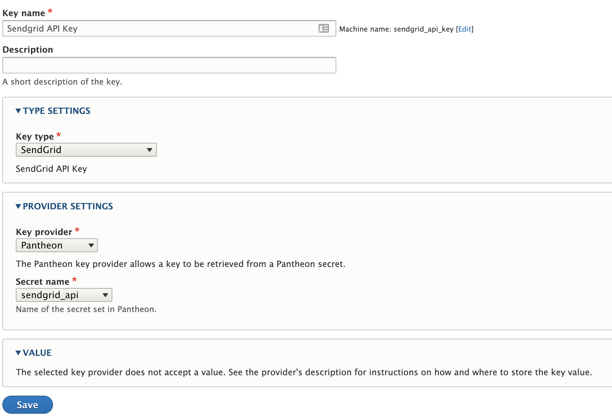
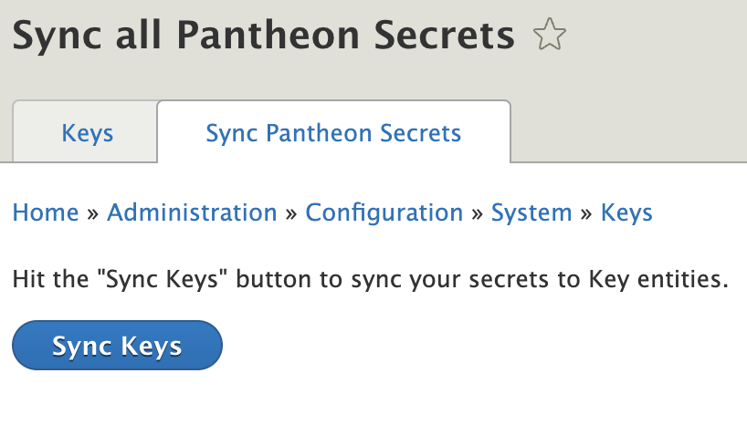
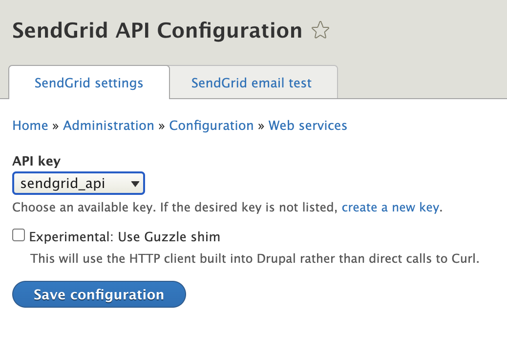
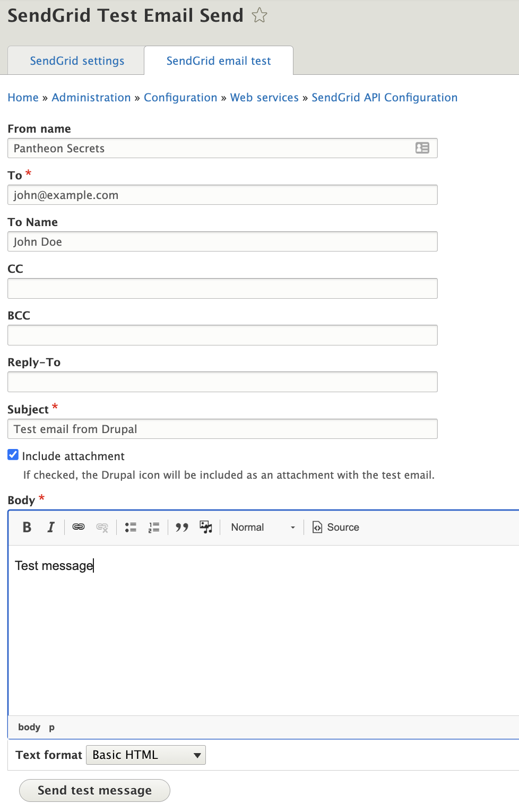

If you want to use Pantheon Secrets in your Drupal application through the [Key module](https://www.drupal.org/project/key), you should use the [Pantheon Secrets](https://www.drupal.org/project/pantheon_secrets) module.

## Pantheon Secrets detailed example

In this guide we will go over an end-to-end example on how to setup secrets for a given site and how to use those secrets on a module that integrates with the Key module. For this example, we will use the [SendGrid API](https://www.drupal.org/project/sendgrid_api) and [SendGrid Mailer](https://www.drupal.org/project/sendgrid_mailer) modules.

### Prerequisites

- Make sure you have access to a Drupal 9.4 or greater site running PHP 8.0 or above hosted on Pantheon.

- Make sure you have [Terminus installed](https://docs.pantheon.io/terminus/install#install-terminus) on your local machine.

- Install the [Terminus Secrets Manager Plugin](https://github.com/pantheon-systems/terminus-secrets-manager-plugin#installation).

### Steps

1. Install the required modules in your Drupal site and push the changes to Pantheon:
    ```bash{promptUser: user}
    composer require drupal/pantheon_secrets drupal/sendgrid_api drupal/sendgrid_mailer
    git add composer.json composer.lock
    git commit -m "Add Pantheon Secrets and SendGrid modules."
    git push
    ```

1. Enable the modules:
    ```bash{promptUser: user}
    terminus drush <site>.<env> -- en -y pantheon_secrets sendgrid_api sendgrid_mailer
    ```

1. Make sure your SendGrid account is correctly configured and allows sending email.

1. Create a SendGrid API key by following the [SendGrid instructions](https://docs.sendgrid.com/ui/account-and-settings/api-keys#creating-an-api-key).

1. Store the API key as a site secret:
    ```bash{promptUser: user}
    terminus secret:site:set <site> sendgrid_api <api_key> --scope=web --type=runtime
    ```

    As a best practice, the non-production environments should be the default and then override that value with a [secret environment override](/guides/secrets/overview#environment-override) to change the API key for the live environment (for example, if you want to use different SendGrid accounts for live and dev environments).

1. Add the Key entity in one of the different available ways:

    * **Option 1: Manually**

      Go to `/admin/config/system/keys` and click **Add key**. Select Pantheon Secret as the key provider and your secret name from the dropdown (make sure you select "SendGrid" as the Key type and "Pantheon" as the Key provider)

      

    * **Option 2: Sync Keys via Drupal Admin**

      Go to `/admin/config/system/keys/pantheon` and click on the "Sync Keys" button to get all of the available secrets into Key entities.

      

      Then, go to `/admin/config/system/keys` to edit the `sendgrid_api` Key and change the type to "SendGrid".

    * **Option 3: Sync Keys via Terminus**

      Use the provided Drush command to sync all of your secrets into Key entities:

      ```bash{promptUser: user}
      terminus drush <site>.<env> -- pantheon-secrets:sync
      ```

      Then, go to `/admin/config/system/keys` to edit the `sendgrid_api` Key and change the type to "SendGrid".

1. Go to the SendGrid API Configuration page (`/admin/config/services/sendgrid`) and select your Key item.

    

1. Make sure your site "Email Address" (`/admin/config/system/site-information`) matches a verified Sender Identity in SendGrid.

1. Go to the Default Mail System Configuration page (`/admin/config/system/mailsystem`) and set `Formatter` and `Sender` to `SendGrid Mailer`.

1. Go to the SendGrid email test page (`/admin/config/services/sendgrid/test`) and test your SendGrid integration by sending a test email.

    

1. The email should get to your inbox. Enjoy!
