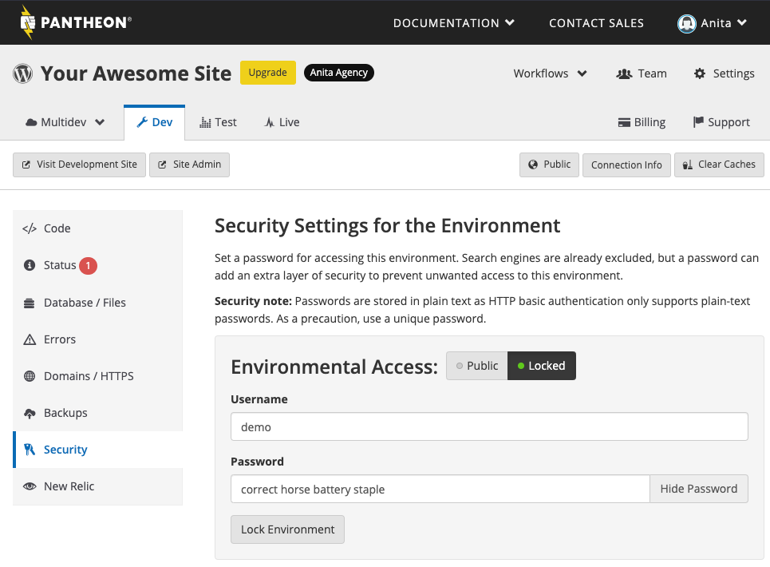
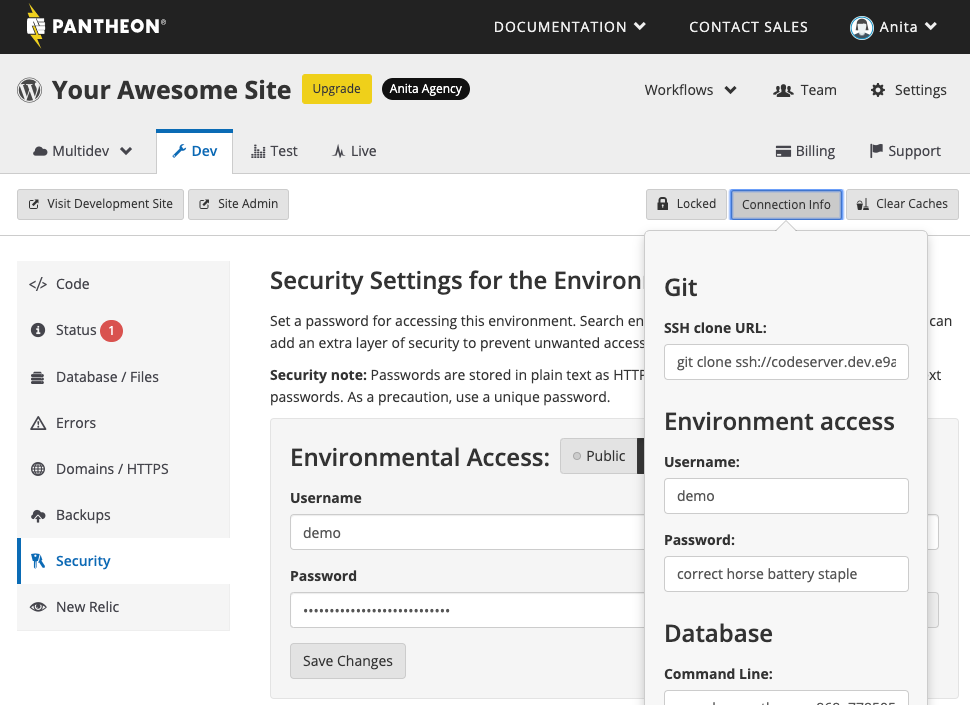
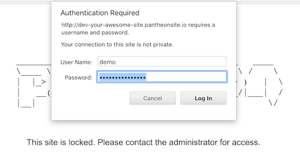

This section provides information on how to secure your Pantheon environments by locking them within the Dashboard.

This is a useful solution when you are working on your site and you would like to keep your progress hidden from the world as you prepare to go live or make updates.

This can be done by putting a username and password on the environment, similar to basic authentication on Apache. Visitors will be prompted to authenticate before the site is served.

<Alert title="Note" type="info">

When a Dev environment is locked, a lock icon will be added to the screenshot of a site on the Your Sites page.

</Alert>



## Password Protect Your Site's Environments

You have the ability to password protect any of the available environments.

1. Select the environment (for example, <span class="glyphicon glyphicon-wrench"></span> **Dev**).

1. Select **Security**.

1. Select **Locked**.

1. Provide a username and password.

1. Click **Lock Environment**.

  If other members of your team on the site need to access the site, they will also be able to view the authentication credentials when they log in to their accounts.

  

1. Refresh your page and you will notice that the environment is shown as Private. You will also be able to see the credentials needed to access that environment.

  You can set a different username and password for each environment. This is important if you only want the Live site publicly viewable, while Dev and Test can be private as you work on your code and content.

1. Visit the URL of the environment that you have made private to verify that everything is working correctly. You should see an authentication form prompting you to enter the username and password for that environment to start your session.

  

<Alert title="Note" type="info">

Environments are not cached by the [Global CDN](/guides/global-cdn) while locked.

</Alert>

### Customize Lock Page

You can add a `locked.html` file in your site's root directory if you'd like to customize the lock page that displays beneath the authentication form.

## Unlock a Site's Environment

Follow the steps below when you are ready to make your environment public again.

1. Click **Security** on your Site Dashboard.

1. Click **Public** next to Environmental Access. This will clear the credentials you entered and make the web accessible resources available without a basic authentication prompt.

## Scripting Site Locking Operations

Your site can also be locked and unlocked using [Terminus](/terminus).

1. Run the command below to lock a site:

  ```bash
  terminus lock:enable <site>:<env> -- user password
  ```

1. Run the command below to unlock a site:

  ```bash
  terminus lock:disable <site>:<env>
  ```

### Pass Credentials Using CI Scripting

Configure your CI tool to pass the username and password on every request to allow tests to run in a locked site environment if you are using CI scripting. Configuration steps will vary depending on your chosen CI tool. We've included a CI authentication example to help you get started:

```bash
{"base_url" : "https://<username>:<password>@'$TERMINUS_ENV'-'$TERMINUS_SITE'.pantheonsite.io/"}
```

- Replace `<username>` with your selected username.
- Replace `<password>` with your configured password.

## Troubleshooting

### Authentication Prompt Appears in Environments Where It's Not Enabled

If you see an authentication prompt for a different environment (for example, a Dev site authentication prompt on the Test environment), you likely have assets, such as images, loading from a locked environment.

1. Inspect your page source code and search for the locked environment's URL (for example, `dev-yoursite.pantheonsite.io`).

1. Replace that URL with the correct URL for the current environment.

### Drupal HTTP Authentication Module

The [HTTP Basic Authentication](https://www.drupal.org/docs/8/core/modules/basic_auth) core module (Drupal 8) and [Basic HTTP Authentication](https://www.drupal.org/project/basic_auth) contrib module (Drupal 7) conflict with [Pantheon's Security tool](/guides/secure-development/security-tool) if both are enabled. We recommend using Pantheon's Security tool within the Site Dashboard on target environments, or the module to restrict access, not both.

Sites that have the environment locked on Pantheon in addition to enabling the module will experience 403 errors. Follow the steps below to resolve these errors.

1. Unlock the environment in the Site Dashboard.

1. Clear the cache.

1. Disable the module in Drupal's admin interface. 

1. Lock the environment on Pantheon after you've disabled the module.

Alternatively, you can resolve 403 errors by using [Terminus](/terminus) to disable the module:

For Drupal 7, run the command below:

```bash
terminus remote:drush <site>:<env> -- pm-disable basic_auth -y
```

## More Resources

- [Pantheon Secure Integration](/guides/secure-development/secure-integration)
