This section provides information on how you can use Two-factor authentication (TFA) to keep your sites secure.

TFA is a security practice that requires your website users to provide a secondary form of authentication in addition to their standard username and password. 

The two most common methods of secondary authentication are:

- SMS messaging

- One-time code generated via an application on a user’s mobile phone

More advanced methods are also available, including:

- Biometric information

- Location through GPS

- Hardware tokens 

For more information, see [Multi Factor Authentication in Drupal Watchdog](http://www.drupalwatchdog.net/volume-2/issue-2/multi-factor-authentication) and [Two Step Authentication on WordPress.org](https://codex.wordpress.org/Two_Step_Authentication).

## Benefits of Two-Factor Authentication

Two-factor authentication is a helpful security practice because it prevents attackers from compromising accounts by requiring an extra authentication method beyond a username and password to log in. This is important because standard password access can be easy to bypass if the user:

- Has a simple password that's easy to guess

- Is observed typing in their password

- Has used their password on another site that becomes compromised

By requiring a second form of authentication (especially one tied to a physical device like a mobile phone or a USB key), would-be attackers not only have to compromise a user’s password, but also their mobile phone or physical USB key, which makes the attack much more difficult.

## Single Site TFA

<TabList>

<Tab title="WordPress" id="tab-1-id" active={true}>

There are many different [WordPress plugins for two-factor authentication](https://wordpress.org/plugins/tags/two-factor-authentication) that can provide TFA capabilities for a single site. A popular plugin is [Duo Two-Factor Authentication](https://wordpress.org/plugins/duo-wordpress/), which makes it easy to set up two-factor authentication on your WordPress site.

1. [Sign up for a Duo account.](https://signup.duo.com/)

1. Log in to the [Duo Admin Panel](https://admin.duosecurity.com/) and navigate to **Applications**.

1. Click **Protect an Application** and locate **WordPress** in the applications list. 

1. Click **Protect this Application** to get your **integration key**, **secret key**, and **API hostname**.

1. Install and activate the [Duo Two-Factor Authentication](https://wordpress.org/plugins/duo-wordpress/) plugin on your WordPress site. You can do this through the WordPress admin panel, or with Terminus:

  ```bash
  terminus remote:wp $SITENAME.dev -- plugin install duo-wordpress --activate
  ```

1. Open the settings page for the Duo plugin > configure Duo with your **integration key**, **secret key**, and **API hostname** from the Duo WordPress application you created earlier at duo.com:
    
  

1. Click **Save Changes**. The page will be automatically redirected to the Duo setup wizard.

6. Follow the on-screen instructions to configure an authentication device to your site and test it. Your browser will be redirected back to the plugin settings page after the configuration is complete.

<Alert title="Note" type="info">

Duo configuration settings and keys are stored in the database. To avoid setting up new keys for each environment you can:

  - Synchronize and import your database

  - Use a tool like [WP-CFM](/wp-cfm)

  - Keep the new application page from the Duo Admin panel open, and reenter the values for each environment

</Alert>

</Tab>

<Tab title="Drupal" id="tab-2-id">

There are a few [different Drupal modules](https://groups.drupal.org/node/235938) including the [Two-Factor Authentication](https://www.drupal.org/project/tfa) module that provide the foundation necessary to use two-factor authentication on a single Drupal site. In addition to the foundation module, you also will need to use a specific TFA module plugin to implement your preferred TFA method. Several of the common TFA methods such as SMS or Time-Based One Time Password are available in the [TFA Basic plugins](https://www.drupal.org/project/tfa_basic) module. There are also developer instructions to [write your own TFA plugin](https://www.drupal.org/node/1663240#dev).

1. Install and enable the [Two-factor Authentication (TFA)](https://www.drupal.org/project/tfa) module and the [TFA Basic plugins](https://www.drupal.org/project/tfa_basic) module on your Drupal site.

1. Download and set up a Time-based One-time Password Algorithm (TOTP) app such as [Authy](https://www.authy.com/download) for either iOS or Android.

1. Configure the TFA module `admin/config/people/tfa` to **Enable TFA**: 

  - Set **TOTP** as the default validation plugin.
  
  - Add **Recovery Codes** as a fallback plugin.
  
  - Allow **Trusted Browsers** for your domain.

  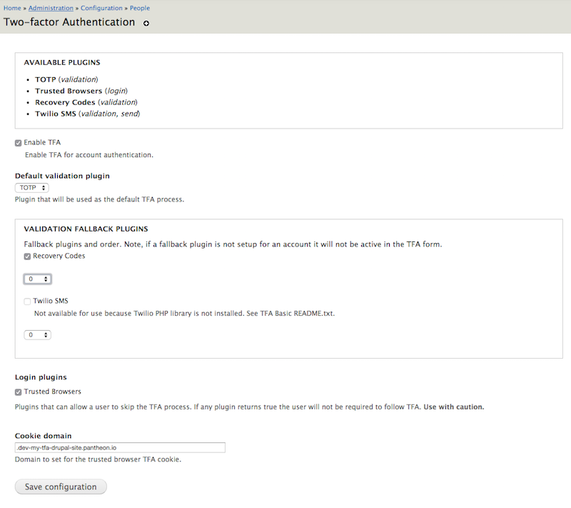

1. Go to the Security settings on each user profile you want to use TFA > click **Enable TFA**.

1. Enter your current password > view the TFA Setup - Application page.

  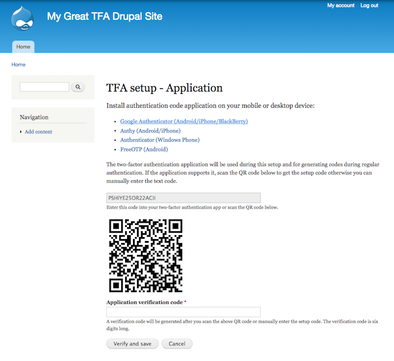

1. Use the app on your mobile phone to scan the QR code to install a new TFA account on your mobile phone.

1. Enter the six-digit TFA code on your mobile app for your specific site to complete the setup. You will then be prompted to confirm a trusted browser (which is optional and will skip TFA on that browser in the future), and to write down TFA recovery codes (best practice).

1. Log in to your Drupal site by using the TOTP mobile app to generate a six digit code.

  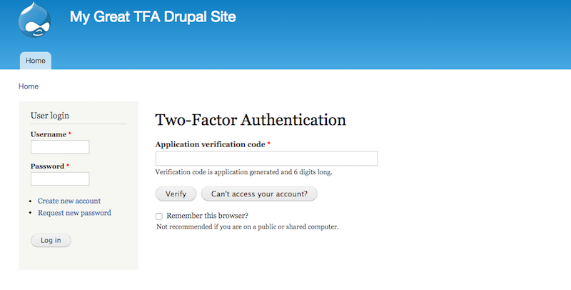

</Tab>

</TabList>


## Organization TFA

<TabList>

<Tab title="WordPress" id="wp-org" active={true}>

There are many different organization-wide [WordPress plugins for single sign on](https://wordpress.org/plugins/tags/single-sign-on) that can provide TFA capabilities. One of the service options we use internally at Pantheon is OneLogin, which has the [OneLogin SAML SSO](https://wordpress.org/plugins/onelogin-saml-sso/) plugin.

#### OneLogin Instructions

1. Sign up and create a [OneLogin account](https://www.onelogin.com/) for your organization.

1. Install the WordPress SAML 2.0 app connector as part of the OneLogin dashboard (you need administrator privileges to install apps). This must be done for each WordPress site that is being managed by OneLogin.

1. Edit the OneLogin WordPress app connector to provide the appropriate default values for the Configuration section. Other sections should already be set up correctly.

  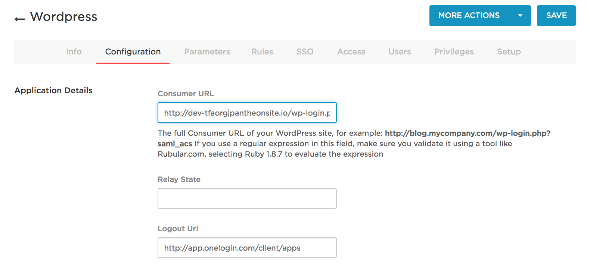

1. **(Optional)** Configure the **Authentication Factors** found under Settings for a list of authentication factors you can enable for your different users.

  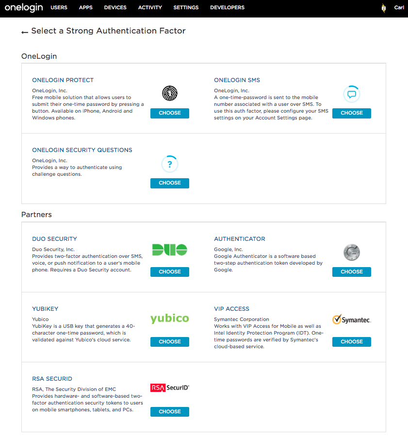

1. Create user accounts in the Users Administration area of OneLogin.

1. Click **New User** and verify that the “Username” and "Email" fields in OneLogin match their WordPress username and email.

  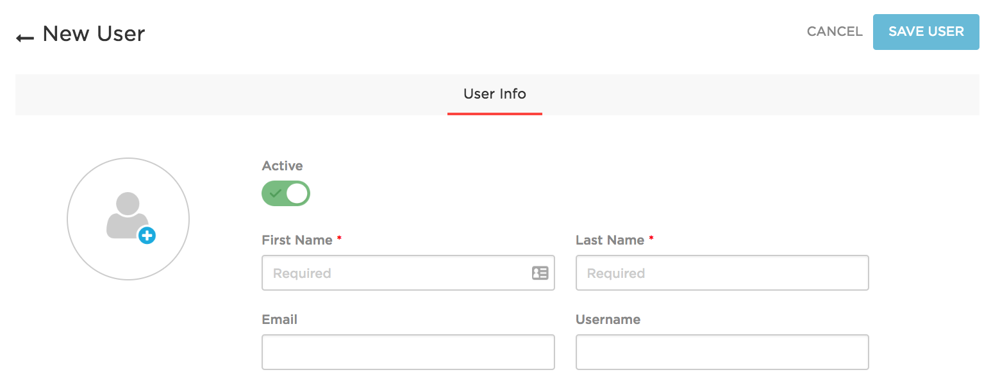

#### WordPress Instructions

1. Install and activate the [OneLogin SAML SSO](https://wordpress.org/plugins/onelogin-saml-sso/) plugin on your WordPress site.

1. Configure the **Identity Provider Settings** section in the SSO/SAML Settings within the WordPress Admin to provide the appropriate values, which are available in the SSO section of the OneLogin Configuration page.

  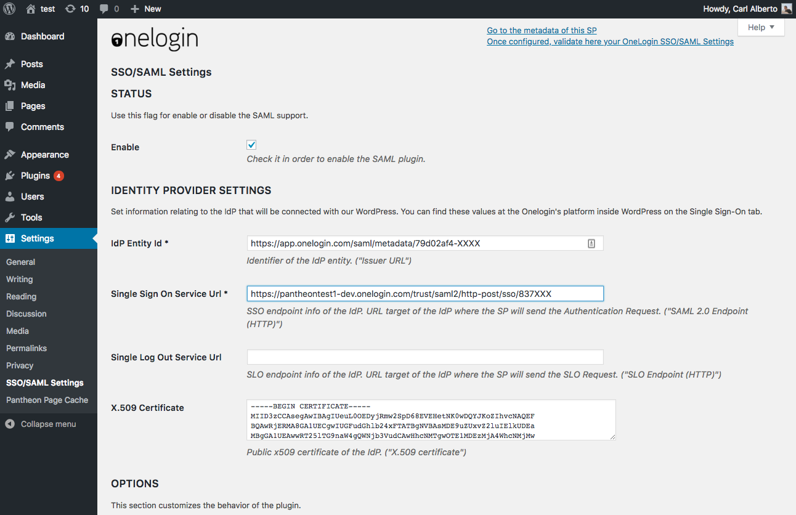

1. Configure the **Options** section (optional) under the SSO/SAML Settings:

   - Select the **Create user if not exists** checkbox if you want users to be auto-created.

   - Select the **Keep Local login** checkout if you still want to use the normal WP login form, otherwise you will always be using OneLogin to authenticate.

   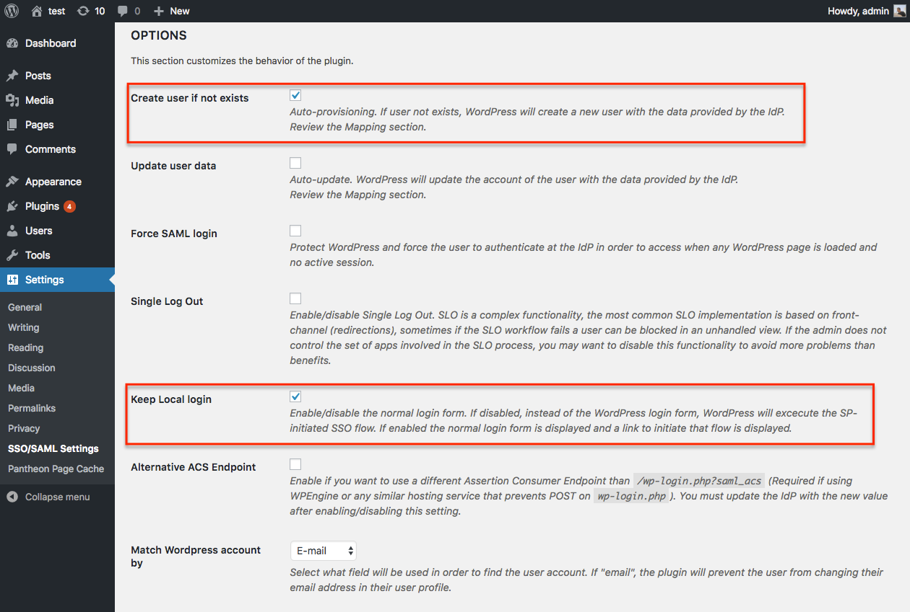

1. Populate the **Attribute Mapping** fields below in the SSO/SAML Settings of the WordPress Admin. Values are case-sensitive.

  - Username
  - E-mail
  - First Name
  - Last Name
  - Role

  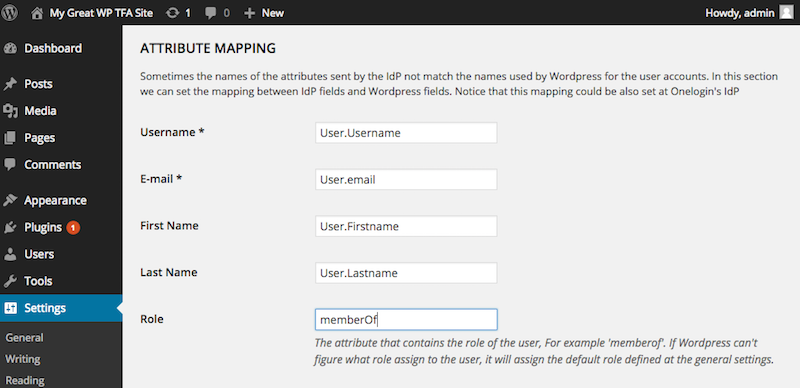

1. Configure the **Customize Actions and Links** in the SSO/SAML Settings of the WordPress Admin to **Prevent use of ?normal**. This requires OneLogin as the authentication solution.

  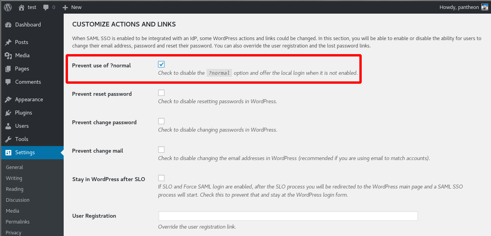

1. Use the OneLogin dashboard to log in to your WordPress site.

  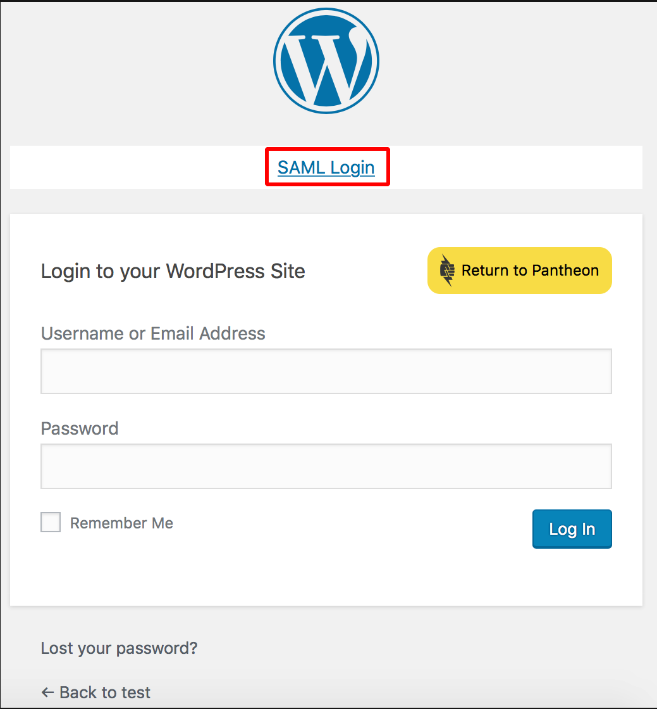

  <Alert title="Note" type="info">

  You can also refer to OneLogin's documentation, [Configure SAML for WordPress](https://onelogin.service-now.com/support/?id=kb_article&sys_id=590b1d83db109700d5505eea4b96197f), for further troubleshooting. You will need a OneLogin admin account to access their knowledge base.

  </Alert>

</Tab>

<Tab title="Drupal" id="drupal-org">

There are many different organization-wide [Drupal modules for single sign on](https://groups.drupal.org/node/182004) that can also provide TFA capabilities. One of the service options we use internally at Pantheon is OneLogin, which has the [OneLogin](https://www.drupal.org/project/onelogin) module.

#### OneLogin Instructions

1. Sign up and create a [OneLogin account](https://www.onelogin.com/) for your organization.

1. Install the Drupal SAML 2.0 app connector as part of the OneLogin dashboard. This will need to be done for each Drupal site that is being managed by OneLogin.

1. Edit the OneLogin Drupal app connector to provide the appropriate default values for the Configuration section. Other sections should already be set up correctly.
  

1. **(Optional)** Configure the **Authentication Factors** found under Settings for a list of authentication factors you can enable for your different users.

  

1. Create user accounts in the Users Administration area in OneLogin.

1. Click **New User** and verify that the “Username” and "Email" fields in OneLogin match their Drupal username and email.


#### Drupal Instructions

1. Install and enable the GitHub version of the [OneLogin SAML](https://github.com/onelogin/drupal-saml) module on your Drupal site. This module is eventually intended to live on Drupal.org as the [2.x branch of the OneLogin project](https://www.drupal.org/project/onelogin).

1. Set the `$_SERVER['SERVER_PORT']` value in `settings.php` according to [these instructions](/server_name-and-server_port). This change is necessary to have SAML use the appropriate ports.

1. Populate the OneLogin SAML module `admin/config/onelogin_saml` fields below.Values are case-sensitive.

  - IdP Entity Id
  - Single Sign On Service URL
  - Single Log Out Service URL
  - X.509 Certificate
  - Username 
  - E-mail 
  - Role

  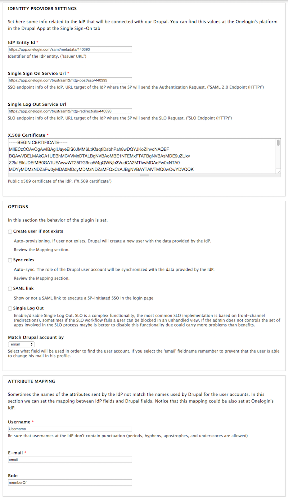

1. Use the OneLogin dashboard to log in to your Drupal site.

</Tab>

</TabList>

## Pantheon Platform TFA

### Log in with Google

The Pantheon Dashboard offers social login with Google, which can be configured to use [Google TFA](https://www.google.com/landing/2step/):


<Alert title="Note" type="info">

We recommend adding an [SSH Key](/ssh-keys) to authenticate yourself on Pantheon for operations such as SFTP connections, which allows for more security than a simple password. If you've registered via social login (Connect with Google) and you'd still like to add a password to your account, logout and visit [https://dashboard.pantheon.io/reset-password](https://dashboard.pantheon.io/reset-password)

</Alert>

### Single Sign-On for Orgs

Single sign-on (SSO) allows users to authenticate against your Identity Provider (IdP) when logging into the Pantheon Dashboard. For more information, see [Single Sign-On for Pantheon Organizations](/sso-organizations).

## More Resources

- [Security on Pantheon](https://pantheon.io/security)

- [WordPress Two Step Authentication](https://codex.wordpress.org/Two_Step_Authentication)

- [Drupal Modules For Two-Factor Authentication](https://groups.drupal.org/node/235938)
