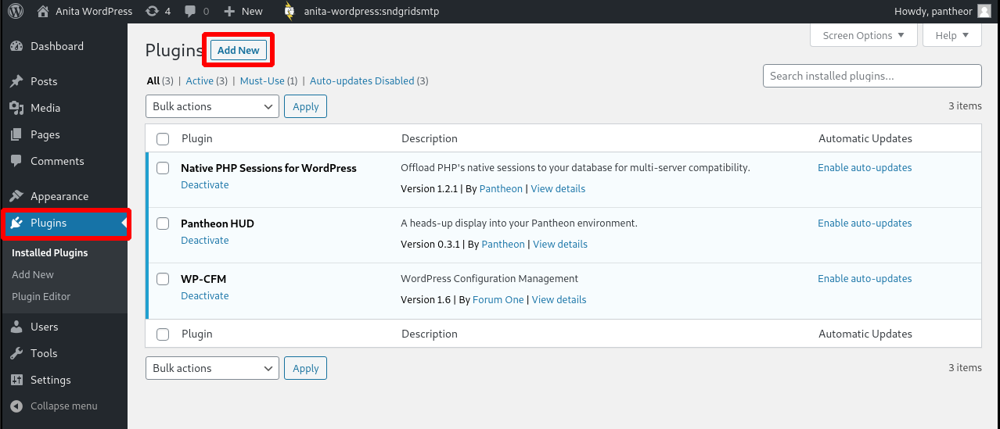
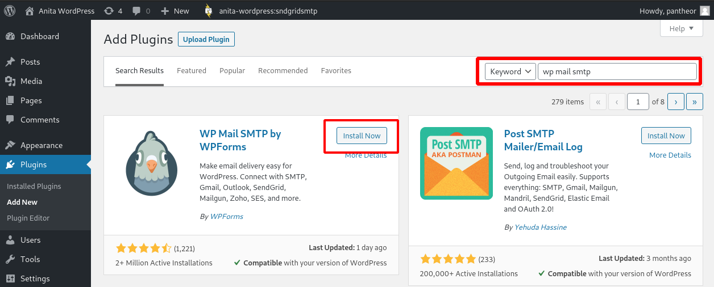
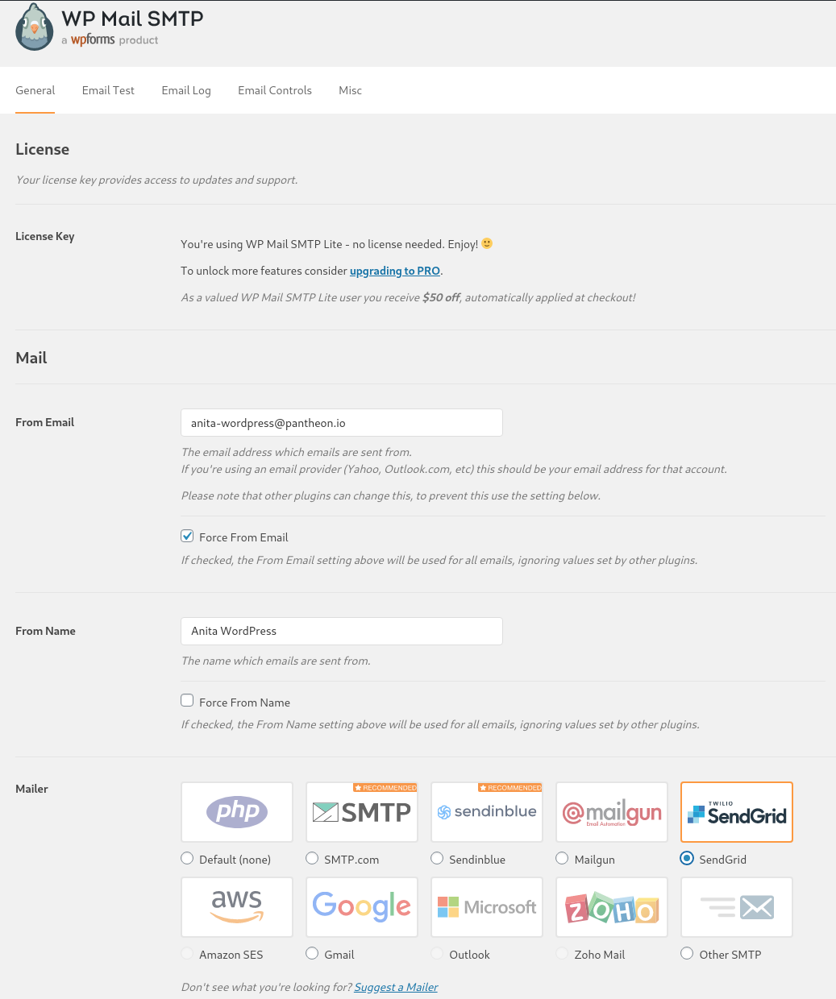

[SendGrid](https://sendgrid.com/) is a popular email service, but its [WordPress plugin](https://wordpress.org/plugins/sendgrid-email-delivery-simplified/) has been deprecated as of July 13, 2021.

This guide will cover how to install and configure [WP Mail SMTP](https://wordpress.org/plugins/wp-mail-smtp/) to send emails from your WordPress site using Sendgrid. This plugin will ensure that the SMTP host credentials are properly configured, so that emails are sent successfully.

<Alert title="Note" type="info">

WP Mail SMTP is not the only plugin available to integrate WordPress with Sendgrid, nor is it officially endorsed by Pantheon as the preferred method.

</Alert>

## Before You Begin

This guide assumes a pre-existing configuration of:

- A configured WordPress site. See our [Quick Start](/guides/quickstart) guide if you need to set up a new WordPress site on Pantheon.
- A familiarity with the [WebOps workflow](/pantheon-workflow), as we will be moving code and content between environments.
- A SendGrid account and API key. Follow the steps in [Create a SendGrid Account](/guides/sendgrid/#create-a-sendgrid-account) to create and authenticate an account.
- If your site has access to [Multidev](/guides/multidev), we suggest creating a new Multidev environment to work in. If so, substitute the Multidev name for `dev` in the guide below, unless otherwise noted.

## Install the WP Mail SMTP Plugin

There are several ways to install and manage WordPress plugins on Pantheon. This guide will cover installation from the WordPress Admin Dashboard, and from the command line using [Terminus](/terminus) and [WP-CLI](/guides/wp-cli).

Each method requires first setting your working environment (Dev or a Multidev environment) to [SFTP mode](/sftp#sftp-mode).

### Install from the WordPress Admin Dashboard

1. From the [Site Dashboard](/guides/account-mgmt/workspace-sites-teams/sites), navigate to the Dev (or Multidev) environment, and click on the **Site Admin** button. Log in to your WordPress Admin Dashboard.

1. Select **Plugins**, then **Add New**

  

1. In the search box, type "wp mail smtp". Results will update automatically. Locate **WP Mail SMTP by WPForms** and click **Install Now**:

  

1. After it is installed, click **Activate**.

WP Mail SMTP is now installed! You can now continue to [Configure WP Mail SMTP for SendGrid](#configure-wp-mail-smtp-for-sendgrid).

### Install with Terminus

<Alert title="Exports" type="export">

When using [Terminus](/terminus), we suggest defining the variables `$site` and `$env` in your terminal session to match your site name and the Dev (or Multidev) environment:

```bash{promptuser: user}
export site=yoursitename
export env=dev #Or a multidev name
```

</Alert>

1. Confirm that the environment is in SFTP mode:

  ```bash{outputLines: 2}
  terminus connection:set $site.$env sftp
  [notice] The connection mode is already set to sftp.
  ```

1. Invoke WP-CLI over Terminus to install and activate WP Mail SMTP:

  ```bash{outputLines: 2-13}
  terminus wp $site.$env -- plugin install --activate wp-mail-smtp
  Warning: Permanently added '[appserver.sendgridsmtp.0e1f236a-....drush.in]:2222,[35.223.224.107]:2222' (RSA) to the list of known hosts.
  Installing WP Mail SMTP by WPForms (2.5.1)
  Warning: Failed to create directory '/.wp-cli/cache/': mkdir(): Read-only file system.
  Downloading installation package from https://downloads.wordpress.org/plugin/wp-mail-smtp.2.5.1.zip...
  Unpacking the package...
  Installing the plugin...
  Plugin installed successfully.
  Activating 'wp-mail-smtp'...
  Plugin 'wp-mail-smtp' activated.
  Success: Installed 1 of 1 plugins.
  [notice] Command: anita-wordpress.sendgridsmtp -- wp plugin install wp-mail-smtp [Exit: 0]
  ```

## Configure WP Mail SMTP for SendGrid

1. From the WordPress Admin Dashboard's Plugins Page, locate WP Mail SMTP and click on **Settings**.

1. Under the **General** tab, in the **Mail** section, provide values for "From Email" and "From Name". In the **Mailer** subsection, select **SendGrid**:

  

1. In the next section, paste in your API key, then select **Save Settings**.

1. To confirm your settings are correct, select the **Email Test** tab and send a test email to yourself. Be sure to check your spam folder for the test message.

Congratulations, you've configured WP Mail SMTP for SendGrid!

## More Resources

- [WP Mail SMTP Documentation](https://wpmailsmtp.com/docs/)  
- [SendGrid Documentation](https://sendgrid.com/docs/)
