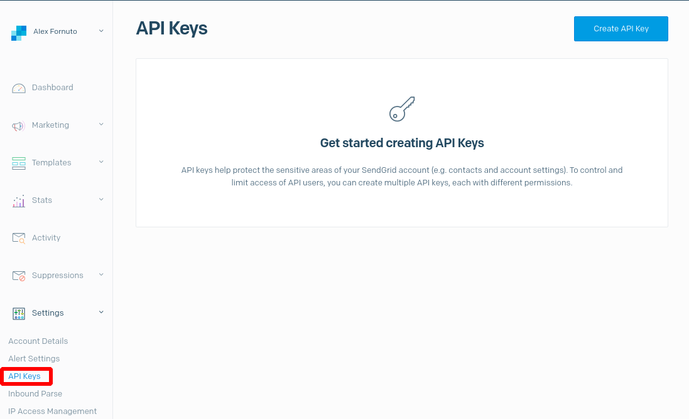
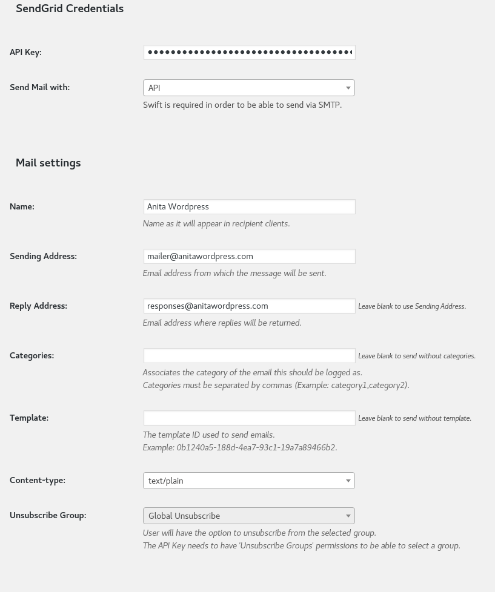
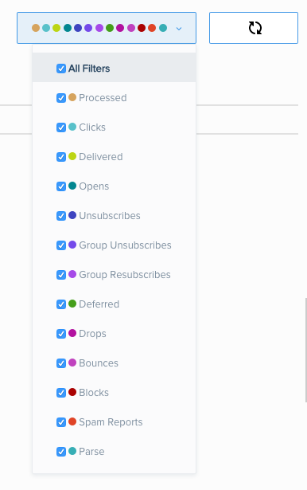

Email is a necessity when running a website, whether it's used with a simple contact form or to manage subscription based services, odds are you’re going to need it. Users may want to receive notices of content updates, have sales receipts sent to them, update their password or membership information, and more. Email is the most effective way of communicating with a site's user base, but it does no good if these messages are filtered and marked as spam.

One of the most common reasons that email gets blocked is because it originates from a website hosted by a third party service, like Pantheon. In order to ensure this doesn't happen to you, we at Pantheon highly encourage using your own email server or a service provider such as SendGrid.

<Alert type="info" title="Note">

New Sendgrid account may need to wait 30 days before upgrading to a paid plan. If you're switching to Sendgrid from an existing email solution, make sure to plan for this.

</Alert>

## Why SendGrid?

[SendGrid](https://sendgrid.com) has a lot of things going for it, all of which do the hard work for you when it comes to how mail is managed on your site. It can handle massive email campaigns while providing highly detailed and flexible reporting, along with the ability to scale and increase deliverability.

## Create a SendGrid Account

1. Get started by [signing up](https://sendgrid.com/partners/pantheon) for an account and selecting a plan that meets your business needs. After receiving your confirmation email, sign in to your [SendGrid account](https://sendgrid.com/login).

1. From within the **Settings** menu, click **API Keys**:

  

1. Click **Create API Key** to define the name and permissions for the API key your site will use. Click **Create & View** to complete the process.

1. The API key will only be displayed once. Copy the key and save it somewhere secure until you can apply it to the site.

1. From the **Settings Menu** click **Sender Authentication**. SendGrid requires accounts created after April 6th 2020 to identify their sender identity through either **Domain Authentication** or **Single Sender Verification**. A more detailed explanation of these options can be found in the [SendGrid Documentation](https://sendgrid.com/docs/for-developers/sending-email/sender-identity/).

## Integrating Sendgrid With Drupal and WordPress

Follow the procedure outlined below for your CMS:

<TabList>

<Tab title="WordPress" id="tab-1-anchor" active={true}>

### Download the WordPress SendGrid Plugin

The official [SendGrid Plugin](https://wordpress.org/plugins/sendgrid-email-delivery-simplified/) replaces the `wp_mail` function with API integration, making it easy to configure and get started.

Install and activate the latest release through the WordPress dashboard or place it in the `code/wp-content/plugins` directory and activate via the dashboard.

### Add Your SendGrid Account Details

1. After you have installed and activated the plugin, go to your site's Dashboard and select **Settings**, then click the SendGrid menu item.
1. Provide the API Key from the previous section.

  <Alert type="info" title="Note">

  There is a [known issue](https://github.com/sendgrid/wordpress/issues/40) with the SendGrid plugin for WordPress where it attempts to reload your API Key whenever there is input, which can conflict with your browser's autofill settings. You can use the **Stop** function of your browser to cancel reloading while you enter your API Key. Note that the API Key must be saved before configuring additional settings.

  </Alert>

1. Enter the email address to send from and provide a reply email address if you prefer replies to go to another address (optional).
1. SendGrid supports categories so you can track email analytics and organize message types. Include any categories you would like to use, separated by commas.



When you're done, click **Update Settings**. Your WordPress application is now set up to send email through SendGrid! Complete the fields in the SendGrid Test section of the Settings page and watch the magic work its way to your inbox. For guidance on checking deliverability in SendGrid, see [Checking Deliverability in SendGrid](#deliverability).

</Tab>

<Tab title="Drupal 8" id="tab-2-anchor">

When using SendGrid with Drupal 8, we recommend using the [SendGrid Integration](https://www.drupal.org/project/sendgrid_integration) module. While you can use the [SMTP Authentication Support](https://www.drupal.org/project/smtp) module to send mail to SendGrid over SMTP, our testing (as of the last update) was hampered by a [known issue](https://www.drupal.org/project/smtp/issues/3135015) with the module recognizing the presence of a required PHP library.

<Alert title="Warning" type="danger" >

The SendGrid API Integration Module for Drupal 8 requires a Composer managed workflow as described in our [Build Tools](/guides/build-tools) or [Drupal 8 and Composer on Pantheon Without Continuous Integration](/guides/drupal-8-composer-no-ci) guides. We cannot support non-Composer workflows using this module. For details, see [the module readme](http://cgit.drupalcode.org/sendgrid_integration/tree/README.md?id=185c4ea) file.

</Alert>

1. Install the [SendGrid Integration](https://www.drupal.org/project/sendgrid_integration) module using Composer:

  ```bash{promptUser: user}
  composer require drupal/sendgrid_integration
  ```

1. Commit, push, and enable the new module. Replace `$SITE` and `$ENV` with the site and environment name:

  ```bash{promptUser: user}
  git add .
  git commit -m "Install sendgrid_integration"
  git push origin master #Or Multidev name
  terminus drush $SITE.$ENV -- en sendgrid_integration -y
  ```

1. Visit `/admin/config/services/sendgrid` once you've logged into your Drupal site as an administrator. Paste your API Key and click **Save Configuration**.

Your Drupal application on Pantheon is now set up to send email through SendGrid's API. Test your configuration from `/admin/config/services/sendgrid/test`.

</Tab>

<Tab title="Drupal 7" id="tab-3-anchor">

### Choosing an Integration Method

Two methods can be used to integrate SendGrid with your Drupal 7 site: API or SMTP.

#### Considerations

- SMTP requests are associated with dynamic outgoing IPs, which can have a negative impact on deliverability.
- API integration using the [SendGrid Integration](https://www.drupal.org/project/sendgrid_integration) module is recommended; however, installation of this module is slightly more complicated, as it requires the use of [Composer](/composer). For Drupal 7 we can utilize the dev release of this module and use Composer in a non-invasive manner that is compatible with upstream updates.

<Accordion title="API Integration" id="d7-api" icon="wrench" active={true}>

### SendGrid API Integration

<Alert title="Exports" type="export">

This process uses [Terminus](/terminus). Before we begin, set the variables `$SITE` and `$ENV` in your terminal session to match your site name and the Dev environment, or multidev name is using [Multidev](/multidev):

```bash{promptUser: user}
export SITE=yoursitename
export ENV=dev
```

</Alert>

1. Install [Composer](https://getcomposer.org) and [Drush](https://docs.drush.org/en/7.x/install/), then install and authenticate [Terminus](/terminus/install).

1. If you haven't done so already, [clone your Pantheon site repository](/git/#clone-your-site-codebase) and navigate to the project's root directory. If you're using Multidev, checkout that branch:

  ```bash{promptUser: user}
  cd $SITE
  git checkout $ENV
  ```

1. Set the connection mode to Git:

  ```bash{promptUser: user}
  terminus connection:set $SITE.$ENV git
  ```

1. Install the [SendGrid Integration](https://www.drupal.org/project/sendgrid_integration) module (and its dependencies) and the [Composer Vendor](https://www.drupal.org/project/composer_vendor) module using Drush:

  ```bash{promptUser: user}
  drush dl sendgrid_integration-7.x-1.3 mailsystem composer_vendor
  ```

Now that the module and dependencies are installed, initialize Composer:

<Partial file="d7-composer-init.md" />

The above configuration specifies setting `vendor-dir` to `sites/all/vendor` for compatibility with the [Composer Vendor](https://www.drupal.org/project/composer_vendor) module, but this directory is not a protected path by default. Make this path non-web accessible by adding the following to the `pantheon.yml` configuration file before proceeding:

```yaml:title=pantheon.yml
protected_web_paths:
  - /sites/all/vendor
```

1. Require the [SendGrid API Library](https://github.com/taz77/sendgrid-php-ng) via Composer:

    ```bash{promptUser: user}
    composer require fastglass/sendgrid:~1.0
    ```

1. Add, commit, and push all of the new files:

  ```bash{promptUser: user}
  git add .
  git commit -am "Add Sendgrid API Integration"
  git push origin master # or $ENV for multidev
  ```

1. Switch the site back to SFTP mode:

  ```bash{promptUser: user}
  terminus connection:set $SITE.$ENV sftp
  ```

1. Enable *Composer Vendor*, followed by *SendGrid Integration*. Order is important here, SendGrid Integration will refuse to activate if the library file is not autoloaded:

  ```bash{promptUser: user}
  terminus drush $SITE.$ENV -- en composer_vendor -y
  terminus drush $SITE.$ENV -- en sendgrid_integration -y
  ```

1. From within your SendGrid account, navigate to **Settings** > **API Keys** and create a site-specific API Key. Click the key to copy it to your keyboard.

1. Visit `/admin/config/services/sendgrid` once you've logged into your Drupal site as administrator. Paste your API Key and click **Save Settings**.

Your Drupal application on Pantheon is now set up to send email through SendGrid's API. Test your configuration from `/admin/config/services/sendgrid/test`.

<Alert title="Note" type="info">

Under `/admin/reports/status` you may see a warning that `composer.lock` isn't found in `code/sites/all`. The actual `composer.lock` is in the code root, but you can symlink to it to remove the warning.

From the project root:

```bash
cd sites/all
ln -s ../../composer.lock ./composer.lock
```

Then commit and push the symlink to Pantheon.

</Alert>

</Accordion>

<Accordion title="SMTP Integration" id="d7-smtp" icon="wrench">

### SendGrid SMTP Integration

1. Install the [SMTP Authentication Support](https://www.drupal.org/project/smtp) module using the [Drupal interface](https://drupal.org/documentation/install/modules-themes) or with [Terminus](/terminus):

     ```bash
     terminus drush <site>.<env> -- en smtp -y
     ```

1. Visit `/admin/config/system/smtp` once you've logged in as administrator.

1. From within Install Options, select **On**.

1. Use the following within SMTP Server Settings:

    **SMTP server**: smtp.sendgrid.net

    **SMTP port**: 2525

    **Use encrypted protocol**: We strongly recommend selecting **TLS**

      <Alert title="Note" type="info">

      Configuring mail to use port 25, 465 or 587 is strongly discouraged because they attract SPAM activities. For details, see [Email on Pantheon](/email)

      </Alert>

1. Provide your site-specific SendGrid credentials and click **Save configuration**. Note that subusers are not available on free plans.


</Accordion>

Your Drupal application on Pantheon is now set up to send email through SendGrid. Provide an address within the Send Test E-mail configuration field and click **Save configuration** to test.

</Tab>

</TabList>

## <a name="deliverability"></a>Checking Deliverability in SendGrid
For testing purposes, your first few deliveries should be to email addresses that you control directly. You can track and measure unique aspects of mail behaviors from within your site's SendGrid account, which should be monitored regularly.

First, log into [SendGrid](https://sendgrid.com/login) and select **Activity**. You will be taken to a page with a form to search by email. Enter the email address, and press **Enter**. SendGrid will search through your mail queue for any messages sent to that address. For additional search parameters, select the filters near the top right corner.

​

You can explore the Statistics and Email Reports from within your site's account to gain insight into email activity, statistics on email clients, and much more.


## Congratulations!

You have now successfully integrated an industrial strength, simple to use, email delivery service into your website. If you have any questions, contact [SendGrid's support team](https://support.sendgrid.com/hc/en-us) or check out SendGrid’s [Email Infrastructure Guide](https://sendgrid.com/resource/the-email-infrastructure-guide-build-it-or-buy-it) for advanced tips on how to create and publish DNS records for increased deliverability.

## Troubleshooting
In some cases, other WordPress plugins can conflict with the Sendgrid plugin and cause it to use PHPMailer instead of SendGrid.

## See Also

- [Prevent Spamming During Drupal Debugging and Testing](/guides/rerouting-outbound-email)
