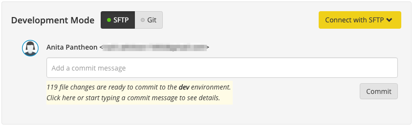

#### Commit Frequently

Keep in mind:

- SFTP changes to code that have not been committed will *not be saved in backups and not included in deployments* as they are not part of your code repository yet.
- Changing your site's connection mode from SFTP to Git will discard all uncommitted file changes. If you want to keep work in progress, commit before toggling the connection mode.
- Containers are migrated as a regular part of maintenance.  This can delete uncommitted changes.
- You won't be able to save anything that's been excluded from version control via `.gitignore`.

## SFTP Mode

Every Development environment has a toggle to switch between SFTP and Git modes. This is to prevent you from accidentally overwriting changes from a different source. To enable SFTP mode, click the **SFTP** button next to Development Mode.

When in SFTP mode, there's comment box above the commit log. As you make changes to the codebase, the Dashboard will track your pending changes for you to see. You can then commit them to version control once you are happy with the results without having to ever use Git directly.

 

## Committing SFTP Changes

Even though you are unable to use Git to push remotely with SFTP mode enabled, you still need to commit your changes to save them, or push them to Test/Live. **Commit early and commit often**.

Large sets of code changes taking longer than two minutes to commit may timeout and fail to commit. In those cases, temporarily remove some of your code changes (new modules or plugins), then try again.

After making a change to your code, you will see a message on the Dashboard, below the comment box, letting you know you have uncommitted changes. Click the notification message to expand the listing of pending changes.

Write a helpful commit message to go with your changes. This make maintaining your code a saner process, and make it easier for any other developers to understand what you've done.

Once your message is ready, click **Commit**.

<Alert title="Note" type="info">

Your Dashboard tracks all changes made within your codebase. File change notifications will not include changes in the content files directory (e.g. `wp-content/uploads` or `sites/default/files/`) since these are not tracked in version control. For more information, see [Use the Pantheon WebOps Workflow](/pantheon-workflow).

</Alert>

## Discard & Abandon SFTP Changes

Toggle the **Connection Mode** from **SFTP** to **Git** to *permanently* discard all SFTP changes that have not been committed, such as the 119 file changes shown above.

This can be useful when you have many changes you wish to undo or if it would otherwise be difficult to manually revert all the changes. Toggle back to **SFTP** mode when you're ready to resume SFTP development.
