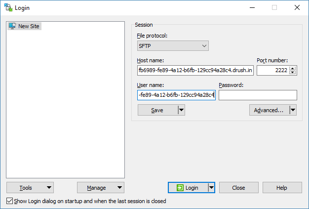
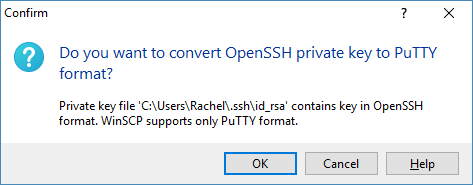

This section provides information on how to use WinSCP with Pantheon.

[WinSCP](https://winscp.net/eng/index.php) is an open source graphical SFTP client for Windows that also supports the Legacy SCP protocol.

## Before You Begin

- Make sure you have the [Pantheon SFTP connection information for your site ready](/guides/sftp/sftp-connection-info). You will need the hostname, username, and port.

- [Generate an SSH key for authentication](/ssh-keys#windows) and [add it to your Pantheon dashboard](/ssh-keys#add-ssh-key---new-dashboard). You must use an SSH key to authenticate, dashboard credentials will not work.

- [Download and install WinSCP](https://winscp.net/eng/docs/installation#download) if you haven't already.

## Connect Your WinSCP Client to Pantheon

1. Start the WinSCP application and enter the connection information. Be sure to take note of the port as Pantheon uses a **non-standard port** for SFTP. Leave the password field blank.

  

1. Click the **Advanced..** button under the password field, then select **SSH** > **Authentication** from the left-hand navigation menu and provide the path to your private key file.

  If you specify a key in an unsupported format (e.g., OpenSSH) you will be prompted to convert the key to PuTTY format, if prompted to convert respond by clicking Ok.

  

  Click Save and Ok, then click the Login button.

1. Click **Yes** to accept the server's host RSA2 Key Fingerprint for the current session and store it in the cache. This allows you to connect to the server and manage your files for the current session.

    - You are directed automatically to the root directory of your appserver when logged in. The left side displays your local computer, and the right displays your site's appserver.

1. Navigate to the `code` directory to access the Drupal or WordPress root and manage your files.

## More Resources

- [Install Cygwin on Windows](/guides/local-development/cygwin-windows)
