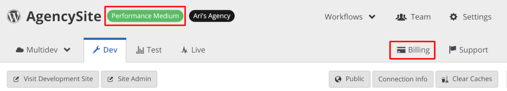

Changing your site plan is typically done at launch time. For a comprehensive step-by-step guide to going live, refer to [Launch Essentials](/guides/launch).

If your site benefits from [Preferred Pricing](https://pantheon.io/plans/agency-preferred-pricing), contact your Supporting Organization for assistance, in order to retain your special pricing rate.

## Access Site Plan

1. Go to the Site Dashboard.

1. For Sandbox sites, click **Upgrade** next to the site's name:
  

  Otherwise, click the current plan tag next to the site's name:
  

<Alert title="Note" type="info">

Changing your site plan is typically done at launch time. For a comprehensive step-by-step guide to going live, refer to [Launch Essentials](/guides/launch).

</Alert>

## See Also

- [Billing in the Site Dashboard](/site-billing)
- [Account Billing in the User Dashboard](/account-billing)
- [Traffic Limits and Overages](/traffic-limits)
- [Site Plans FAQs](/guides/site-plan/site-plans-faq)
