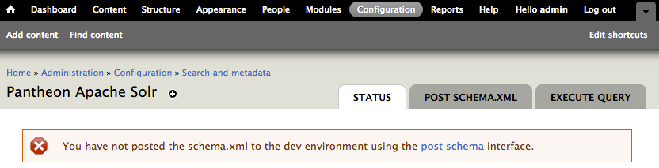
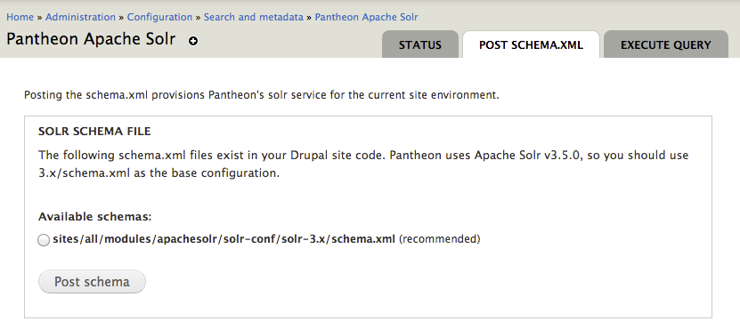
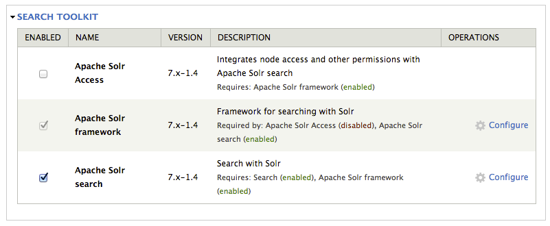
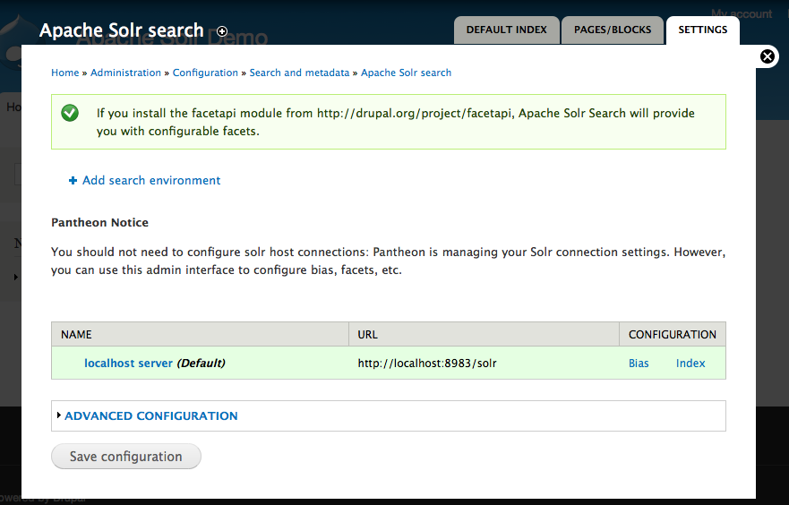
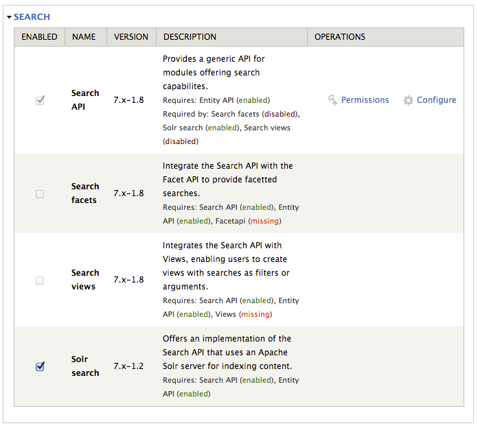
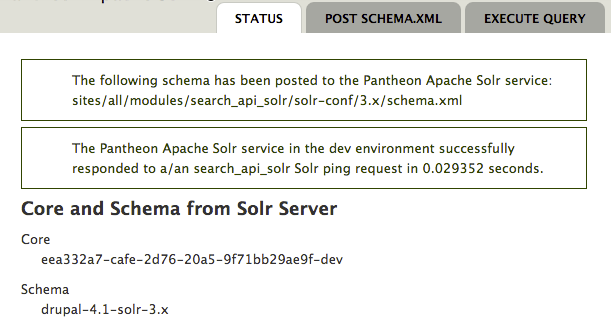

This guide provides information on using **Pantheon's Solr Service** with Drupal 7.

If you are looking for additional search features for more advanced use cases, you may want to consider [alternative Solr service](/solr#alternatives-to-pantheons-solr-service) for your site. See the [Opensolr](/opensolr) guide for one example.

## Before You Begin

1. Use [one-click updates](/core-updates#apply-upstream-updates-via-the-site-dashboard) to make sure you are running the latest version of Drupal 7 core.

1. Add the Solr Index Server to your site.

  From your Dashboard, go to **Settings** > **Add Ons** > **Apache Solr Index Server: Add**. This will provision Apache Solr containers for every environment for your site.

You are now ready to begin integrating with Drupal.

## Install Solr for Drupal

This guide describes how to implement Solr search using Pantheon's Solr module, which is designed to work specifically with the Solr service provided by Pantheon. Using a non-Pantheon Solr service with this module is not supported, and may result in unexpected behavior.

### Add Either the Apache Solr Search or Search API Solr Search Module

Two contributed modules are supported by Pantheon that interface with Pantheon's Apache Solr service (you only need to install one of these modules):

- [https://drupal.org/project/apachesolr](https://drupal.org/project/apachesolr) - 7.x-1.x and 6.x-1.x
- [https://drupal.org/project/search\_api\_solr](https://drupal.org/project/search_api_solr) - 7.x-1.x

For most users, the `apachesolr` module is the easiest to configure and maintain, and includes functionality like facets and other great features.

If you rely on highly customized data structures and the `apachesolr` module is not enough for your needs, `search_api_solr` provides an alternative with a more powerful interface, but is much more complex.

Choose one or the other and add it to your codebase. Do not enable or configure it yet.

### Enable the Pantheon Apache Solr Module

<Alert title="Note" type="info">

If you previously installed the Acquia Solr module and you still have the files present in your codebase, you will need to delete them from your repo before enabling the Pantheon Apache Solr module. If you don't, you may receive an error when attempting to connect to the Solr server.

</Alert>

The [Pantheon Apache Solr](https://github.com/pantheon-systems/drops-7/tree/master/modules/pantheon/pantheon_apachesolr) module is included within all Drupal 7 sites on Pantheon. This module **must** be enabled and configured in each environment (Dev, Test, Live, and each Multidev) in order to use Pantheon's Apache Solr service. The Pantheon Apache Solr module is not required if you are using a third-party Solr service.

**The Pantheon Apache Solr module requires that you enable the core Search module** to have administrator permission granted for "Administer search". You will not be able to post `schema.xml` if the core Search module is disabled.

Once enabled, click **Configure**, or navigate to **Administration** > **Configuration** > **Search and metadata** > **Pantheon Apache Solr**.

 

### Post the schema.xml Using the Pantheon Apache Solr Module

The next step is to post the `schema.xml`, which describes Drupal fields to the Solr search indexer. Posting the schema will activate the Solr server for the site environment. Click **Post schema.xml**.



1. Choose the appropriate schema for the module that you are using (apachesolr or search_api_solr) > click **Post schema**.

    - In the majority of cases, you will want to use `3.x/schema.xml`. Do not attempt to use schemas intended for different versions of Solr, because it won't work. When you've made your selection, 

1. Place the following within `settings.php` to configure schema across all Pantheon environments (optional):

    ```php:title=settings.php
    if (isset($_ENV['PANTHEON_ENVIRONMENT'])) {
    // set schema for apachesolr OR set schema for search_api_solr (uncomment the line you need)
    // $conf['pantheon_apachesolr_schema'] = 'sites/all/modules/apachesolr/solr-conf/solr-3.x/schema.xml';
    // $conf['pantheon_apachesolr_schema'] = 'sites/all/modules/search_api_solr/solr-conf/solr-3.x/schema.xml';
    // or if you have a contrib folder for modules use
    // $conf['pantheon_apachesolr_schema'] = 'sites/all/modules/contrib/apachesolr/solr-conf/solr-3.x/schema.xml';
    // $conf['pantheon_apachesolr_schema'] = 'sites/all/modules/contrib/search_api_solr/solr-conf/solr-3.x/schema.xml';
    }
    ```

<Alert title="Note" type="info">

You must post the `schema.xml` in each environment (Dev, Test, Live, and each Multidev) that you want to use Pantheon's Solr Service in.

</Alert>

### Enable and Configure Your Solr Module

You will need to enable either Apache Solr Search or Search API Solr Search, depending on which one you selected in the [previous steps](#add-either-the-apache-solr-search-or-search-api-solr-search-module). You should have installed only one of these modules and will need to enable only one.

<TabList>

<Tab title="Apache Solr Search" id="apachesolrsearch" active={true}>

#### Enabling Apache Solr Search (apachesolr)

Enable both the **Apache Solr framework** and **Apache Solr Search** modules.

 

Browse to the main Apache Solr settings screen and you should now see an index is ready for you. You do not need to configure any server settings, but you can still handle your facet and bias settings as per normal:

 

Note that the default connection parameters are correct and do not need changing. After this point, your configuration and settings will be the same as any generic Apache Solr use case.

</Tab>

<Tab title="Search API Solr Search" id="apisolr">

#### Enabling Search API Solr Search (search\_api\_solr)

Three modules are required; [entity](https://drupal.org/project/entity), [search\_api](https://drupal.org/project/search_api) and [search\_api\_solr](https://drupal.org/project/search_api_solr) need to be installed and enabled.



</Tab>

</TabList>

## Extend Solr for Drupal 7

### Apache Tika

The [Apache Tika](https://tika.apache.org/) toolkit detects and extracts metadata and structured text content from various documents using existing parser libraries.

Tika can extract content from a number of document formats such as HTML, XML, Microsoft Office document formats, and PDFs and more.

Once you have downloaded and installed the ApacheSolr Attachments module ([apachesolr_attachments](https://www.drupal.org/project/apachesolr_attachments)), you'll need to configure the module's settings.

1. Go to the Tika settings page at: `/admin/config/search/apachesolr/attachments` and enter the following fields:

    - **Extract Using:** Tika (local java application)
    - **Tika Directory Path:** `/srv/bin`
    - **Tika jar file:** `tika-app-1.21.jar`

1. Verify that your site is able to extract text from documents. Click **Test your Tika Attachments** under the Actions section.

If everything is working correctly, you will see the success message "Text can be successfully extracted".

## Additional Help

The Pantheon Solr module provides a comprehensive help section that describes a number of key Solr concepts and terms. View it by going to **Administration** > **Help** > **Pantheon Apache Solr**.

## Pantheon Solr Service Status

The Pantheon Solr module provides several interfaces for troubleshooting the health of the service, along with the ability to manually perform queries. These checks are independent of contrib module configurations in order to determine whether the service itself is performing properly, or if there is there is a problem with your site configuration.

### Status

This interface reports what the last schema that was posted to the service and whether the service itself responds to a ping.

**Administration** > **Configuration** > **Search and metadata** > **Pantheon Apache Solr**



### Execute Query

The Pantheon Apache Solr module provides an interface for administrators to send queries directly to the Solr server, independently of any contrib module. This is advanced functionality and is intended for debugging purposes only. Try queries like `/admin/ping` to see the raw server response.

 

### Drupal Status Report

The Pantheon Apache Solr module also adds an item to the Administration > Reports > Status report that performs a similar check to the Status check, independently of contrib module configurations.

 

## Troubleshooting

The following are Pantheon-specific variables that you can check for, depending on the module you are using.

Keep in mind that newly indexed items have a 2-minute delay until cron has been run or manually indexed before they become available in Solr search.

<Partial file="solr-commit-changes.md" />

#### apachesolr.module

If you're using the Apache Solr module, you can check for the existence of this variable using [Terminus](/terminus):

```bash{promptUser: user}
terminus drush <site>.<env> -- vget apachesolr_service_class
```

#### search_api_solr.module

If you are using search_api_solr.module, you can check it with the command:

```bash{promptUser: user}
terminus drush <site>.<env> -- vget search_api_solr_connection_class
```

### Error During Search API Solr Installation

If you receive the following error, be sure that you have followed all of the instructions as described in the INSTALL.txt. We can not resolve this for you as it is part of the module setup:

> Exception: SolrPhpClient library not found! Please follow the instructions in search_api_solr/INSTALL.txt for installing the Solr search module. in _search_api_solr_solrphpclient_path()

### Post Schema Into All Environments

This needs to be done for Dev, Test, and Live individually. You can do this at `admin/config/search/pantheon/schema`.

### Re-Index Content

**ApacheSolr module:** You can do this at `admin/config/search/apachesolr`. Click **Queue all content for reindexing** to initiate. This will add content that has not yet been indexed to the Solr indexing queue (following the configured items-per-cron-event setting).


**Search API Solr module:** Navigate to your Search Index list page at `admin/config/search/search_api` and click the index you need to rebuild. On the index view page, you can either queue all items for reindexing or clear your existing index and re-index in batches.

## Safely Remove Solr

The following code changes are required before Solr can be safely uninstalled and disabled:

<Partial file="remove-addons/d7-solr.md" />

## More Resources

- [Apache Solr on Pantheon](/solr)
- [Using OpenSolr with Pantheon](/opensolr)
