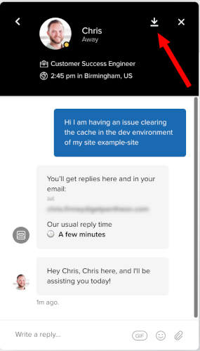

This section provides information on how to open a support ticket as well as other ways to contact support.

<Alert title="Note" type="info" >

We recommend you begin your Support journey from the affected [Personal Workspace](/guides/account-mgmt/workspace-sites-teams/workspaces#switch-between-workspaces), [Professional Workspace](/guides/account-mgmt/workspace-sites-teams/workspaces#switch-between-workspaces), or [Site Dashboard](/guides/account-mgmt/workspace-sites-teams/sites#site-dashboard). This ensures that the appropriate Support options are available to you, and simplifies the process of contacting us.

</Alert>

#### Provide a detailed description
For every method of contacting Pantheon Support documented on this page, please prepare and include a **detailed description** for the issue you're experiencing, such as:
- Steps to reproduce the issue (including URLs or paths to files).
- Environments affected (Multidev/Dev/Test/Live), if applicable.
- When the issue began.
- Error messages received, if applicable.
- Links to screenshots or screencasts of the behavior, if necessary.

## General support ticket

The ticket support feature is available to certain Account packages and account types. For details, refer to the [support feature table](/guides/support/#support-features-and-response-times). Tickets are associated with the site from which the ticket is opened. Please be sure that if you maintain several sites, that you open the ticket from the correct site's dashboard.

1. [Go to the workspace](/guides/account-mgmt/workspace-sites-teams/workspaces#switch-between-workspaces).

1. Go to the **Support** tab, then select **Open support ticket**.

1. Enter a subject (summary of your issue).

1. Provide a [detailed description](#provide-a-detailed-description) of your support request.

1. Click **Submit ticket**

After a ticket is submitted, you can view details for your support requests. If are you are part of an Workspace, your support tickets are visible to all members except [Unprivileged users](/guides/account-mgmt/workspace-sites-teams/teams#organizations-roles-and-permissions).

## Live Chat

Start a chat with our Support Team to ask questions or request assistance on issues within our [scope of support](#scope-of-support). This support feature is available to all users and sites across all plans, including Sandbox.

To receive the highest level of support available to your site or Workspace, remember to access the chat from the Workspace if available.

1. [Go to the workspace](/guides/account-mgmt/workspace-sites-teams/workspaces#switch-between-workspaces).

1. Go to the **Support** tab, then select **Start chat**.

1. Provide a [detailed description](#provide-a-detailed-description) of your support request.

You can download a transcript of your chat with the <Icon icon="arrowDownToLine"/> button:

<Alert title="Note" type="info">

Some in-browser ad or tracking blockers may interfere with the **Start chat** button. If you don't see the button, try allowlisting `pantheon.io` or disabling the browser extension. Intercom has provided more details on [why this happens](https://www.intercom.com/help/en/articles/2546256-troubleshooting-when-the-messenger-doesn-t-appear) on their site.

</Alert>

## Emergency ticket
**Diamond** and **Platinum** customers also have the option to open an **emergency ticket** (formerly On-call help) for business-critical issues. Pantheon escalates emergency tickets to our support engineers, even during off-hours. If your issue is non-business-critical, please open a [general support](#general-support-ticket) ticket instead.

1. [Go to the workspace](/guides/account-mgmt/workspace-sites-teams/workspaces#switch-between-workspaces).

1. Go to the **Support** tab, then select **Open emergency ticket**.

1. Enter a subject (summary of your issue).

1. Provide a [detailed description](#provide-a-detailed-description) of your support request.

1. Click **Submit ticket**

After a ticket is submitted, you can view details for your support requests. If are you are part of an Workspace, your support tickets are visible to all members except [Unprivileged users](/guides/account-mgmt/workspace-sites-teams/teams#organizations-roles-and-permissions).

## Call Us
**Diamond** and **Platinum** customers can call the 24/7 Premium Support Hotline for any technical issues, escalations, site, billing, or overages queries. You can find the phone number in the Support tab of your workspace.
